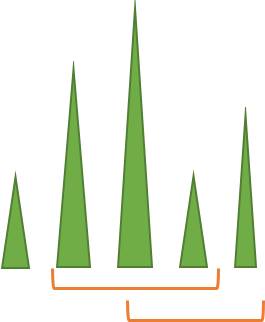

## 이야기

새해 복 많이 받으세요.

현관에 장식할 카도마츠를 만들다가 $1$가지 사실을 깨달았습니다.

## 문제 설명

$N$개의 대나무를 무작위로 늘어놓고 높이를 각각 $A_i$라고 할 때, 순서를 바꾸지 않고 연속한 $3$개를 골라 카도마츠 수열이 되는 조합이 몇 개인지 알고 싶어졌습니다.

선택한 $3$개의 대나무 중 $2$번째로 긴 대나무가 원래 배치의 왼쪽 또는 오른쪽에 있는 것이 카도마츠라고 합니다. 여기에 $3$개의 길이가 모두 다르다는 조건까지 만족하는 것을 카도마츠 수열이라고 합니다.

$N$개 대나무의 높이가 주어질 때 카도마츠 수열이 되는 조합 수를 구하세요. 각 대나무에는 번호가 있어 서로 구별됩니다.

## 입력

```text
$N$
$A_1\ A_2\ \dots\ A_N$
```

$N$은 대나무의 수이며, $A_1,\dots,A_N$은 나열된 순서대로 각 대나무의 높이를 나타냅니다. 모든 입력은 정수입니다.

## 제한

- $3 \le N \le 100$
- $1 \le A_i \le 100$ $(1 \le i \le N)$

## 출력

카도마츠 수열이 되는 조합 수를 출력하세요. 마지막에 줄 바꿈을 출력하세요.

## 예제

### 예제 1 {file=""}

#### 입력

```text
5
1 3 4 1 2
```

#### 출력

```text
2
```

$[3,4,1]$과 $[4,1,2]$가 카도마츠 수열입니다. $[3,4,2]$처럼 연속하지 않은 선택은 안 됩니다.



### 예제 2 {file=""}

#### 입력

```text
5
1 4 2 4 1
```

#### 출력

```text
2
```

$[1,4,2]$와 $[2,4,1]$이 카도마츠 수열입니다.

### 예제 3 {file=""}

#### 입력

```text
5
1 4 1 5 2
```

#### 출력

```text
2
```

$[1,4,1]$은 $1$번째와 $3$번째 길이가 같으므로 카도마츠 수열이 아닙니다.
