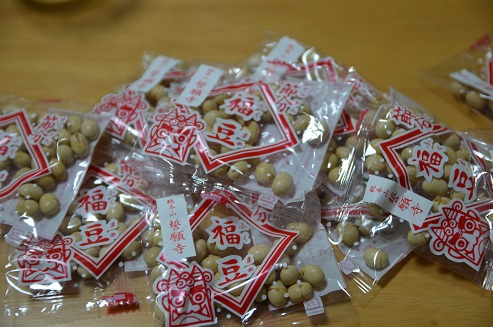

## 문제 설명

yukiさん은 콩이 $K$개씩 들어 있는 봉지를 $N$개 주웠습니다. 세쓰분에는 나이와 같은 수의 콩을 먹는 풍습이 있습니다.

yukiさん의 가족은 $F$명이고, 각 가족 구성원의 나이는 $A_1, A_2, \ldots, A_F$입니다. 모든 사람이 자신의 나이만큼 콩을 먹은 뒤 남는 콩의 수를 구하세요. 필요한 콩이 부족하여 모두가 먹을 수 없다면 $-1$을 출력하세요.



그림 $1$. 오늘의 수확 (2015년 2월 3일, [誓願寺](http://ja.wikipedia.org/wiki/%E8%AA%93%E9%A1%98%E5%AF%BA))

## 입력

```text
$K\ N\ F$
$A_1\ A_2\ \cdots\ A_F$
```

## 제한

- $1 \le K,N \le 1\,000$
- $1 \le F \le 100$
- $1 \le A_i \le 100$

## 출력

모든 사람이 나이만큼 콩을 먹은 뒤 남는 콩의 수를 $1$줄에 출력하세요. 콩이 부족하면 $-1$을 출력하세요.

## 예제

### 예제 1 {file=""}

#### 입력

```text
10 10 3
10 20 40
```

#### 출력

```text
30
```
