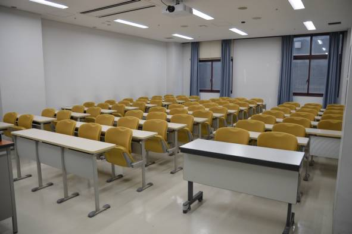

## 이야기

어떤 교원(익명 희망)은 바로 근처에서 세쓰분 축제가 열리는 가운데 기말시험 감독을 하다가 다음 문제를 생각했습니다.

## 문제 설명

부정행위를 막기 위해 학생들은 같은 책상에서 서로 이웃한 좌석에 앉을 수 없습니다. 예를 들어 의자가 $3$개 있는 책상에 학생 $2$명이 앉는 경우 양 끝 의자만 사용할 수 있고, 학생 $1$명이 앉는 경우에는 $3$개 중 어느 의자든 사용할 수 있습니다.

어떤 방에는 책상 종류가 $N$가지 있습니다. $C_k$개의 의자가 있는 책상이 $D_k$개씩 있고, 각 책상의 의자는 일직선으로 배치되어 있습니다.

이 방에서 시험을 볼 수 있는 학생 수의 최댓값을 $10^9+7$로 나눈 나머지를 구하세요.



그림 $1$. 이 문제가 탄생한 장소 (京都大学 1共01 교실, 2015년 2월 4일)

## 입력

```text
$N$
$C_1\ D_1$
$C_2\ D_2$
$\vdots$
$C_N\ D_N$
```

## 제한

- $1 \le N \le 100\,000 = 10^5$
- $1 \le C_k \le 10^{18}$
- $1 \le D_k \le 10^{18}$
- $i \ne j$이면 $C_i \ne C_j$

## 출력

시험을 볼 수 있는 학생 수의 최댓값을 $10^9+7$로 나눈 나머지를 출력하세요.

## 예제

### 예제 1 {file=""}

#### 입력

```text
2
2 5
3 20
```

#### 출력

```text
45
```

사진에 나온 교실의 경우입니다. 의자가 $2$개인 책상에는 최대 $1$명, 의자가 $3$개인 책상에는 최대 $2$명이 앉을 수 있으므로 합계 $45$명까지 시험을 볼 수 있습니다.
