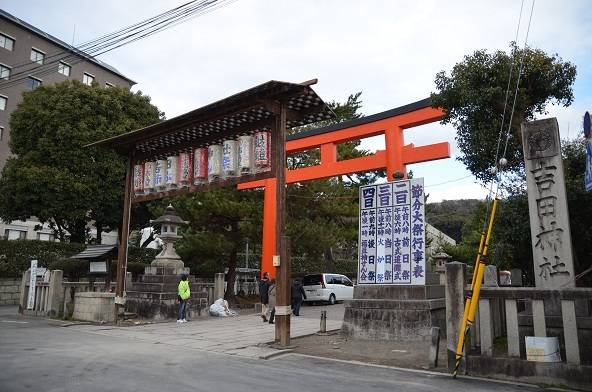

## 이야기

어떤 교원(익명 희망)은 바로 근처에서 세쓰분 축제가 열리는 가운데 기말시험 감독을 하다가 다음 문제를 생각했습니다.

## 문제 설명

부정행위를 막기 위해 학생들은 같은 책상에서 서로 이웃한 좌석에 앉을 수 없습니다. 의자가 $3$개 있는 책상에 학생 $2$명이 앉는 경우 양 끝 의자만 사용할 수 있고, 학생 $1$명이 앉는 경우에는 $3$개 중 어느 의자든 사용할 수 있습니다.

어떤 방에는 책상 종류가 $N$가지 있습니다. $C_k$개의 의자가 있는 책상이 $D_k$개씩 있고, 각 책상의 의자는 일직선으로 배치되어 있습니다.

시험을 보는 사람 수는 알 수 없습니다. 사용되는 의자의 배치로 가능한 패턴의 수를 $10^9+7$로 나눈 나머지를 구하세요. 학생은 구별하지 않고 의자의 사용 여부만 구분합니다.



그림 $1$. 시험일(2/3) 다음 날에도 세쓰분 축제가 열리는 듯하지만… (吉田神社 앞, 2015년 2월 4일)

## 입력

```text
$N$
$C_1\ D_1$
$C_2\ D_2$
$\vdots$
$C_N\ D_N$
```

## 제한

- $1 \le N \le 30\,000 = 3 \times 10^4$
- $1 \le C_k \le 10^{18}$
- $1 \le D_k \le 10^{200}$
- $i \ne j$이면 $C_i \ne C_j$

## 출력

사용되는 의자의 패턴 수를 $10^9+7$로 나눈 나머지를 출력하세요.

## 예제

### 예제 1 {file=""}

#### 입력

```text
1
3 1
```

#### 출력

```text
5
```

의자가 $3$개인 책상에서는 아무도 앉지 않는 경우 $1$가지, $1$명이 어느 의자에 앉는 경우 $3$가지, $2$명이 양 끝에 앉는 경우 $1$가지이므로 합계 $5$가지입니다. 학생은 구별하지 않고 의자의 사용 방식만 구분합니다.

### 예제 2 {file=""}

#### 입력

```text
2
1 2
3 1
```

#### 출력

```text
20
```

의자가 $1$개인 책상 $2$개는 각각 사용하거나 사용하지 않는 $2$가지 경우가 있으므로 패턴 수가 $4$배가 됩니다.

### 예제 3 {file=""}

#### 입력

```text
3
10 10
20 20
30 30
```

#### 출력

```text
500979274
```
