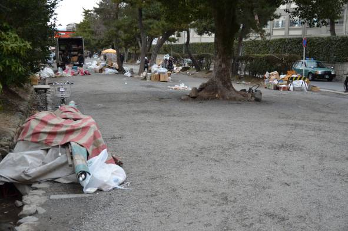

## 이야기

어떤 교원(익명 희망)은 바로 근처에서 세쓰분 축제가 열리는 가운데 기말시험 감독을 하다가 다음 문제를 생각했습니다.

## 문제 설명

부정행위를 막기 위해 학생들은 같은 책상에서 서로 이웃한 좌석에 앉을 수 없습니다. 의자가 $3$개 있는 책상에 학생 $2$명이 앉는 경우 양 끝 의자만 사용할 수 있고, 학생 $1$명이 앉는 경우에는 $3$개 중 어느 의자든 사용할 수 있습니다.

어떤 특이한 방에는 책상이 $1$개만 있고 의자가 $C$개 있습니다. 이 방에서 $P$명의 학생이 시험을 볼 때 학생을 배치하는 방법의 수를 $10^9+7$로 나눈 나머지를 구하세요. 시험 감독 (2)와 달리 학생은 서로 구별된다는 점에 주의하세요. (예제의 $1$번째 테스트 케이스를 참고하세요.)

프로그램이 $1$초 이내에 실행되면서 정답을 출력하고 yukicoder가 허용하는 프로그램이라면 정답으로 인정됩니다. (제출 목록을 보면 무언가 알 수 있을까요?)



그림 $1$. …이미 뒷정리 중이었습니다 (吉田神社 앞, 2015년 2월 4일)

## 입력

$1$번째 줄에 테스트 케이스 수를 나타내는 정수 $T$가 주어집니다. 각 테스트 케이스는 다음 형식입니다.

```text
$C\ P$
```

## 제한

- $1 \le T \le 30$
- $1 \le C \le 10^{10\,000}$
- $1 \le P \le 10^{10\,000}$

## 출력

각 테스트 케이스에 대해 학생 배치 방법의 수를 $10^9+7$로 나눈 나머지를 $1$줄에 출력하세요.

## 예제

### 예제 1 {file=""}

#### 입력

```text
3
3 2
1 196547891657825679231564789567843659723659763246578365879364576378658372657842658746758638746587236589762187456587168
123456789 1
```

#### 출력

```text
2
0
123456789
```

$1$번째 테스트 케이스에서는 $2$명의 학생이 양 끝에 앉아야 하며, 어느 학생이 어느 끝에 앉는지에 따라 $2$가지입니다. $2$번째는 불가능합니다. $3$번째는 $1$명의 학생이 원하는 의자에 앉을 수 있습니다.
