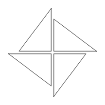

## 이야기

太郎君에게는 매우 소중히 아끼는 저금통이 있습니다. 이 저금통은 太郎君이 $N$살 생일에 선물로 받은 것이었습니다.

어느 날 소중히 보관하던 저금통이 갑자기 사라졌습니다. 太郎君은 특기인 흑마술로 행방을 찾으려고 흑마술 책을 펼쳤고, 다음과 같은 내용이 적혀 있었습니다.

## 문제 설명

“끈으로 그림과 같은 마방진을 그리고 중앙에 양초를 세워라. 각각의 직각삼각형은 모두 같은 크기여야 하며, 변의 길이는 모두 양의 정수여야 한다.”



太郎君은 길이 $L$인 끈을 가지고 있습니다. 이 끈을 자유롭게 자르고 접을 수 있을 때, 太郎君이 만들 수 있는 마방진의 형태 종류 수를 구하세요.

어떤 마방진을 그대로 정수배한 형태, 회전한 형태, 뒤집은 형태는 같은 형태로 간주합니다.

太郎君은 무사히 저금통의 위치를 찾아낸 직후 二郎君의 방으로 뛰어들었다고 합니다.

## 입력

```text
$L$
```

끈의 길이를 나타내는 정수 $L$이 주어집니다.

## 제한

- $1 \le L \le 10\,000\,000 = 10^7$

## 출력

만들 수 있는 마방진 형태 종류 수를 $1\,000\,003$으로 나눈 나머지를 출력하세요. 마지막에 줄바꿈을 출력하세요.

## 예제

### 예제 1 {file=""}

#### 입력

```text
165
```

#### 출력

```text
3
```

직각삼각형의 변이 $(3,4,5)$, $(5,12,13)$, $(8,15,17)$인 $3$가지 마방진을 만들 수 있습니다. 필요한 끈의 길이는 각각 $48$, $120$, $160$이므로 $165$ 이하입니다.

### 예제 2 {file=""}

#### 입력

```text
8765
```

#### 출력

```text
152
```

### 예제 3 {file=""}

#### 입력

```text
47
```

#### 출력

```text
0
```

끈의 길이가 부족하여 마방진을 만들 수 없습니다. 저금통의 행방을 알 수 없게 되었습니다.
