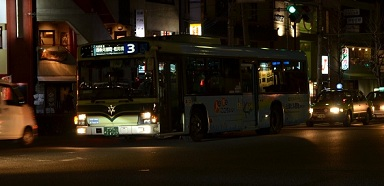

## 문제 설명

교토의 시내버스에는 여러 노선이 있습니다. 각 노선에서 그날의 막차와 막차의 바로 전 버스는 전광판의 불빛 색이 평소와 다릅니다. 평소에는 흰색, 막차의 바로 전 버스는 초록색, 막차는 빨간색입니다.

yukiさん은 첫차부터 막차까지 어떤 도로를 지나가는 모든 버스의 불빛 색을 확인하고 본 순서대로 메모했습니다. yukiさん은 메모를 잘못하지 않았는지 걱정하고 있습니다. 이 메모가 실제로 가능한 순서를 나타내는지 판정하세요.

모든 노선의 시내버스는 매일 $3$대 이상 운행하며, $1$일 동안 같은 경로를 운행한다고 가정합니다.



그림 $1$. 교토 시내버스 $3$번 노선으로, 평소의 불빛입니다. 참고로 불빛이 초록색이나 빨간색이면 글자가 약간 읽기 어려워집니다 (百万遍에서, 2015년 2월 4일)

## 입력

$1$번째 줄에 테스트 케이스 수를 나타내는 정수 $T$가 주어집니다. 각 테스트 케이스는 $1$줄로 이루어지며, 문자열 $S$가 주어집니다. $S$의 $i$번째 문자는 $i$번째로 본 버스의 불빛 색을 나타내며, `W`는 흰색, `G`는 초록색, `R`은 빨간색입니다. 다른 문자는 포함되지 않습니다.

## 제한

- $1 \le T \le 1\,000$
- $1 \le |S| \le 1\,000$

## 출력

가능한 패턴이면 `possible`, 불가능하면 `impossible`을 각 테스트 케이스마다 $1$줄에 출력하세요.

## 예제

### 예제 1 {file=""}

#### 입력

```text
5
WWWWWWWWWGR
WWWWGWGRR
WWWWWWWWWWWWWWGRRG
WGRWGR
WWWWWWWWWWWWWWWWWGGWGWGGWGWGGGWGG
```

#### 출력

```text
possible
possible
impossible
possible
impossible
```

$1$번째는 $1$개의 노선만 있는 경우입니다. $2$번째는 $2$개의 노선이 있는 경우입니다. $3$번째는 $1$개의 노선에서 막차 뒤에 초록색 버스가 오는 것처럼 되어 이상하므로 불가능합니다. $4$번째처럼 $1$개의 노선의 막차가 끝난 뒤 다른 노선이 운행을 시작할 수도 있습니다. $5$번째는 막차가 없으므로 불가능합니다.
