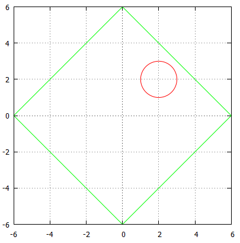

## 이야기

ゆきちゃん은 애견 ルビー와 함께 매일 산책하고 있었습니다. 그런데 갑자기 나타난 UFO가 ルビー를 납치해 도망쳤습니다. ルビー를 구하기 위해 ゆきちゃん의 초능력을 발휘하여 UFO를 잡으세요.

## 문제 설명

좌표 $(0,0)$에 있는 ゆきちゃん은 경계까지의 맨해튼 거리가 자연수인 결계를 순간적으로 만들 수 있습니다. UFO는 현재 위치 $(x,y)$에 중심이 있고 반지름이 $r$인 원입니다. 결계를 만들었을 때 UFO가 결계 내부에 있으면 포획에 성공합니다.

단, UFO가 결계에 닿으면 도망가므로 주의하세요. ゆきちゃん은 다른 UFO 습격에 대비해 힘을 아끼고 싶으므로 결계 크기는 최소로 해야 합니다.

UFO를 포획하기 위해 만드는 결계 크기의 최솟값을 출력하세요.

결계는 충분히 얇다고 가정합니다. UFO가 결계에 닿는다는 것은 UFO의 경계 위 또는 내부에 있으면서 동시에 결계의 경계 위에 있는 점 $P$가 존재하는 경우를 뜻합니다.

## 입력

```text
$x\ y\ r$
```

입력은 $1$줄로 주어지며, 모두 정수입니다.

## 제한

- $-100 \le x,y \le 100$
- $1 \le r \le 100$

## 출력

ゆきちゃん이 만드는 결계의 크기, 즉 ゆきちゃん에서 경계까지의 맨해튼 거리를 $1$줄에 출력하세요.

## 예제

### 예제 1 {file=""}

#### 입력

```text
2 2 1
```

#### 출력

```text
6
```

경계까지의 맨해튼 거리가 $6$인 결계를 만들면 UFO를 내부에 가둘 수 있습니다. ゆきちゃん은 좌표 $(0,0)$에 있으므로 결계(초록색)와 UFO(빨간색)는 아래 그림과 같습니다.



### 예제 2 {file=""}

#### 입력

```text
-50 -40 30
```

#### 출력

```text
133
```

UFO는 꽤 멀리 도망쳤지만, ゆきちゃん의 손에 금세 붙잡힙니다.

### 예제 3 {file=""}

#### 입력

```text
0 0 100
```

#### 출력

```text
142
```

안타깝게도 UFO는 도망칠 틈도 없이 ゆきちゃん에게 붙잡혔습니다.
