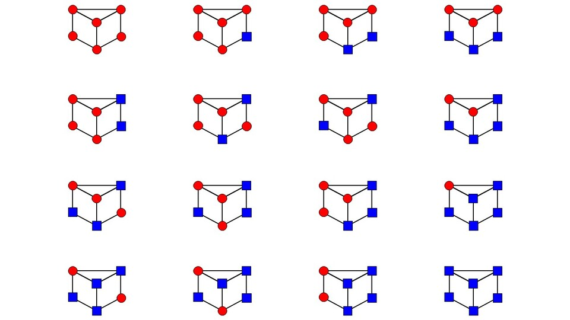

밑면이 한 변 1인 정`N`각형이고 옆 모서리 길이가 2인 정`N`각기둥 `Γ_N`의 `2N`개 꼭짓점을 `C`가지 색으로 칠합니다.

회전으로 일치하는 색칠을 같은 것으로 볼 때 가능한 색칠 방법의 수를 `10^9+7`로 나눈 나머지를 구하세요.

## 제약

- `1 <= T <= 10`
- `3 <= N <= 10^9`
- `1 <= C <= 10^9`

## 입력

테스트 케이스마다 `N C`가 주어집니다.

## 출력

각 테스트 케이스의 답을 출력하세요.

## 예제

### 예제 1 {file="1_Sample.txt"}

#### 입력

```text
3
3 2
5 1
46 20211031
```

#### 출력

```text
16
1
173884620
```

첫 번째 테스트 케이스에서 색 $1$을 빨간색, 색 $2$를 파란색으로 나타내면 다음 $16$가지 색칠이 가능합니다.



두 번째 테스트 케이스에서는 $1$가지 색만 사용할 수 있으므로 모든 꼭짓점을 그 색으로 칠하는 $1$가지 방법뿐입니다.

세 번째 테스트 케이스에서는 $10^9+7$로 나눈 나머지를 구해야 한다는 점에 주의하세요. 이는 $\mathcal{G}1$ 문제와 다른 점입니다.
