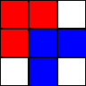
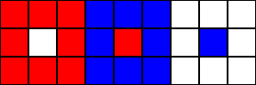

## 문제 설명

세로 $H$, 가로 $W$인 직사각형 격자가 있습니다. 각 칸은 흰색 또는 검은색으로 칠해져 있습니다.

yuki君은 검은 칸을 모두 빨강 또는 파랑으로 다시 칠하려고 합니다. 빨간 칸과 파란 칸을 각각 적어도 $1$칸씩 칠하고, 빨간 칸의 집합과 파란 칸의 집합이 평행 이동으로 일치하도록 만들고 싶습니다. 가능하면 `YES`, 불가능하면 `NO`를 출력하세요.

같은 칸에 여러 색을 칠할 수 없으며, 흰 칸은 다시 칠하지 않습니다.

## 입력

```text
$H\ W$
$S_1$
$S_2$
$\vdots$
$S_H$
```

$1$번째 줄에 $H$, $W$가 공백으로 구분되어 주어집니다. 이어지는 $H$줄에 격자의 $i$번째 행을 나타내는 길이 $W$의 문자열 $S_i$가 주어집니다.

## 제한

- $1 \le H,W \le 50$
- $S_i$는 길이 $W$이며 `#`과 `.`으로만 이루어집니다.
- $S_i$의 $j$번째 문자가 `#`이면 $(i,j)$ 칸은 검은색, `.`이면 흰색입니다.

## 출력

가능하면 `YES`, 불가능하면 `NO`를 따옴표 없이 출력하세요. 마지막에 줄바꿈을 출력하세요.

## 예제

### 예제 1 {file=""}

#### 입력

```text
3 3
##.
###
.#.
```

#### 출력

```text
YES
```

아래처럼 조건을 만족하도록 칠할 수 있으므로 `YES`를 출력합니다.



### 예제 2 {file=""}

#### 입력

```text
5 3
.#.
.#.
.#.
.#.
.#.
```

#### 출력

```text
NO
```

어떻게 나누어 칠해도 $2$가지 색의 배치가 일치하지 않으므로 `NO`를 출력합니다.

### 예제 3 {file=""}

#### 입력

```text
3 9
######...
#.####.#.
######...
```

#### 출력

```text
YES
```

아래처럼 나누어 칠할 수 있으므로 `YES`를 출력합니다.



원래 배치나 칠한 배치에 빈틈이나 떨어진 부분이 있어도 괜찮습니다.

### 예제 4 {file=""}

#### 입력

```text
3 5
#...#
##.##
#...#
```

#### 출력

```text
NO
```

$2$개의 배치는 평행 이동만으로 일치해야 합니다. 회전이나 뒤집기는 할 수 없습니다.

### 예제 5 {file=""}

#### 입력

```text
5 8
###.....
#.####..
..####..
..####.#
.....###
```

#### 출력

```text
YES
```

### 예제 6 {file=""}

#### 입력

```text
23 33
...............##................
...........##########............
.......##################........
...##########################....
.##....##################....##..
.######....##########....######..
.##########....##....##########..
.##....########..##############..
.######....####..##############..
.##############..##############..
.##############..##############..
.##############..##############..
...############..############....
.......########..########........
...........####..####............
...............##................
.................................
........#...#...........#........
........#...............#........
#.#.#.#.#.#.#.###.###.###.###.#.#
#.#.#.#.##..#.#...#.#.#.#.##..##.
.#..###.#.#.#.###.###.###.###.#..
#................................
```

#### 출력

```text
NO
```
