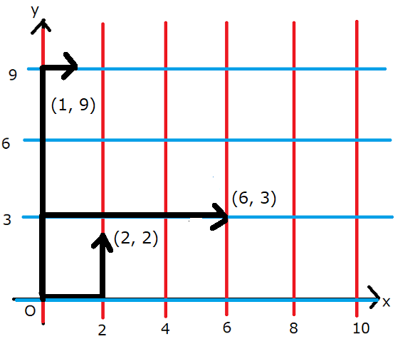

무한한 격자 도시에서 집은 $(0,0)$입니다. 도로는 음이 아닌 정수 $n,m$에 대해 $x=An$, $y=Bm$인 직선뿐입니다. 양의 정수 좌표 $(x,y)$에 카페를 지으려 합니다.

## 문제

$x+y\le N$이고 도로 위만 지나 집에서 도달 가능한 후보지의 개수를 구하세요.

## 입력

```text
$T$
$N\ A\ B$
```

$1\le T\le10^5$, $2\le N\le10^9$, $1\le A,B\le10^9$입니다.

## 출력

각 테스트 케이스의 답을 출력하세요.

## 예제

### 예제 1 {file="01_sample_01.txt"}

#### 입력

```text
5
10 2 3
8 9 10
1200 1 2
31415 92 65
123456789 12345 67890
```

#### 출력

```text
27
0
719400
12841651
729437374182
```

$5$개의 테스트 케이스가 주어집니다.

첫 번째 테스트 케이스에서는 아래 그림처럼 $x=0,x=2,x=4,x=6,\dots$와 $y=0,y=3,y=6,y=9,\dots$인 직선에 도로가 놓여 있습니다.



예를 들어 $(2,2)$, $(6,3)$, $(1,9)$는 집에서의 맨해튼 거리가 $10$ 이하이고, 그림의 경로처럼 도로 위로 이동해 도달할 수 있으므로 카페를 지을 조건을 만족합니다. 다른 후보지도 있으며, 모두 $27$곳입니다.

두 번째 테스트 케이스에서는 카페를 지을 수 있는 좌표가 없으므로 $0$을 출력합니다. 카페의 좌표 $x,y$가 모두 양수여야 한다는 점에 주의하세요.

답이 $32$비트 정수에 들어가지 않을 수도 있습니다.
