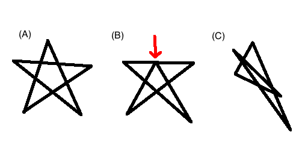

## 문제 설명

$XY$ 좌표 평면 위에 점 $5$개가 주어집니다. 점들을 선으로 연결하여 별을 그릴 수 있는지 판정하세요.

별의 정의는 그림으로 설명되어 있습니다. (A)는 아름다운 별입니다. (B)는 빨간 화살표로 표시된 부분이 나타나지 않으므로 별이 아닙니다. (C)는 상당히 찌그러져 있지만 별입니다. 실루엣으로 보았을 때 뾰족한 부분이 $5$개 있어야 별이라고 생각하면 됩니다.



## 입력

```text
$X_1\ Y_1$
$X_2\ Y_2$
$X_3\ Y_3$
$X_4\ Y_4$
$X_5\ Y_5$
```

- $(X_i,Y_i)$는 $i$번째 점의 정수 좌표이며, 주어지는 $5$개의 점은 서로 다릅니다.
- 점이 주어지는 순서에는 의미가 없습니다.

## 제한

- $-1\,000 \le X_i,Y_i \le 1\,000$

## 출력

점을 연결하여 별을 그릴 수 있으면 `YES`, 그렇지 않으면 `NO`를 $1$줄에 출력하세요. 마지막에 줄바꿈을 출력하세요.

## 예제

### 예제 1 {file=""}

#### 입력

```text
0 1
-1 0
1 0
-1 -1
1 -1
```

#### 출력

```text
YES
```

$(0,1) \to (1,-1) \to (-1,0) \to (1,0) \to (-1,-1) \to (0,1)$ 순서로 선을 연결하면 별을 그릴 수 있습니다.

### 예제 2 {file=""}

#### 입력

```text
0 0
-1 0
1 0
-1 -1
1 -1
```

#### 출력

```text
NO
```

문제 설명의 그림 (B)와 같은 모양이 되어 별을 그릴 수 없습니다.

### 예제 3 {file=""}

#### 입력

```text
-10 10
10 10
0 0
-10 -10
10 -10
```

#### 출력

```text
NO
```

어떤 순서로 점을 연결해도 별을 그릴 수 없습니다.
