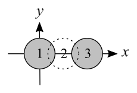
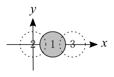
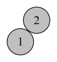

## 이야기

ユキさん은 손에 있는 많은 $1$엔 동전을 $1$개씩 방바닥에 던지며 놀고 있습니다.

## 문제 설명

던진 동전이 바닥에 멈췄을 때 이미 바닥에 있는 동전과 조금이라도 겹치면 다음 동전을 던지기 전에 그 동전을 치웁니다. 겹치지 않으면 그대로 바닥에 남기며, 이후에는 움직이지 않습니다.

ユキさん이 동전을 $N$번 던진 뒤 바닥에 남아 있는 동전 수를 구하세요.

모든 동전은 바닥 또는 바닥의 다른 동전 위에 반드시 눕혀진 상태로 멈춥니다. 동전은 반지름 $10$인 원으로 취급하고 두께는 무시합니다. $2$개의 동전의 원이 정확히 외접하면 서로 겹치지 않은 것으로 간주합니다.

각 동전이 멈췄을 때 원의 중심 위치가 바닥 좌표로 기록되어 있습니다.

## 입력

```text
$N$
$X_1\ Y_1$
$X_2\ Y_2$
$\vdots$
$X_N\ Y_N$
```

$N$은 $1$엔 동전을 던진 횟수입니다. $i$번째로 던진 동전이 멈췄을 때의 중심 좌표는 $(X_i, Y_i)$입니다.

## 제한

- $1 \le N \le 100\,000 = 10^5$
- $0 \le X_i,Y_i \le 20\,000$
- $N,X_i,Y_i$는 정수입니다.

## 출력

동전을 $N$번 던진 뒤 바닥에 남아 있는 동전 수를 출력하세요.

## 예제

### 예제 1 {file=""}

#### 입력

```text
3
0 0
15 0
30 0
```

#### 출력

```text
2
```

$1$번째 동전은 다른 동전과 겹치지 않으므로 반드시 남습니다. $2$번째 동전은 $1$번째 동전과 겹쳐 치워집니다. $3$번째 동전은 다른 동전과 겹치지 않으므로 남습니다. 이미 치운 $2$번째 동전은 관계없습니다. 결국 $1$번째와 $3$번째 동전 $2$개가 남으므로 답은 $2$입니다.



### 예제 2 {file=""}

#### 입력

```text
3
15 0
0 0
30 0
```

#### 출력

```text
1
```

던진 횟수와 위치는 예제 $1$과 같지만 순서가 다르므로 $1$개만 남습니다.



### 예제 3 {file=""}

#### 입력

```text
2
100 100
112 116
```

#### 출력

```text
2
```

$2$개의 동전은 정확히 접하지만 겹치지 않으므로 모두 남습니다.


