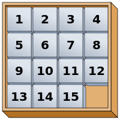

## 문제 설명

ゆきこちゃん은 `15 퍼즐`이라는 퍼즐을 하고 있습니다. 15 퍼즐의 규칙은 다음과 같습니다.

$4 \times 4$ 보드에 $1$부터 $15$까지의 수가 쓰인 타일을 순서대로 배치합니다(아래 그림). 빈칸의 상하좌우에 인접한 타일을 빈칸으로 밀어 넣는 동작을 반복합니다. 목표한 타일 배치를 만들 수 있으면 성공입니다.



ゆきこちゃん은 15 퍼즐을 보통의 방식으로 하는 데 싫증이 났습니다. 그래서 다음 규칙을 추가해 플레이하기로 했습니다.

**규칙: $1$번 밀어 움직인 타일은 다시 밀어 움직일 수 없습니다.**

목표한 타일 배치가 주어질 때 그 배치를 만들 수 있는지 판정하세요.

## 입력

```text
$a_{11}\ a_{12}\ a_{13}\ a_{14}$
$a_{21}\ a_{22}\ a_{23}\ a_{24}$
$a_{31}\ a_{32}\ a_{33}\ a_{34}$
$a_{41}\ a_{42}\ a_{43}\ a_{44}$
```

목표한 타일 배치가 주어집니다. $a_{ij}$는 $i$번째 행, $j$번째 열의 값이며, $0$은 빈칸을 나타냅니다. 예를 들어 초기 배치는 예제 $1$처럼 입력됩니다.

## 제한

$a_{ij}$는 $0$ 이상 $15$ 이하의 서로 다른 정수입니다.

## 출력

목표한 타일 배치를 만들 수 있으면 **`Yes`**를, 만들 수 없으면 **`No`**를 출력하세요. 마지막에 개행을 넣으세요.

## 예제

### 예제 1 {file=""}

#### 입력

```text
1 2 3 4
5 6 7 8
9 10 11 12
13 14 15 0
```

#### 출력

```text
Yes
```

초기 배치가 그대로 목표 배치입니다.

### 예제 2 {file=""}

#### 입력

```text
1 2 3 4
5 6 7 8
9 10 12 0
13 14 11 15
```

#### 출력

```text
Yes
```

### 예제 3 {file=""}

#### 입력

```text
1 2 3 4
5 6 7 8
9 10 12 15
13 14 11 0
```

#### 출력

```text
No
```

목표 배치를 만들려면 $15$번 타일을 최소 $2$번 밀어 움직여야 합니다.
