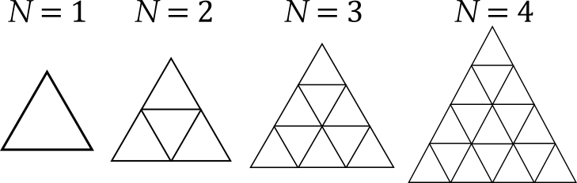

## 이야기

안녕하세요, 선배.

めぐる는 ちょたクエ라는 동인 게임을 하고 있는데, 클리어 후의 추가 던전이 매우 힘듭니다. 친구의 병을 치료하기 위해 사랑스러운 캐릭터 cucumber에게 부탁해 마법소녀가 되어 과제를 수행한다는 이야기인데, 이 과제가 아주 번거롭습니다.

## 문제 설명

과제 미궁의 $N$층은 $N$단의 삼각형으로 이루어진 모양입니다. 말로만 해서는 잘 모르시겠지요. 간단히 그리면 다음과 같습니다.



이 미궁의 $N$층에서 정해진 경로를 지나면 다음 층으로 가는 계단이 나타납니다. 하지만 정해진 경로에 대한 힌트가 전혀 없어서 모든 경로를 시험해야 합니다. 지금까지의 경향으로 보아 정해진 경로는 단순 다각형으로 이루어진 경로입니다. 단순 다각형은 변이 서로 교차하지 않는 다각형입니다. [ARC037D](http://arc037.contest.atcoder.jp/tasks/arc037_d)를 참고하면 단순 다각형을 이해하는 데 도움이 됩니다.

대체 몇 개의 경로를 시험해야 하는지 구하세요.

## 입력

```text
$N$
```

## 제한

- $1 \leq N \leq 12$

## 출력

$N$층의 경로 수를 출력하세요. 경로는 어디에서 시작하든 처음 위치로 돌아오면 되므로, 단순 다각형의 수와 같습니다.

## 예제

### 예제 1 {file=""}

#### 입력

```text
1
```

#### 출력

```text
1
```

### 예제 2 {file=""}

#### 입력

```text
2
```

#### 출력

```text
11
```

[ARC037D](http://arc037.contest.atcoder.jp/tasks/arc037_d)의 예제 $1$과 같은 문제일까요?

### 예제 3 {file=""}

#### 입력

```text
5
```

#### 출력

```text
128967
```
