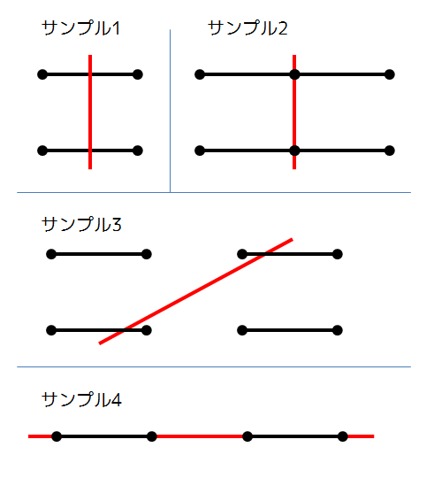

## 문제 설명

평면 위에 선분이 $N$개 있습니다. 여기에 원하는 직선 $1$개를 그을 수 있을 때, 최대 몇 개의 선분과 교차하도록 할 수 있는지 구하세요.

이 문제에서 직선과 선분이 교차한다는 것은 $2$개의 도형에 공통으로 포함되는 점(끝점을 포함)이 $1$개 이상 존재한다는 뜻입니다.

## 입력

```text
$N$
$a_1\ b_1\ c_1\ d_1$
$\vdots$
$a_N\ b_N\ c_N\ d_N$
```

$1$번째 줄에 $N$이 주어집니다. $i+1$번째 줄에는 $i$번째 선분의 끝점 $(a_i,b_i)$, $(c_i,d_i)$가 주어집니다.

## 제한

- 모든 입력은 정수입니다.
- $1 \leq N \leq 100$
- $|a_i|,|b_i|,|c_i|,|d_i| \leq 100$
- $(a_i,b_i) \ne (c_i,d_i)$
- $i \ne j$이면 $(a_i,b_i,c_i,d_i) \ne (a_j,b_j,c_j,d_j)$이고 $(c_j,d_j,a_j,b_j)$와도 다릅니다.

## 출력

정답을 $1$줄에 출력하고 마지막에 개행을 넣으세요.

## 예제



그림의 「サンプル1」, 「サンプル2」, 「サンプル3」, 「サンプル4」는 각각 예제 $1$, 예제 $2$, 예제 $3$, 예제 $4$를 뜻합니다.

### 예제 1 {file=""}

#### 입력

```text
2
0 0 1 0
0 1 1 1
```

#### 출력

```text
2
```

### 예제 2 {file=""}

#### 입력

```text
4
0 0 1 0
1 0 2 0
0 1 1 1
1 1 2 1
```

#### 출력

```text
4
```

### 예제 3 {file=""}

#### 입력

```text
4
0 0 1 0
2 0 3 0
0 1 1 1
2 1 3 1
```

#### 출력

```text
2
```

### 예제 4 {file=""}

#### 입력

```text
2
0 0 1 0
2 0 3 0
```

#### 출력

```text
2
```
