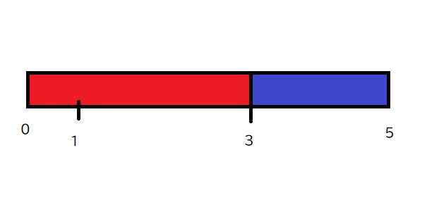
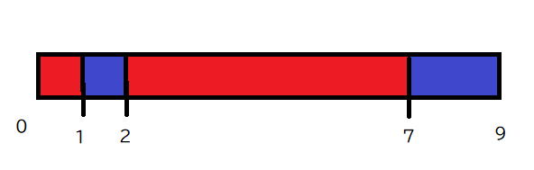

길이 $L$인 양갱에 $N$개의 절단선이 있습니다. 홀수 개 $k$개의 절단선을 골라 양갱을 $k+1$개의 조각으로 나누고, 홀수 번호 조각은 A가, 짝수 번호 조각은 B가 가집니다. $\lvert A-B\rvert$의 최솟값을 구하세요.

## 조건

- $2\le L\le10^5$, $1\le N\le100$
- $0<X_1<\cdots<X_N<L$

## 입력

```text
L N
X1 X2 ... XN
```

## 출력

$\lvert A-B\rvert$의 최솟값을 출력하세요.

## 예제

### 예제 1 {file="01_sample_01.txt"}

#### 입력

```text
5 2
1 3
```

#### 출력

```text
1
```



길이 $5$인 양갱의 왼쪽에서 $1,3$인 지점에 절단선이 있습니다. 두 번째 절단선에서 자르면 길이 $3,2$로 나뉩니다.

A씨는 길이 $3$인 조각 $1$을, B씨는 길이 $2$인 조각 $2$를 얻으므로 $\lvert A-B\rvert=1$입니다. 이보다 작게 만들 수 없으므로 답은 $1$입니다.

### 예제 2 {file="01_sample_02.txt"}

#### 입력

```text
9 3
1 2 7
```

#### 출력

```text
3
```



길이 $9$인 양갱의 왼쪽에서 $1,2,7$인 지점에 절단선이 있습니다. 모든 절단선에서 자르면 길이 $1,1,5,2$인 $4$개 조각으로 나뉩니다.

A씨는 조각 $1,3$을, B씨는 조각 $2,4$를 가져갑니다. 따라서 $\lvert A-B\rvert=\lvert6-3\rvert=3$입니다. 이보다 작게 만들 수 없으므로 답은 $3$입니다.

### 예제 3 {file="01_sample_03.txt"}

#### 입력

```text
2 1
1
```

#### 출력

```text
0
```

### 예제 4 {file="01_sample_04.txt"}

#### 입력

```text
100000 30
3094 4822 5682 6189 6494 6505 8276 8758 9856 11633 14312 16150 16304 20183 22646 23645 24327 25607 26464 32214 32407 33177 39608 41552 42802 44344 44706 45451 49184 97259
```

#### 출력

```text
1632
```
