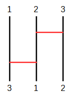
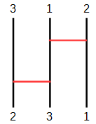
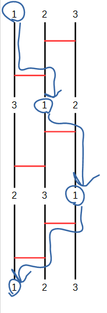

이 문제는 [No.101 빙글빙글! 사다리타기!](http://yukicoder.me/problems/213)의 속편입니다. 아직 풀지 않았다면 먼저 No.101을 푸는 것이 좋을 수 있습니다.

## 문제 설명

太郎君은 다시 수열 $1,2,\ldots,N$을 [사다리타기](http://ja.wikipedia.org/wiki/%E3%81%82%E3%81%BF%E3%81%A0%E3%81%8F%E3%81%98)로 섞으며 놀고 있습니다. 예전에는 같은 사다리타기를 몇 번 섞어야 원래 수열로 돌아오는지 궁금했지만, 이제는 같은 사다리타기를 몇 번 섞어야 어떤 수열을 만들 수 있는지 궁금해졌습니다.

예를 들어 다음 사다리타기는 수열 $1,2,3$을 $3,1,2$로 섞습니다.



이 사다리타기를 반복해서 사용하면 $1,2,3 \to 3,1,2 \to 2,3,1$이 됩니다.




$2$번 섞어서 $2,3,1$을 만들 수 있습니다.

주어진 $1$개의 사다리타기와 만들고 싶은 $Q$개의 수열에 대해, 각각 최소 몇 번 반복해야 하는지 출력하세요. 아무리 반복해도 만들 수 없는 수열이면 $-1$을 출력하세요. 단, 최소 $1$번은 섞어야 합니다.

## 입력

사다리타기는 세로선 $N$개와 세로선에 수직인 가로 막대 $K$개로 이루어집니다. $K$개의 가로 막대는 모두 서로 다른 높이에 있고, 위에서 $k$번째 가로 막대는 왼쪽에서 $X_k$번째 세로선과 $Y_k$번째 세로선을 연결합니다.

수열의 $i$번째 수는 사다리타기의 왼쪽에서 $i$번째 세로선을 위에서 아래로 따라가며 얻습니다. 도중에 가로 막대와 만나면 연결된 다른 세로선으로 이동해 계속 아래로 내려갑니다. 세로선의 맨 아래에 도착했을 때 왼쪽에서 $j$번째 세로선에 있었다면 그 수는 섞인 수열의 $j$번째 수가 됩니다.

```text
$N$
$K$
$X_1\ Y_1$
$\vdots$
$X_K\ Y_K$
$Q$
$A_{11}\ \dots\ A_{1N}$
$\vdots$
$A_{Q1}\ \dots\ A_{QN}$
```

$1$번째 줄에 세로선 수 $N$, $2$번째 줄에 가로 막대 수 $K$가 주어집니다. 다음 $K$개 줄에 가로 막대 정보가 주어지고, 그다음 줄에 만들고 싶은 수열의 수 $Q$가 주어집니다. 이어지는 $Q$개 줄에 각 목표 수열 $A_i$의 원소 $A_{ij}$가 공백으로 구분되어 주어집니다.

모든 입력은 정수입니다.

## 제한

- $2 \leq N \leq 100$
- $0 \leq K \leq 1\,000$
- $1 \leq X_i\lt Y_i\leq N$
- $X_i+1=Y_i$
- $1 \leq Q \leq 10$
- $A_i$는 $1,2,\ldots,N$의 순열입니다.

## 출력

```text
$S_1$
$\vdots$
$S_Q$
```

$i$번째 줄에 $1,2,\ldots,N$을 $A_i$로 만들기 위해 필요한 최소 섞기 횟수 $S_i$를 출력하세요. 아무리 섞어도 만들 수 없으면 $-1$을 출력하세요.

## 예제

### 예제 1 {file=""}

#### 입력

```text
3
2
2 3
1 2
4
1 3 2
3 1 2
2 3 1
1 2 3
```

#### 출력

```text
-1
1
2
3
```

$1,3,2$는 아무리 섞어도 만들 수 없습니다. 또한 최소 $1$번은 섞어야 하므로 $1,2,3$을 만들려면 $3$번 섞어야 합니다.



### 예제 2 {file=""}

#### 입력

```text
5
5
1 2
3 4
2 3
1 2
3 4
3
4 2 3 1 5
1 2 3 4 5
4 2 3 5 1
```

#### 출력

```text
1
2
-1
```

### 예제 3 {file=""}

#### 입력

```text
4
6
1 2
2 3
3 4
3 4
2 3
1 2
2
1 2 3 4
2 3 4 1
```

#### 출력

```text
1
-1
```
