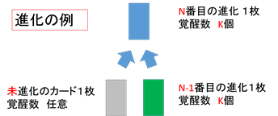
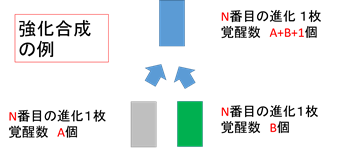

## 이야기

P君은 소셜 게임을 하고 있습니다. 카드의 강화와 진화에 관한 문제입니다.

## 문제 설명

어떤 캐릭터의 카드는 최종 형태가 될 때까지 $N$번 진화합니다. 진화시키려는 카드에 재료를 [진화 합성]하면 진화합니다. $1$번 진화하는 데 필요한 재료는 그 캐릭터의 **미진화 형태 카드** $1$장입니다.

카드에는 잠재 능력이 있고, $k$번째 진화 상태 카드의 잠재 능력 수는 $S_k$개입니다. **같은 진화 상태의 카드**를 재료로 [강화 합성]하면 잠재 능력을 [각성]시킬 수 있습니다. 새로 각성하는 잠재 능력 수는 재료 카드가 현재 각성한 잠재 능력 수의 합에 $1$을 더한 값입니다. 단, 강화 합성 결과 각성 수가 그 형태에서 각성할 수 있는 최대 수를 넘으면 최대 수로 제한됩니다.

진화할 때는 진화하는 카드의 각성 수를 늘리거나 줄이지 않고 $1$단계 위 형태로 만듭니다. 진화 재료로 사용하는 카드가 잠재 능력을 각성하고 있어도 [진화 합성]에서는 새로운 각성이 일어나지 않습니다.

게임에서 얻을 수 있는 카드는 잠재 능력이 $1$개도 각성되지 않은 미진화 카드뿐이라고 할 때, 최종 형태 카드를 만들기 위해 필요한 카드의 최소 수를 최종 형태의 각성 수별로 구하세요.



그림의 「진화의 예」: 미진화 카드 $1$장(각성 수 임의)과 $N-1$번째 진화 카드 $1$장(각성 수 $K$개)으로 $N$번째 진화 카드 $1$장(각성 수 $K$개)을 만듭니다.



그림의 「강화 합성의 예」: $N$번째 진화 카드 $1$장(각성 수 $A$개)과 같은 진화 카드 $1$장(각성 수 $B$개)으로 $N$번째 진화 카드 $1$장(각성 수 $A+B+1$개)을 만듭니다.

## 입력

```text
$N$
$S_0\ S_1\ \cdots\ S_N$
```

$N$과 $S_k$ ($0 \leq k \leq N$)는 음이 아닌 정수입니다.

## 제한

- $0 \leq N \leq 10$
- $0 \leq S_0 \leq S_1 \leq \cdots \leq S_N \leq 10$

## 출력

최종 상태를 만들기 위해 필요한 카드 수를 잠재 능력 미각성부터 완전 각성까지, 즉 각성 수가 $0$부터 $S_N$까지 증가하는 순서로 공백 구분해 출력하세요. 마지막 숫자 뒤에는 공백을 붙이지 말고 개행을 넣으세요.

## 예제

### 예제 1 {file=""}

#### 입력

```text
3
1 3 6 9
```

#### 출력

```text
4 5 7 8 11 12 14 16 19 20
```

예를 들어 출력의 $5$번째 값 $11$을 설명하겠습니다. 카드 $11$장으로 잠재 능력 $4$개가 각성된 최종 형태 카드를 만들 수 있습니다.

1. 미진화·미각성 카드를 강화해 미진화·$1$각성 카드로 만든 뒤 진화해 $2$번째 형태·$1$각성 카드로 만듭니다. $3$장씩 $2$세트가 필요합니다.
2. 별도의 미진화·미각성 카드를 진화해 $2$번째 형태·미각성 카드로 만듭니다. $2$장이 필요합니다.
3. $1$번의 $1$세트와 $2$번의 카드를 강화해 $2$번째 형태·$2$각성 카드로 만든 뒤 진화해 $3$번째 형태·$2$각성 카드로 만듭니다. 추가로 $1$장이 필요합니다.
4. $1$번의 남은 $1$세트를 진화해 $3$번째 형태·$1$각성 카드로 만듭니다. 추가로 $1$장이 필요합니다.
5. $3$번과 $4$번의 카드를 강화해 $3$번째 형태·$4$각성 카드로 만든 뒤 진화해 최종 형태·$4$각성 카드로 만듭니다. 추가로 $1$장이 필요합니다.

총 $3\times2+2+1+1+1=11$장입니다.

### 예제 2 {file=""}

#### 입력

```text
3
0 0 0 0
```

#### 출력

```text
4
```

### 예제 3 {file=""}

#### 입력

```text
4
0 0 0 0 10
```

#### 출력

```text
5 10 15 20 25 30 35 40 45 50 55
```
