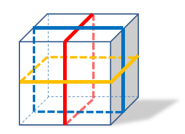

## 이야기

yuki君은 친구에게 줄 선물이 들어 있는 상자를 리본으로 포장하려고 합니다. 선물이 매우 무거우므로 만일을 대비해 상자에 리본을 여러 바퀴 감으려고 합니다.

## 문제 설명

yuki君은 직육면체 상자를 다음과 같이 포장합니다.

빨간 리본은 상자의 윗면, 뒷면, 아랫면, 앞면의 $4$개 면을 둘러싸도록 $R$바퀴 감습니다.

파란 리본은 윗면, 왼쪽 면, 아랫면, 오른쪽 면의 $4$개 면을 둘러싸도록 $B$바퀴 감습니다.

노란 리본은 앞면, 오른쪽 면, 뒷면, 왼쪽 면의 $4$개 면을 둘러싸도록 $Y$바퀴 감습니다.

각 리본은 직육면체의 모서리 중점들을 지나며, 처지지 않습니다. 리본의 두께는 무시할 수 있습니다. 아래 그림은 포장의 예입니다.



상자의 방향은 자유롭게 회전할 수 있다고 할 때, $3$색 리본의 전체 길이의 최솟값을 구하세요.

## 입력

입력은 다음 형식으로 주어집니다.

```text
$L_1\ L_2\ L_3$
$R\ B\ Y$
```

$1$번째 줄에 상자의 $3$개 변의 길이 $L_1,L_2,L_3$가 주어집니다.

$2$번째 줄에 빨간색, 파란색, 노란색 리본을 감는 횟수 $R,B,Y$가 주어집니다.

## 제한

- $1 \le L_1,L_2,L_3 \le 100$
- $0 \le R,B,Y \le 100$
- 모든 입력은 정수입니다.

## 출력

$3$색 리본의 전체 길이의 최솟값을 $1$줄로 출력하세요.

## 예제

### 예제 1 {file=""}

#### 입력

```text
3 4 5
1 1 2
```

#### 출력

```text
62
```

$4\times5$인 면을 앞쪽으로 두면 됩니다.

### 예제 2 {file=""}

#### 입력

```text
10 10 10
5 0 3
```

#### 출력

```text
320
```

$3$가지 색상의 리본을 모두 사용해야 하는 것은 아닙니다.

### 예제 3 {file=""}

#### 입력

```text
56 34 12
7 8 9
```

#### 출력

```text
3176
```

