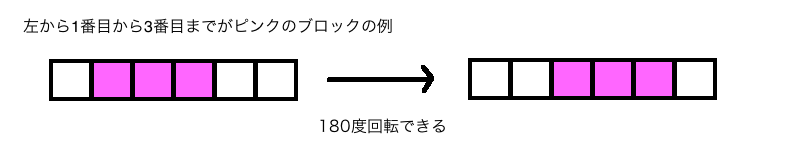
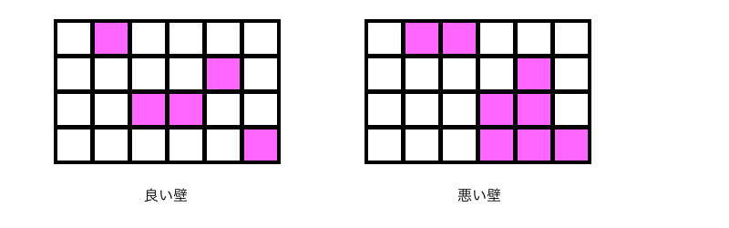

## 문제 설명

$1\times1$ 블록이 가로로 $M$개 이어진 $1\times M$ 블록이 있습니다.

블록은 기본적으로 흰색이지만, 왼쪽에서 $L$번째부터 왼쪽에서 $R$번째까지($0$부터 셉니다)의 연속한 블록은 분홍색입니다.

블록은 $180$도 회전할 수 있지만 $90$도 회전할 수는 없습니다.

다음 그림과 같습니다.



왼쪽에서 $1$번째부터 $3$번째까지 분홍색인 블록의 예입니다. $180$도 회전할 수 있습니다.

가로 길이가 같은 $1\times M$ 블록 $N$개가 주어집니다. 각 블록에는 분홍색인 연속 영역이 정확히 $1$개씩 있습니다.

이 $N$개의 블록을 위로 쌓아 좋은 벽을 만들려고 합니다. 좋은 벽이란 벽을 세로 열 방향에서 보았을 때 분홍색 블록이 $1$개 이하인 벽입니다.

예를 들어 $1\times6$ 블록 $4$개를 쌓았을 때 좋은 벽과 나쁜 벽의 예가 있습니다.



왼쪽의 좋은 벽은 각 세로 열에 분홍색 블록이 없거나 $1$개 있습니다. 반면 오른쪽의 나쁜 벽은 분홍색 블록이 $2$개 이상인 세로 열이 있습니다.

각 블록은 원하는 만큼 $180$도 회전할 수 있습니다. 주어진 $N$개의 블록을 모두 쌓아 좋은 벽을 만들 수 있는지 판정하세요.

## 입력

```text
$N\ M$
$L_0\ R_0$
$L_1\ R_1$
$\vdots$
$L_{N-1}\ R_{N-1}$
```

$N$은 $1\times M$ 블록의 개수입니다.

$M$은 블록 $1$개를 구성하는 가로 방향 블록의 개수입니다.

$L_i$는 $i$번째 블록에서 분홍색 영역의 가장 왼쪽 블록 위치이고, $R_i$는 가장 오른쪽 블록 위치입니다. 위치는 $0$부터 셉니다.

## 제한

- $2 \le N \le 2\,000$
- $2 \le M \le 4\,000$
- $0 \le L_i \le R_i \le M-1$

## 출력

좋은 벽을 만들 수 있으면 `YES`, 만들 수 없으면 `NO`를 $1$줄에 출력하세요.

마지막에 개행을 출력하세요.

## 예제

### 예제 1 {file=""}

#### 입력

```text
4 6
5 5
2 3
4 4
1 1
```

#### 출력

```text
YES
```

문제 설명에 나온 좋은 벽의 예와 같습니다. 어떤 블록도 $180$도 회전하지 않고 쌓으면 좋은 벽이 됩니다. $0$번째 블록을 $180$도 회전해도 여전히 좋은 벽입니다.

### 예제 2 {file=""}

#### 입력

```text
4 6
3 5
3 4
4 4
1 2
```

#### 출력

```text
NO
```

문제 설명에 나온 나쁜 벽의 예와 같습니다. $180$도 회전을 어떻게 사용해도 좋은 벽을 만들 수 없습니다.

### 예제 3 {file=""}

#### 입력

```text
2 4
0 1
0 1
```

#### 출력

```text
YES
```

$2$개 블록 중 $1$개를 $180$도 회전해 쌓으면 좋은 벽이 됩니다.

### 예제 4 {file=""}

#### 입력

```text
5 10
8 8
0 0
2 4
2 3
8 8
```

#### 출력

```text
YES
```

좋은 벽을 만들 수 있습니다.

