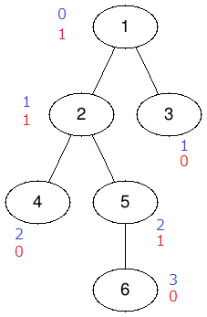
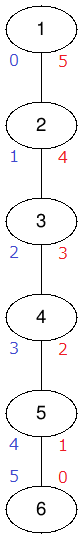

## 문제 설명

$N$개의 정점을 가진 트리가 주어집니다. 각 정점에는 $1$부터 $N$까지의 번호가 중복 없이 부여되어 있고, 정점 $1$이 트리의 루트입니다.

정점 $i$에 대해 루트에서의 거리를 $R_i$, 가장 가까운 리프까지의 거리를 $L_i$라고 합니다. 정점 번호 순서대로 $\min(R_i,L_i)$를 출력하세요.

정점 $u$에서 정점 $v$로 이동할 때 지나야 하는 최소 간선 수를 정점 $u$에서 $v$까지의 거리(정점 $v$에서 $u$까지의 거리)로 정의합니다.

## 입력

```text
$N$
$x_1\ y_1$
$\vdots$
$x_{N-1}\ y_{N-1}$
```

$1$번째 줄에 정점 수 $N$이 주어집니다. $2$번째 줄부터 $N-1$개의 줄에 간선 정보가 공백으로 주어집니다. $i$번째 간선은 정점 $x_i$와 정점 $y_i$를 연결합니다.

입력은 모두 정수입니다.

## 제한

- $2 \le N \le 10^5$
- $1 \le x_i < y_i \le N$
- $i\ne j$일 때 $x_i\ne x_j$ 또는 $y_i\ne y_j$임이 보장됩니다.

즉, 다중 간선이나 자기 루프가 없고 트리는 연결되어 있습니다.

## 출력

```text
$\min(R_1,L_1)$
$\vdots$
$\min(R_N,L_N)$
```

$N$개의 줄에 걸쳐 출력하세요. $i$번째 줄에는 $\min(R_i,L_i)$를 출력합니다.

## 예제

### 예제 1 {file=""}

#### 입력

```text
6
1 2
1 3
2 4
2 5
5 6
```

#### 출력

```text
0
1
0
0
1
0
```

$R_i$를 파란색, $L_i$를 빨간색으로 표시한 예입니다.



### 예제 2 {file=""}

#### 입력

```text
6
1 2
2 3
3 4
4 5
5 6
```

#### 출력

```text
0
1
2
2
1
0
```


