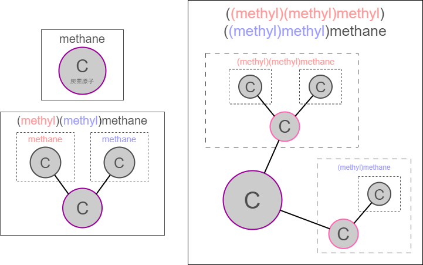
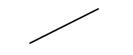
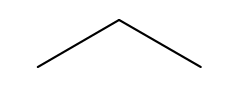
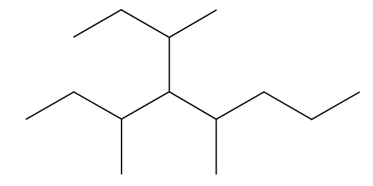

## 문제 설명

> 이 문제는 픽션입니다. 현대의 화학과는 큰 차이가 있습니다.

**탄소 원자**는 자신을 제외한 탄소 원자와 최대 $4$개까지 (직접) **결합**할 수 있습니다.

$1$개 이상의 탄소 원자가 서로 결합한 것을 **탄화수소**라고 합니다.

또한 모든 탄화수소는 **이름**인 문자열과, 정확히 $1$개의 **루트**인 탄소 원자를 각각 가집니다.

**알케인**은 다음 규칙에 따라 재귀적으로 구성되는 탄화수소입니다.

- 각 알케인의 루트에 (직접) 결합한 탄소 원자의 수가 $4$개 미만인, 서로 다른 알케인 최대 $4$개로 이루어진 집합 $S$에 대해, 공통의 새 탄소 원자 $X$를 추가하고 $S$에 속하는 각 알케인의 루트에 $X$를 결합해 얻은 탄화수소를 다음과 같이 구성합니다.
  - $S$에 속하는 각 알케인의 이름에서 끝의 `ane`를 제거하고, 앞에 `(`, 뒤에 `yl)`을 붙여 얻은 문자열들로 이루어진 다중 집합을 $P$라고 합니다.
  - $P$에 속하는 모든 문자열을 임의의 순서로 이어 붙여 얻은 문자열을 $p$라고 할 때, 이름은 $p$의 끝에 `methane`을 이어 붙인 문자열입니다.
  - 루트는 새로 추가한 탄소 원자 $X$입니다.
- 특히 $S = \emptyset$인 경우, $1$개의 탄소 원자 $X$만으로 이루어진 탄화수소이며 이름은 `methane`, 루트는 탄소 원자 $X$ 자신입니다.

$N$개의 서로 다른 탄소 원자, 즉 탄소 원자 $1,2,\dots,N$으로 이루어진 $1$개의 알케인이 주어집니다.

이 알케인의 이름을 구하세요.

구성 절차에 따라 이름이 여러 개일 수 있지만, 그중 $1$개를 출력하면 됩니다.

탄소 원자가 루트인지 여부는 겉보기만으로 구별할 수 없습니다.

따라서 어느 탄소 원자가 루트인지는 주어지지 않으며, 여러분이 자유롭게 $1$개를 선택해도 됩니다.



그림의 `炭素原子`는 탄소 원자를 뜻합니다.

### 보조 도구

<https://openmolecules.org/name2structure.html> 페이지에 이름을 입력하면 해당 이름의 알케인 구조식을 그릴 수 있습니다. 외부 사이트입니다.

## 입력

입력은 표준 입력으로 다음 형식으로 주어집니다.

```text
$N$
$C_{1,1}\ C_{1,2}\ C_{1,3}\ C_{1,4}$
$C_{2,1}\ C_{2,2}\ C_{2,3}\ C_{2,4}$
$\vdots$
$C_{N,1}\ C_{N,2}\ C_{N,3}\ C_{N,4}$
```

다중 집합 $L_i \coloneqq \{\!\!\{\, C_{i, 1}, C_{i, 2}, C_{i, 3}, C_{i, 4} \,\}\!\!\} \scriptsize \; (1 \leq i \leq N)$를 정의합니다.

서로 다른 $2$개의 탄소 원자 $i,j$($i \ne j$)가 서로 (직접) 결합하는 경우, 그리고 그 경우에만 $i \in L_j$가 성립합니다.

다음 조건을 전부 만족하는 것이 보장됩니다.

- $C_{i, j} \in \{\, 1, 2, \dots, N,$ `H` $\,\} \scriptsize \; (1 \leq i \leq N \land 1 \leq j \leq 4)$
- $i \notin L_i$($1 \leq i \leq N$)
- $i \in L_j \Leftrightarrow j \in L_i$($1 \leq i,j \leq N$)
- 각 $L_i$($1 \leq i \leq N$)에서 `H` 이외의 값은 중복되지 않습니다.
- 이 탄소 원자들로 이루어진 탄화수소는 알케인입니다.

*표현은 콘테스트 후에 수정되었습니다.*

## 제한

- $1 \leq N \leq 2 \times 10^5$
- $N$은 정수입니다.
- $N$개의 탄소 원자 모두로 이루어진 알케인이 정확히 $1$개 주어집니다.

## 출력

답을 표준 출력으로 $1$줄에 출력하세요.

## 예제

### 예제 1 {file="00_sample0000.txt"}

#### 입력

```text
2
2 H H H
1 H H H
```

#### 출력

```text
(methyl)methane
```

`ethane`이 아닙니다.



### 예제 2 {file="00_sample0001.txt"}

#### 입력

```text
3
2 H H H
1 3 H H
2 H H H
```

#### 출력

```text
(methyl)(methyl)methane
```

`((methyl)methyl)methane`도 정답입니다.



### 예제 3 {file="00_sample0002.txt"}

#### 입력

```text
6
2 3 4 5
1 H H H
1 H H H
1 H H H
1 6 H H
5 H H H
```

#### 출력

```text
(((methyl)(methyl)(methyl)methyl)methyl)methane
```


### 예제 4 {file="00_sample0003.txt"}

#### 입력

```text
14
2 H H H
1 3 H H
2 4 5 H
3 H H H
3 H 9 6
H 5 8 7
H H 6 H
11 H 6 H
5 10 12 H
H 9 H H
8 14 H H
13 9 H H
12 H H H
H 11 H H
```

#### 출력

```text
((methyl)methyl)(((((methyl)methyl)(methyl)methyl)((methyl)((methyl)methyl)methyl)methyl)(methyl)methyl)methane
```


