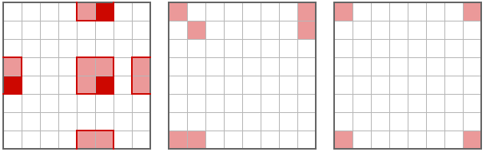

## 문제 설명

세로와 가로가 각각 $N$칸인, 총 $N^2$칸으로 이루어진 격자가 있습니다.

$2$개의 정수 $r$, $c$에 대해 칸 $(r,c)$는 위에서 $r \bmod N$번째 행, 왼쪽에서 $c \bmod N$번째 열의 칸입니다.

여기서 $x \bmod N$은 $x=Nq+r$를 만족하는 정수 $q$가 존재하고, $0 \leq r<N$을 만족하는 유일한 정수 $r$입니다. ($x \in \mathbb{Z}$)

처음에 칸 $(r,c)$ ($0 \leq r,c<N$)은 $S_{r+1,c+1}=$ `.`이면 **흰색**, $S_{r+1,c+1}=$ `#`이면 **검은색**으로 칠해져 있습니다.

**작업**과 **행동**이 각각 $N^2$종류씩 있습니다. 작업 $(r,c)$와 행동 $(r,c)$는 모두 $0 \leq r,c<N$의 범위에서 구별합니다.

작업 $(r,c)$는 $4$개의 칸 $(r,c),(r-1,c),(r,c-1),(r-1,c-1)$의 색을 순서대로 반전합니다. **검은색**은 **흰색**으로, **흰색**은 **검은색**으로 바꿉니다. $N$에 따라 같은 칸의 색이 여러 번 반전될 수 있습니다.

행동 $(r,c)$는 $3$개의 작업, 작업 $(r,c),(r,0),(0,c)$을 순서대로 수행합니다. $r,c$에 따라 같은 작업이 여러 번 수행될 수 있습니다.

uni くん은 **행동**을 자유로운 순서로 총 $0$회 이상 $N^2$회 이하 수행할 수 있습니다. 모든 칸을 **흰색**으로 만들 수 있는지 판정하고, 가능하면 행동 순서 $1$개를 구하세요.

$N=8$인 경우의 예:



왼쪽부터 행동 $(4,5)$, $(1,1)$, $(0,5)$에 의해 (홀수 번) 반전되는 칸을 나타냅니다.

## 입력

입력은 다음 형식으로 주어집니다.

```text
$N$
$S_{1,1}S_{1,2}\dots S_{1,N}$
$S_{2,1}S_{2,2}\dots S_{2,N}$
$\vdots$
$S_{N,1}S_{N,2}\dots S_{N,N}$
```

## 제한

- $1 \leq N \leq 10^3$
- $N$은 정수입니다.
- $S_{i,j}\in\{$ `.` , `#` $\}\scriptsize\;(1\leq i,j\leq N)$

## 출력

목표를 달성할 수 없다면 $-1$을 $1$줄에 출력하세요.

목표를 달성할 수 있다면 답이 되는 절차의 길이(행동 횟수)를 $T$ ($0 \leq T \leq N^2$)라 합니다. $i$ ($1 \leq i \leq T$)번째 행동이 행동 $(R_i,C_i)$ ($0 \leq R_i,C_i<N$)가 되도록 하는 $T$개의 정수쌍을 $T$와 함께 다음 형식으로 출력하세요.

```text
$T$
$R_1\ C_1$
$R_2\ C_2$
$\vdots$
$R_T\ C_T$
```

## 예제

### 예제 1 {file=""}

#### 입력

```text
7
..#.#..
.......
#.##..#
..#.#..
#..##.#
.......
..#.#..
```

#### 출력

```text
2
3 3
4 4
```

처음에 행동 $(3,3)$을 수행하면 격자는 다음과 같이 됩니다.

```text
...##..
.......
.......
#..##.#
#..##.#
.......
...##..
```

다음으로 행동 $(4,4)$를 수행하면 격자는 다음과 같이 됩니다.

```text
.......
.......
.......
.......
.......
.......
.......
```

### 예제 2 {file=""}

#### 입력

```text
5
#...#
.#..#
.....
.....
##...
```

#### 출력

```text
1
1 1
```

### 예제 3 {file=""}

#### 입력

```text
6
#.##.#
...#.#
.####.
##..##
##..##
##.##.
```

#### 출력

```text
8
1 5
4 3
0 0
2 4
4 4
0 2
3 2
5 2
```

### 예제 4 {file=""}

#### 입력

```text
3
###
#.#
###
```

#### 출력

```text
-1
```
