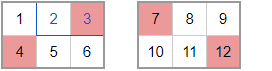
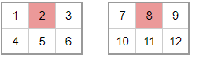
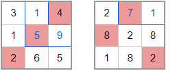

## 문제 설명

격자 $A$, $B$가 있습니다. $2$개의 격자는 모두 세로 $H$칸, 가로 $W$칸, 총 $HW$칸으로 이루어져 있습니다.

$A$, $B$의 위에서 $i$번째($1 \leq i \leq H$) 행, 왼쪽에서 $j$번째($1 \leq j \leq W$) 열에 있는 칸에는 각각 정수 $A_{i,j}$, $B_{i,j}$가 쓰여 있습니다.

이 $2$개의 격자에서 $1$개 이상의 칸을 색칠합니다.

다음 조건을 모두 만족하는 색칠을 **좋은 색칠**이라고 합니다.

- $A$, $B$ 각각에 대해 모든 행에 색칠된 칸이 **최대** $1$개 있습니다.
- $A$, $B$ 각각에 대해 모든 열에 색칠된 칸이 **최대** $1$개 있습니다.
- $A$에서 색칠된 칸이 존재하는 행 번호의 집합과 $B$에서 색칠된 칸이 존재하는 행 번호의 집합이 같습니다.
- $A$에서 색칠된 칸이 존재하는 열 번호의 집합과 $B$에서 색칠된 칸이 존재하는 열 번호의 집합이 같습니다.

여기서 $i$번째 행의 번호는 $i$이고, $j$번째 열의 번호는 $j$입니다.

색칠된 격자 $X$의 **점수** $f(X)$를 다음과 같이 계산합니다.

1. 색칠된 모든 칸에 대해, 임의의 순서로 다음 연산을 정확히 $1$번씩 수행합니다. 결과는 순서에 의존하지 않습니다.
   - 해당 칸보다 엄격하게 오른쪽 위에 있는 모든 칸에 쓰인 수 $x$를 $-x$로 바꿉니다.
2. 그 후 색칠된 모든 칸에 쓰인 수의 총곱을 구하고, 이를 $f(X)$로 정의합니다.

모든 좋은 색칠에 대해 $f(A) \times f(B)$의 합을 구하세요.

답의 절댓값이 커질 수 있으므로, $998\,244\,353$으로 나눈 나머지를 출력하세요.

2024.07.26 21:41에 다음 문장이 정정되었습니다. $A$의 색칠된 칸 집합이 다르거나 $B$의 색칠된 칸 집합이 다를 때, 그리고 그럴 때에만 색칠 방법이 다릅니다.

## 입력

입력은 다음 형식으로 표준 입력에서 주어집니다.

```text
$H\ W$
$A_{1,1}\ A_{1,2}\ \cdots\ A_{1,W}$
$A_{2,1}\ A_{2,2}\ \cdots\ A_{2,W}$
$\vdots$
$A_{H,1}\ A_{H,2}\ \cdots\ A_{H,W}$
$B_{1,1}\ B_{1,2}\ \cdots\ B_{1,W}$
$B_{2,1}\ B_{2,2}\ \cdots\ B_{2,W}$
$\vdots$
$B_{H,1}\ B_{H,2}\ \cdots\ B_{H,W}$
```

## 제한

- $1 \leq H \leq 100$
- $1 \leq W \leq 2\,000$
- $0 \leq A_{i,j} < 998\,244\,353$ ($1 \leq i \leq H$ 및 $1 \leq j \leq W$)
- $0 \leq B_{i,j} < 998\,244\,353$ ($1 \leq i \leq H$ 및 $1 \leq j \leq W$)
- 입력은 모두 정수입니다.

## 출력

답을 구하고, $998\,244\,353$으로 나눈 나머지를 표준 출력에 $1$줄로 출력하세요.

여기서 $x$를 $998\,244\,353$으로 나눈 나머지란, $x = 998\,244\,353 \times q + r$인 정수 $q$가 존재하고 $0 \leq r < 998\,244\,353$를 만족하는 유일한 정수 $r$을 뜻합니다.

## 예제

### 예제 1 {file="00_sample0000.txt"}

#### 입력

```text
2 3
1 2 3
4 5 6
7 8 9
10 11 12
```

#### 출력

```text
271
```

좋은 색칠은 총 $18$가지입니다. 각 색칠에 대해 얻는 $f(A) \times f(B)$의 값을 절댓값이 작은 순서로 나열하면 $7, 16, 27, 40, 55, 72, 385, -400, 504, -540, -616, 640, -1\,008, 1\,080, 1\,152, -1\,188, -1\,440, 1\,485$가 됩니다.

이 값들의 합은 $271$입니다.

$f(A) \times f(B)$의 계산 결과 예를 몇 가지 보입니다. 왼쪽과 오른쪽 격자는 각각 $A$, $B$입니다. 위 예제와 반드시 관련 있는 것은 아닙니다.



$( -3 \times 4 ) \times ( 7 \times 12 ) = -1\,008$



$(2) \times (8) = 16$



$(4 \times -5 \times 2) \times (-7 \times 8 \times 2) = 4\,480$
