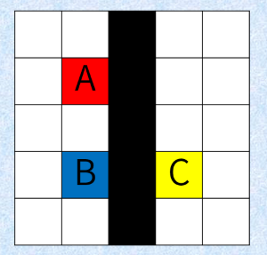
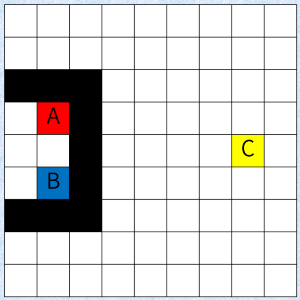

## 문제 설명

어떤 마을은 $N$행 $N$열의 격자 모양으로 되어 있으며, 그중 $1$칸을 구획이라고 합니다. $i$행 $j$열의 구획을 구획 $(i, j)$라고 합니다.

Alice, Bob, Charlie $3$명은 **서로 상하좌우로 인접하지 않는 서로 다른** 구획에 각각 살고 있습니다. Alice, Bob, Charlie가 사는 구획은 각각 $(a_x, a_y)$, $(b_x, b_y)$, $(c_x, c_y)$입니다. 또한 **$3$명이 사는 모든 구획에는 상하좌우의 모든 방향에 인접한 구획이 존재합니다**.

Bob은 Alice의 생일에 Alice의 집으로 가서 선물을 주기로 했습니다.

어떻게든 Alice와 친해지고 싶은 Bob은 Charlie가 Alice에게 선물을 주지 못하도록 마을의 몇몇 구획에 **벽**을 설치하여 Charlie가 Alice의 집에 도착할 수 없게 하기로 했습니다.

구체적으로, 다음 조건을 만족하도록 벽을 설치합니다.

- 벽이 설치되지 않은 상하좌우로 인접한 칸으로 계속 이동하여 Bob의 집에서 Alice의 집으로 **도달할 수 있어야 합니다**.
- 벽이 설치되지 않은 상하좌우로 인접한 칸으로 계속 이동하여 Charlie의 집에서 Alice의 집으로 **도달할 수 없어야 합니다**.

하지만 건설 비용 문제로 Bob은 최대 $N$개의 벽만 설치할 수 있습니다. 또한 **Alice, Bob, Charlie 중 누군가의 집이 있는 구획에는 벽을 설치할 수 없습니다**.

조건을 만족하는 벽의 설치 방법을 구하세요. 문제의 제한 아래에서는 조건을 만족하는 벽의 설치 방법이 항상 존재함이 증명됩니다.

## 입력

입력은 다음 형식으로 표준 입력에서 주어집니다.

```text
$N$
$a_x\ a_y$
$b_x\ b_y$
$c_x\ c_y$
```

제$1$번째 줄에 격자의 크기를 나타내는 정수 $N$이 주어집니다.

제$2$번째 줄에 Alice의 집의 위치 $(a_x,a_y)$가 주어집니다.

제$3$번째 줄에 Bob의 집의 위치 $(b_x,b_y)$가 주어집니다.

제$4$번째 줄에 Charlie의 집의 위치 $(c_x,c_y)$가 주어집니다.

## 제한

- 입력은 모두 정수입니다.
- $5 \leq N \leq 1\,000$
- $2 \leq a_x,a_y,b_x,b_y,c_x,c_y \leq N-1$
- $(a_x,a_y)$, $(b_x,b_y)$, $(c_x,c_y)$는 모두 서로 다릅니다.
- $(a_x,a_y)$, $(b_x,b_y)$, $(c_x,c_y)$는 서로 상하좌우로 인접하지 않습니다. 즉, $|a_x-b_x|+|a_y-b_y|\neq 1$, $|a_x-c_x|+|a_y-c_y|\neq 1$, $|b_x-c_x|+|b_y-c_y|\neq 1$입니다.

## 출력

벽의 설치 개수를 $m$, $i$번째 벽을 설치하는 구획을 구획 $(x_i,y_i)$라고 할 때, 다음 형식으로 출력하세요. $m\leq N$이고 $(x_i,y_i)$가 모두 서로 달라야 합니다. 또한 $(x_i,y_i)$는 $(a_x,a_y)$, $(b_x,b_y)$, $(c_x,c_y)$ 중 어느 것과도 같아서는 안 됩니다.

```text
$m$
$x_1\ y_1$
$x_2\ y_2$
$\vdots$
$x_m\ y_m$
```

## 예제

### 예제 1 {file="01_sample_01.txt"}

#### 입력

```text
5
2 2
4 2
4 4
```

#### 출력

```text
5
1 3
2 3
3 3
4 3
5 3
```

다음 그림과 같이 벽을 설치합니다. 빨간색, 파란색, 노란색 구획은 각각 Alice, Bob, Charlie의 집이 있는 구획을, 검은색 구획은 벽을 설치한 구획을, 흰색 구획은 그 밖의 구획을 나타냅니다.



이때, Bob은 Alice의 집에 도달할 수 있지만 Charlie는 Alice의 집에 도달할 수 없습니다.

### 예제 2 {file="01_sample_02.txt"}

#### 입력

```text
9
4 2
6 2
5 8
```

#### 출력

```text
9
3 1
3 2
3 3
4 3
5 3
6 3
7 3
7 2
7 1
```

다음 그림과 같이 벽을 설치합니다.



벽의 설치 개수를 최소화할 필요는 없습니다.
