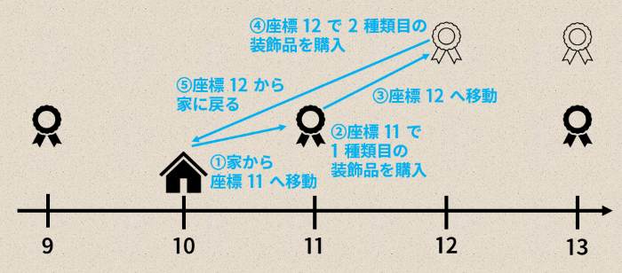

## 문제 설명

무한히 긴 수직선 위에 Alice의 집과 상점이 있습니다. Alice의 집은 수직선 위의 좌표 $X$에 있습니다. 또한 음이 아닌 모든 정수 좌표에 상점이 $1$개씩 있습니다.

Alice는 집에서 생일 파티를 열기 위해 장식품을 사기로 했습니다.

장식품은 $N$종류이고, 각 장식품을 구매할 수 있는 상점의 조건은 다음과 같습니다.

- $i$번째 장식품은 상점의 좌표 $x$가 $x \mathbin{\&} 2^{c_i} \ne 0$을 만족할 때, 그리고 그때에 한해서만 구매할 수 있습니다.

여기서 $a \mathbin{\&} b$는 음이 아닌 정수 $a$와 $b$의 비트 단위 AND를 나타냅니다.

Alice는 다음 행동을 $0$번 이상, 원하는 횟수만큼 원하는 순서로 수행할 수 있습니다.

- **이동**: 원하는 정수 $y$를 $1$개 선택합니다. Alice의 현재 좌표가 $x$일 때, Alice의 좌표를 $x+y$로 바꿉니다.
- **구매**: Alice의 현재 좌표가 음이 아닌 정수일 때만 수행할 수 있습니다. 현재 좌표에 있는 상점에서 구매할 수 있는 장식품을 $1$개 선택해 구매합니다.

이때 **이동 거리**를 모든 **이동**에서 선택한 값의 절댓값의 합으로 정의합니다.

처음에 Alice는 자신의 집에 있습니다. Alice가 행동을 반복하여 모든 종류의 장식품을 $1$개씩 구매한 뒤 집으로 돌아오는 데 필요한 **이동 거리**의 최솟값을 구하세요.

$T$개의 테스트 케이스가 주어지므로, 각각에 대해 답을 구하세요.

### 배경

#### 비트 단위 AND

음이 아닌 정수 $a$와 $b$의 비트 단위 AND $a \mathbin{\&} b$는 다음과 같이 정의합니다.

- $a \mathbin{\&} b$를 $2$진법으로 나타냈을 때 $2^k$의 자릿값은 $a$와 $b$를 각각 $2$진법으로 나타냈을 때 $2^k$의 자릿값이 모두 $1$이면 $1$, 그렇지 않으면 $0$입니다.
- 예를 들어 $3 \mathbin{\&} 5 = 1$입니다. ($2$진법으로 나타내면 $011 \mathbin{\&} 101 = 001$입니다.)

## 입력

입력은 다음 형식으로 표준 입력에서 주어집니다.

```text
$T$
$\mathrm{case}_1$
$\mathrm{case}_2$
$\vdots$
$\mathrm{case}_T$
```


각 테스트 케이스는 다음 형식으로 주어집니다.

```text
$N\ X$
$c_1\ c_2\ \cdots\ c_N$
```


$1$번째 줄에 테스트 케이스의 개수 $T$가 주어집니다. 각 테스트 케이스는 $1$번째 줄에 $N$과 $X$, $2$번째 줄에 $c_1$, $c_2$, $\ldots$, $c_N$을 공백으로 구분해 주어집니다.

## 제한

- 입력은 모두 정수입니다.
- $1 \le T \le 1\,000$
- $1 \le N \le 60$
- $0 \le c_1 < c_2 < \dots < c_N < 60$
- $0 \le X < 2^{60}$

## 출력

$T$줄을 출력하세요. $i$번째 줄에는 $i$번째 테스트 케이스의 답을 출력하세요.

## 예제

### 예제 1 {file="01_sample_01.txt"}

#### 입력

```text
4
2 10
0 2
1 0
3
4 15
0 1 2 3
5 20240822
0 5 7 8 18
```


#### 출력

```text
4
16
0
2
```


$1$번째 테스트 케이스에서는 다음과 같이 행동하는 것이 최적입니다.

- 먼저 집에서 좌표 $11$로 이동합니다.
- 다음으로 좌표 $11$에 있는 상점에서 $1$번째 장식품을 구매합니다.
- 다음으로 좌표 $11$에서 좌표 $12$로 이동합니다.
- 다음으로 좌표 $12$에 있는 상점에서 $2$번째 장식품을 구매합니다.
- 마지막으로 좌표 $12$에서 집으로 돌아옵니다.

이때 **이동 거리**는 $4$입니다. 이 과정을 그림으로 나타내면 다음과 같습니다.



$2$번째 테스트 케이스에서는 집에서 장식품을 살 수 있는 상점 중 가장 가까운 상점이 좌표 $8$에 있습니다. 따라서 좌표 $0$에서 좌표 $8$로 이동하고, 좌표 $8$에서 장식품을 구매한 다음, 좌표 $8$에서 좌표 $0$으로 돌아오는 행동이 최적입니다. 이때 **이동 거리**는 $16$입니다.

$3$번째 테스트 케이스에서는 Alice의 집과 같은 좌표에 있는 상점에서 모든 장식품을 구매할 수 있습니다. 따라서 **이동 거리**의 최솟값은 $0$입니다.
