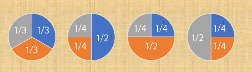

## 문제 설명

원형 생일 케이크가 $1$개 있습니다. 이 케이크를 $K$명이 부채꼴 모양으로 잘라 나누어 먹기로 했습니다.

케이크를 나눌 때 각 사람이 받는 몫은 $1 \leq n \leq N$을 만족하는 정수 $n$을 사용하여 $\frac{1}{n}$으로 나타낼 수 있어야 합니다. 또한 모든 사람의 케이크 몫의 합은 $1$이어야 합니다. 즉, 케이크를 남겨서는 안 됩니다.

조건을 만족하는 케이크 나누기 방법의 개수를 구하세요. 단, 적어도 $1$명의 몫이 다르면 서로 다른 나누기 방법으로 구분합니다.

이 문제의 제한에서 답은 $2^{60}$ 미만임이 보장됩니다.

## 입력

입력은 다음 형식으로 표준 입력에서 주어집니다.

```text
$K\ N$
```

$K$는 사람 수, $N$은 각 몫의 분모에 대한 상한을 나타내는 정수입니다.

## 제한

- 입력은 모두 정수입니다.
- $1 \leq K \leq N \leq 24$

## 출력

조건을 만족하는 케이크 나누기 방법의 개수를 출력하세요.

## 예제

### 예제 1 {file="01_sample_01.txt"}

#### 입력

```text
3 4
```

#### 출력

```text
4
```

$1$번째, $2$번째, $3$번째 사람의 몫이 각각 $g_1$, $g_2$, $g_3$인 나누기 방법을 $(g_1,g_2,g_3)$으로 나타내면, 구하는 나누기 방법은 다음 $4$가지입니다.

$(\frac{1}{3},\frac{1}{3},\frac{1}{3})$, $(\frac{1}{2},\frac{1}{4},\frac{1}{4})$, $(\frac{1}{4},\frac{1}{2},\frac{1}{4})$, $(\frac{1}{4},\frac{1}{4},\frac{1}{2})$

특히 뒤의 $3$가지가 서로 구분된다는 점에 주의하세요.



### 예제 2 {file="01_sample_02.txt"}

#### 입력

```text
4 10
```

#### 출력

```text
47
```

### 예제 3 {file="01_sample_03.txt"}

#### 입력

```text
15 24
```

#### 출력

```text
4048971290390
```

답이 $32$비트형 정수 값에 들어가지 않을 수 있음에 주의하세요.
