## 이야기

마법사 Alice는 생일을 맞아 성년이 된 것을 계기로 공격 마법을 익혔습니다.

## 문제 설명

공격 마법을 사용하려면 **마법진**을 그려야 합니다. 마법진을 $2$차원 평면에 나타내면 다음과 같습니다.

- $1 \leq x \leq X$, $1 \leq y \leq Y$를 만족하는 모든 정수 $x,y$와 $1 \leq r \leq 10^9$를 만족하는 모든 정수 $r$에 대해, 좌표 $(x,y)$를 중심으로 하고 반지름이 $r$인 원이 $1$개씩 그려져 있습니다.

Alice는 **음양옥**을 좋아하기 때문에 마법진에 음양옥이 몇 개 포함되어 있는지 세기로 했습니다. **음양옥**은 다음 도형을 나타냅니다.

- 다음 도형을 **기본 음양옥**이라고 합니다.
  - $xy$ 평면에서 중심이 $(0,0)$이고 반지름이 $2$인 원 A, 중심이 $(0,-1)$이고 반지름이 $1$인 원 B, 중심이 $(0,1)$이고 반지름이 $1$인 원 C를 생각합니다.
  - 이때 원 A 전체, 원 B의 $x \geq 0$인 부분, 원 C의 $x \leq 0$인 부분으로 이루어진 도형을 **기본 음양옥**이라고 합니다.
- **기본 음양옥**과 닮음인 도형(양의 배율에 의한 확대·축소 및 뒤집기·회전을 하여 일치하는 도형을 같은 것으로 간주합니다)을 **음양옥**이라고 합니다.

**기본 음양옥**을 그림으로 나타내면 다음과 같습니다.

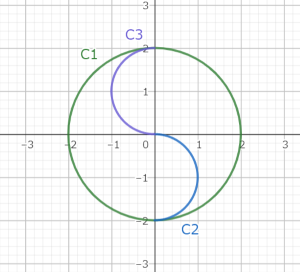

정수 $M$이 주어집니다. 마법진에 포함된 **음양옥**의 개수를 $M$으로 나눈 나머지를 구하세요. 즉, 마법진을 이루는 도형의 일부 중 음양옥인 것의 개수를 $M$으로 나눈 나머지를 구하세요.

## 입력

입력은 다음 형식으로 표준 입력에서 주어집니다.

```text
$X\ Y\ M$
```

## 제한

- 입력은 모두 정수입니다.
- $1 \leq X,Y \leq 4 \times 10^6$
- $10^8 \leq M \leq 10^9$

## 출력

마법진에 포함된 음양옥의 개수를 $M$으로 나눈 나머지를 출력하세요.

## 예제

### 예제 1 {file="01_sample_01.txt"}

#### 입력

```text
3 3 100000000
```

#### 출력

```text
12
```

포함된 음양옥은 그림에 나타난 $12$개입니다. 단, 그림에는 반지름이 $2$ 이하인 원만 그려져 있다는 점에 주의하세요.

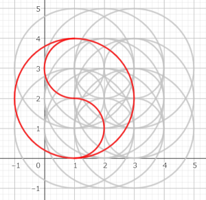

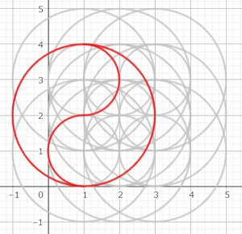

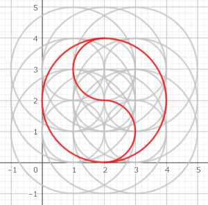

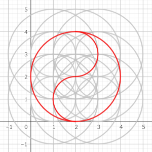

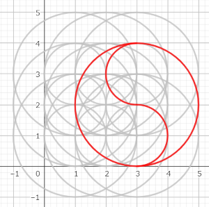

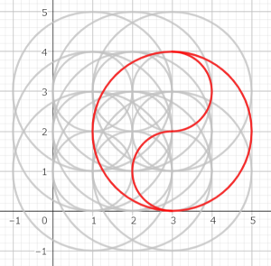

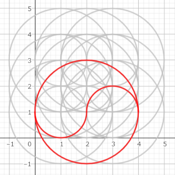

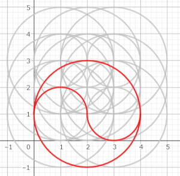

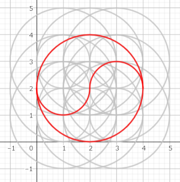

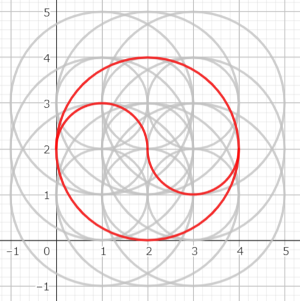

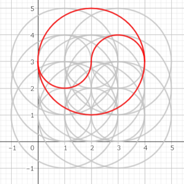

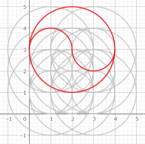

### 예제 2 {file="01_sample_02.txt"}

#### 입력

```text
4 7 100000000
```

#### 출력

```text
100
```

### 예제 3 {file="01_sample_03.txt"}

#### 입력

```text
1 1 100000000
```

#### 출력

```text
0
```

마법진에 음양옥이 포함되지 않는 경우도 있습니다.

### 예제 4 {file="01_sample_04.txt"}

#### 입력

```text
70 1003381 998244535
```

#### 출력

```text
357570745
```

음양옥의 개수를 $M$으로 나눈 나머지를 출력하세요.
