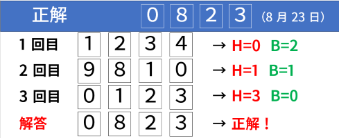

이 문제는 **인터랙티브 문제**(여러분이 작성한 프로그램과 저지 프로그램이 표준 입출력을 통해 대화하는 문제)입니다.

## 이야기

Alice는 친구 Bob에게 생일 선물을 주고 싶어 합니다.

Alice는 Bob의 생일에 대해, **MMDD 형식에서 각 숫자가 서로 다르다**는 것은 알고 있었지만 Bob의 정확한 생일은 몰랐기 때문에 언제 선물을 주어야 할지 알 수 없었습니다.

그래서 Alice는 Bob의 생일을 물어보기로 했습니다. 하지만 Bob은 생일을 직접 알려 주지 않습니다.

## 문제 설명

월과 일로 이루어진 날짜를 다음과 같이 $4$개의 숫자로 이루어진 문자열로 나타내는 방법을 **MMDD 형식**이라고 합니다.

- 월을 나타내는 $2$자리 수와 일을 나타내는 $2$자리 수를 이 순서대로 이어 붙여 $4$개의 숫자로 이루어진 문자열로 봅니다.
- 월이나 일을 나타내는 수가 $1$자리라면 앞에 $0$을 붙입니다.
- 예를 들어 $1$월 $2$일, $12$월 $13$일, $8$월 $22$일을 MMDD 형식으로 나타내면 각각 `0102`, `1213`, `0822`입니다.

Alice는 다음과 같이 질문하여 생일을 알아내려고 합니다.

- **각 숫자가 서로 다른 $4$개의 숫자로 이루어진 문자열** $S_Q$를 Bob에게 전달합니다. Bob의 생일을 MMDD 형식으로 나타낸 것을 $S_A$라고 할 때, 다음 $2$개의 값을 각각 알려 달라고 합니다.
  - $S_Q$와 $S_A$에 모두 포함되어 있고 위치도 서로 같은 숫자의 개수 $H$입니다. 즉, $S_Q$의 $i$번째 문자와 $S_A$의 $i$번째 문자가 같은 정수 $i\ (1 \leq i \leq 4)$의 개수입니다.
  - $S_Q$와 $S_A$에 모두 포함되어 있지만 위치는 서로 다른 숫자의 개수 $B$입니다. 즉, $S_Q$의 $i$번째 문자와 $S_A$의 $j$번째 문자가 같고 $i \ne j$를 만족하는 정수쌍 $(i,j)\ (1 \leq i,j \leq 4)$의 개수입니다.
- 다음 사항에 주의해야 합니다.
  - **$S_A$의 각 숫자는 서로 다름**이 보장됩니다.
  - $S_A$는 [그레고리력](https://ja.wikipedia.org/wiki/%E3%82%B0%E3%83%AC%E3%82%B4%E3%83%AA%E3%82%AA%E6%9A%A6)에서 실제로 존재하는 날짜의 MMDD 형식이지만, $S_Q$는 **그레고리력에서 실제로 존재하는 날짜의 MMDD 형식일 필요가 없습니다**.

하지만 Bob은 난처해하기 때문에 질문에 **최대 $6$번까지만** 대답해 줍니다.

Alice의 입장에서 Bob에게 $6$번 이내로 질문하여 Bob의 생일을 맞히세요.

$S_A$는 프로그램과 저지 시스템이 대화하기 전에 결정됩니다.

$T$개의 테스트 케이스가 주어지므로 각각에 대해 답하세요.

### 그레고리력에서 실제로 존재하는 날짜란

그레고리력에서 실제로 존재하는 날짜란 $d=(31,29,31,30,31,30,31,31,30,31,30,31)$에 대해 $1 \leq i \leq 12$ 및 $1 \leq j \leq d_i$를 사용하여 “$i$월 $j$일”로 나타낼 수 있는 날짜를 말합니다.

## 입력

이 문제는 **인터랙티브 문제**(여러분이 작성한 프로그램과 저지 프로그램이 표준 입출력을 통해 대화하는 문제)입니다.

여러분의 프로그램이 Alice 역할을, 저지 프로그램이 Bob 역할을 맡습니다.

처음에 테스트 케이스의 개수 $T$가 주어집니다.

```text
$T$
```

이후 $T$개의 테스트 케이스가 이어집니다.

Bob에게 질문을 출력하면 그 답은 다음 형식으로 표준 입력에서 주어집니다.

```text
$H\ B$
```

여기서 $H$는 $S_Q$와 $S_A$에 모두 포함되어 있고 위치도 서로 같은 숫자의 개수이며, $B$는 $S_Q$와 $S_A$에 모두 포함되어 있지만 위치는 서로 다른 숫자의 개수입니다.

제한을 위반하는 입력을 하거나 질문 횟수가 $6$회를 초과하면 입력으로 $H=-1,\ B=-1$이 주어집니다. 이 경우 이미 오답으로 판정된 것이므로 즉시 프로그램을 종료하세요.

Bob의 생일을 답하는 출력을 한 뒤에는 그 답에 대한 판정값 $a$가 다음 형식으로 표준 입력에서 주어집니다.

```text
$a$
```

Bob의 생일을 올바르게 출력했다면 $a=0$이 주어집니다. 이 경우 다음 테스트 케이스가 있으면 계속 처리하고, 없으면 즉시 프로그램을 종료하세요.

올바르게 출력하지 못했다면 $a=-1$이 주어집니다. 이 경우에도 이미 오답으로 판정된 것이므로 즉시 프로그램을 종료하세요.

## 제한

- $T$는 정수입니다.
- $1 \leq T \leq 200$
- $S_A$는 그레고리력에서 실제로 존재하는 날짜의 MMDD 형식입니다.
- $S_A$의 각 숫자는 서로 다릅니다.

## 출력

Bob에게 질문하려면 다음 형식으로 출력해야 합니다. 여기서 $S_Q$는 각 숫자가 서로 다른 $4$개의 숫자로 이루어진 문자열이어야 합니다.

```text
$?\ S_Q$
```

Bob의 생일을 답할 때는 다음 형식으로 출력해야 합니다. 여기서 $S_A$는 Bob의 생일을 MMDD 형식으로 나타낸 $4$개의 문자로 이루어진 문자열입니다.

```text
$!\ S_A$
```

**출력할 때마다 반드시 표준 출력을 flush하세요. 그렇지 않으면 TLE가 될 수 있습니다.**

잘못된 출력이 이루어진 경우 저지 결과는 정의되지 않습니다.

$H=-1,\ B=-1$ 또는 $a=-1$이 입력으로 주어진 뒤 프로그램을 즉시 종료하지 않으면 저지 결과는 정의되지 않습니다.

모든 테스트 케이스에 답한 뒤에는 프로그램을 즉시 종료하세요. 그렇지 않으면 저지 결과는 정의되지 않습니다.

**Bob의 생일을 답하는 출력은 질문 횟수에 포함되지 않습니다.**

인터랙티브 문제에 익숙하지 않다면 [인터랙티브 형식 문제에 대한 정리](https://yukicoder.me/wiki/reactive)도 확인하세요.

## 예제

### 예제 1 {file=""}

#### 입력

```text
1
```

$T=1$입니다.

#### 출력

```text
? 1234
```

$1$번째 질문으로 $S_Q$=`1234`를 전달합니다. $12$월 $34$일은 존재하지 않는 날짜이지만 이런 질문을 해도 됩니다.

#### 입력

```text
0 2
```

$S_Q$=`1234`일 때 $H=0,\ B=2$라는 답을 받았습니다.

#### 출력

```text
? 9810
```

$2$번째 질문으로 $S_Q$=`9810`을 전달합니다.

#### 입력

```text
1 1
```

$S_Q$=`9810`일 때 $H=1,\ B=1$이라는 답을 받았습니다.

#### 출력

```text
? 0123
```

$3$번째 질문으로 $S_Q$=`0123`을 전달합니다.

#### 입력

```text
3 0
```

$S_Q$=`0123`일 때 $H=3,\ B=0$이라는 답을 받았습니다.

#### 출력

```text
! 0823
```

이 정보로부터 $S_A$=`0823`임을 알 수 있으므로 이를 답합니다. 이 출력은 질문 횟수에 포함되지 않습니다.

#### 입력

```text
0
```

$a=0$이 입력으로 주어졌으므로 올바르게 답했습니다. 모든 테스트 케이스에 답했으므로 여기서 프로그램을 종료합니다.

이 일련의 흐름을 그림으로 나타내면 다음과 같습니다.



이미지의 일본어 라벨은 `正解`(정답), `1回目`·`2回目`·`3回目`($1$번째·$2$번째·$3$번째), `解答`(답), `正解！`(정답!), `8月23日`($8$월 $23$일)을 뜻합니다.
