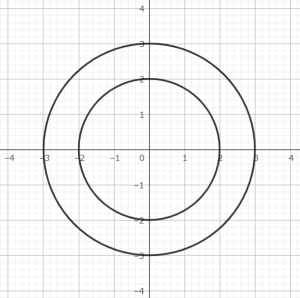
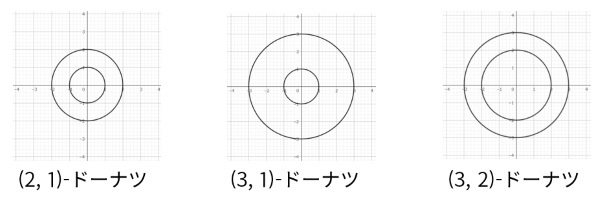
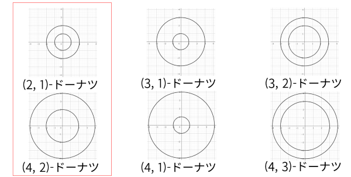

## 문제 설명

양의 정수 $x,y$가 $x>y$를 만족할 때, 중심이 같고 반지름이 각각 $x$, $y$인 원 $A$, 원 $B$로 이루어진 평면 도형을 $(x,y)$-도넛이라고 합니다.

예를 들어 $(3,2)$-도넛은 다음과 같습니다.



Bob은 생일 선물로 $L\leq i\leq R$ 및 $1\leq j<i$를 만족하는 각 정수쌍 $(i,j)$에 대해 $(i,j)$-도넛을 $1$개씩 받았습니다.

**양의 배율로 확대 또는 축소하여 서로 일치시킬 수 있는 도넛을 같은 종류로 간주하고**, 서로 일치시킬 수 없는 도넛을 다른 종류로 간주합니다. Bob이 받은 도넛의 종류 수를 구하세요.

총 $T$개의 테스트 케이스가 주어지므로, 각각에 대해 답을 구하세요.

각 테스트 케이스에서 $L,R$은 **암호화된 상태로 각각 정수 $\alpha,\beta$로 주어집니다**. 다음과 같이 $L,R$을 복호화한 뒤 답을 구하세요.

$\mathrm{ans}_0=0$, $\mathrm{ans}_i$를 $i$번째 테스트 케이스의 답이라고 합니다. $i$번째 테스트 케이스에 대해서는 다음과 같이 복호화합니다.

$L=\alpha\oplus\mathrm{ans}_{i-1},\quad R=\beta\oplus\mathrm{ans}_{i-1}$

여기서 $x\oplus y$는 $x$와 $y$의 비트 단위 XOR을 뜻합니다.

### 배경

#### 비트 단위 XOR

$2$개의 음이 아닌 정수 $x,y$의 비트 단위 XOR $x\oplus y$를 다음과 같이 정의한 것입니다.

- $x\oplus y$를 이진수로 나타냈을 때 $2^k$의 자리의 값은 $x,y$를 각각 이진수로 나타냈을 때 $2^k$의 자리 중 정확히 $1$곳만 $1$이면 $1$, 그렇지 않으면 $0$입니다.
- 예를 들어 $3\oplus 5=6$입니다. 이진수로 나타내면 $011\oplus 101=110$입니다.


## 입력

```text
$T$
$\mathrm{case}_1$
$\mathrm{case}_2$
$\vdots$
$\mathrm{case}_T$
```

입력은 표준 입력으로 주어집니다. 여기서 $\mathrm{case}_i$는 $i$번째 테스트 케이스를 나타냅니다.

$1$번째 줄에 테스트 케이스의 수 $T$가 주어집니다.

각 테스트 케이스는 다음 형식으로 주어집니다.

```text
$\alpha\ \beta$
```

각 테스트 케이스에서 암호화된 정수 $\alpha,\beta$가 주어집니다.

## 제한

- 입력은 모두 정수입니다.
- $1\leq T\leq 10^5$
- $0\leq\alpha,\beta\leq 10^{18}$
- 복호화한 $L,R$은 $2\leq L\leq R\leq 2\times 10^5$를 만족합니다.

## 출력

$T$줄 출력하세요. $i$번째 줄에는 $i$번째 테스트 케이스의 답을 출력하세요.

## 예제

### 예제 1 {file="01_sample_01.txt"}

#### 입력

```text
5
2 3
1 7
15 15
11 200009
12158598942 12158743847
```

#### 출력

```text
3
5
9
12158598917
10159235125
```

$1$번째 테스트 케이스에서는 $\mathrm{ans}_0=0$이므로 $L=2,R=3$으로 복호화됩니다. 따라서 Bob은 $(2,1)$-도넛, $(3,1)$-도넛, $(3,2)$-도넛까지 총 $3$개의 도넛을 받았습니다. 이 도넛들은 모두 다른 종류이므로 답은 $3$종류입니다.



$2$번째 테스트 케이스에서는 $\mathrm{ans}_1=3$이므로 $L=2,R=4$로 복호화됩니다. Bob은 $(2,1)$-도넛, $(3,1)$-도넛, $(3,2)$-도넛, $(4,1)$-도넛, $(4,2)$-도넛, $(4,3)$-도넛까지 총 $6$개의 도넛을 받았습니다. $(2,1)$-도넛은 확대하면 $(4,2)$-도넛과 일치시킬 수 있습니다. 양의 배율로 확대·축소하여 서로 일치시킬 수 있는 도넛의 쌍은 이 쌍뿐이므로 도넛의 종류는 $5$종류입니다.



$3$번째 테스트 케이스에서는 $\mathrm{ans}_2=5$이므로 $L=10,R=10$으로 복호화됩니다.

$4$번째 테스트 케이스에서는 $\mathrm{ans}_3=9$이므로 $L=2,R=200\,000$으로 복호화됩니다.

$5$번째 테스트 케이스에서는 $\mathrm{ans}_4=12\,158\,598\,917$이므로 $L=27,R=182\,818$로 복호화됩니다.
