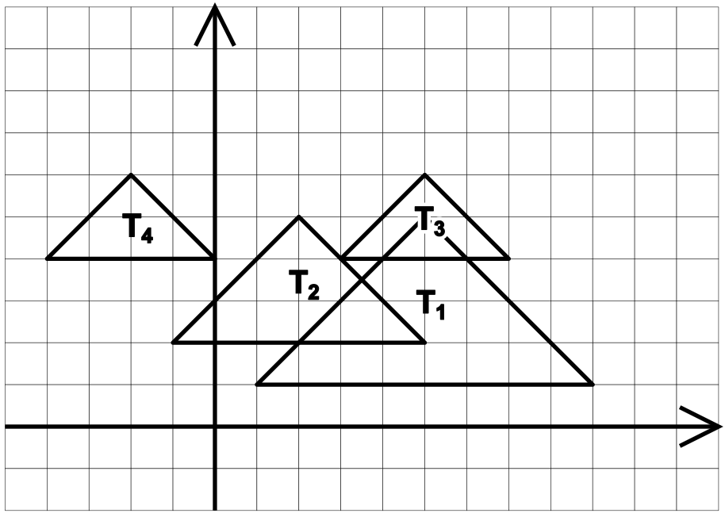

## 문제 설명

$xy$ 평면 위에 $N$개의 삼각형이 있고, 삼각형에 $T_1, T_2, \ldots, T_N$이라는 이름이 붙어 있습니다.

$i=1,2,\ldots,N$에 대해, $T_i$의 $3$개의 꼭짓점의 좌표는 $(A_i,B_i)$, $(A_i-D_i,B_i-D_i)$, $(A_i+D_i,B_i-D_i)$입니다.

$i=1,2,\ldots,Q$에 대해 다음 질의에 답하세요.

- $S_i$, $L_i$, $R_i$가 주어질 때, $T_{S_i}$가 $T_{L_i},T_{L_i+1},\ldots,T_{R_i}$ 각각과 **양의** 면적의 공통 부분을 가지는지 판정하세요. $2$개의 삼각형이 접하는 경우에는 **양의** 면적이 아님에 유의하세요.

단, $T_i$와 $T_i$는 양의 면적의 공통 부분을 가진다고 합니다.

## 입력

```text
$N$
$A_1\ B_1\ D_1$
$A_2\ B_2\ D_2$
$\vdots$
$A_N\ B_N\ D_N$
$Q$
$S_1\ L_1\ R_1$
$S_2\ L_2\ R_2$
$\vdots$
$S_Q\ L_Q\ R_Q$
```

$1$번째 줄에 삼각형의 개수 $N$이 주어집니다.

다음 $N$개의 줄에 각 삼각형의 $A_i$, $B_i$, $D_i$가 주어집니다.

그다음 줄에 질의의 개수 $Q$가 주어집니다.

다음 $Q$개의 줄에 각 질의의 $S_i$, $L_i$, $R_i$가 주어집니다.

입력은 모두 정수입니다.

## 제한

- $1 \le N \le 2 \times 10^5$
- $-10^{16} \le A_i,B_i \le 10^{16}$
- $1 \le D_i \le 10^{16}$
- $1 \le Q \le 2 \times 10^5$
- $1 \le S_i \le N$
- $1 \le L_i \le R_i \le N$

## 출력

$Q$줄에 걸쳐 출력하세요.

$i$번째 줄에는 $T_{S_i}$가 $T_{L_i},T_{L_i+1},\ldots,T_{R_i}$ 각각과 양의 면적의 공통 부분을 가진다면 `Yes`를, 그렇지 않다면 `No`를 출력하고 줄바꿈하세요.

$Q$줄을 출력한 뒤에도 줄바꿈하세요.

## 예제

### 예제 1 {file=""}

#### 입력

```text
4
5 5 4
2 5 3
5 6 2
-2 6 2
3
1 1 3
3 1 2
4 1 3
```

#### 출력

```text
Yes
No
No
```

이 삼각형들을 그리면 다음과 같습니다.



- $1$번째 질의에서 $T_1$은 $T_1,T_2,T_3$ 각각과 양의 면적의 공통 부분을 가지므로 `Yes`를 출력합니다.
- $2$번째 질의에서 $T_3$은 $T_1$과 양의 면적의 공통 부분을 가지지만, $T_2$와는 접하기만 하므로 양의 면적의 공통 부분을 가지지 않습니다. 따라서 `No`를 출력합니다.
- $3$번째 질의에서 $T_4$는 $T_1,T_2,T_3$ 어느 것과도 양의 면적의 공통 부분을 가지지 않으므로 `No`를 출력합니다.

### 예제 2 {file=""}

#### 입력

```text
1
10000000000000000 10000000000000000 10000000000000000
1
1 1 1
```

#### 출력

```text
Yes
```

입력이 $32$비트 정수에 들어가지 않을 수 있습니다.

또한 $N = 1$일 수도 있습니다.
