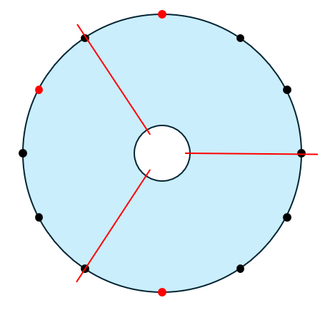

## 문제 설명

원형 케이크가 있습니다. 원주 위에 $2N$개의 점이 같은 간격으로 배치되어 있으며, 시계 방향으로 $1,2,\dots,2N$의 번호가 붙어 있습니다.

또한 번호가 홀수인 $K$개의 점 $A_1,A_2,\dots,A_K$의 위치에는 딸기가 놓여 있습니다.

이제 번호가 짝수인 점을 $K$개 선택하고, 케이크의 중심에서 선택한 점으로 향하는 반직선을 따라 케이크를 잘라 $K$개의 조각으로 나눕니다.

어떤 조각에도 딸기가 반드시 $1$개 이상 놓이도록 절단할 점을 선택했을 때, 가장 작은 조각 크기의 최댓값을 구하세요.

구체적으로 선택한 정점을 번호가 작은 순서대로 $B_1,B_2,\dots,B_K$라고 할 때, $B_{K+1}=B_1+2N$으로 간주하여 다음 값의 최댓값을 구하세요.

$\min_{i=1,2,\dots,K}(B_{i+1}-B_i)$

문제의 제한으로부터 조건을 만족하는 절단 방법이 항상 $1$개 이상 존재함을 증명할 수 있습니다.

## 입력

```text
$N\ K$
$A_1\ A_2\ \cdots\ A_K$
```

$1$번째 줄에 점의 배치를 나타내는 정수 $N,K$가 주어집니다.

$2$번째 줄에 딸기가 놓인 점의 번호 $A_1,A_2,\dots,A_K$가 주어집니다.

## 제한

- $2 \leq K \leq N \leq 5 \times 10^5$
- $1 \leq A_1 < A_2 < \dots < A_K \leq 2N-1$
- $1 \leq i \leq K$에 대해 $A_i$는 홀수입니다.
- 입력은 모두 정수입니다.

## 출력

$1$줄에 답을 출력하세요.

## 예제

### 예제 1 {file="01_sample_01.txt"}
#### 입력
```text
6 3
1 7 11
```
#### 출력
```text
4
```

점 $4$, 점 $8$, 점 $12$의 위치에 절단선을 넣으면 모든 조각의 크기를 $4$로 만들 수 있습니다.



### 예제 2 {file="01_sample_02.txt"}
#### 입력
```text
2 2
1 3
```
#### 출력
```text
2
```

### 예제 3 {file="01_sample_03.txt"}
#### 입력
```text
20 5
7 9 17 21 31
```
#### 출력
```text
6
```
