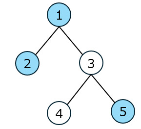

이 문제의 시간 제한은 엄격하게 설정되어 있습니다. **빠른 언어 사용을 권장합니다.**

## 문제 설명

$1$부터 $N$까지의 번호가 붙은 $N$개의 정점으로 이루어진 트리가 주어집니다. $i=1,2,\dots,N-1$에 대해 $i$번째 간선은 정점 $u_i$와 정점 $v_i$를 연결합니다.

트리의 각 정점에는 라임나무 또는 모과나무 $1$그루가 자랍니다. 문자열 $S$가 주어집니다. $S$의 $i$번째 문자가 `1`이면 정점 $i$에 라임나무가 자라고, `0`이면 모과나무가 자랍니다.

$1\leq l\leq r\leq N$을 만족하는 정점의 쌍 $(l,r)$ 중에서, $l$에서 $r$로 가는 양 끝점을 포함한 단순 경로 위에 자라는 라임나무의 개수가 모과나무의 개수보다 많은 쌍의 개수를 구하세요.

### 배경

단순 경로란 정점의 수열 $v_1,v_2,\dots,v_k$로서 다음 조건을 모두 만족하는 것을 말합니다.

- $1\leq i\leq k-1$에 대해 정점 $v_i$와 정점 $v_{i+1}$이 간선으로 직접 연결되어 있습니다.
- 모든 $1\leq i<j\leq k$에 대해 정점 $v_i$와 정점 $v_j$가 서로 다릅니다.

트리에서 양 끝점을 지정하면 단순 경로는 유일하게 정해집니다.

## 입력

```text
$N$
$u_1\ v_1$
$u_2\ v_2$
$\vdots$
$u_{N-1}\ v_{N-1}$
$S$
```

제$1$번째 줄에 정수 $N$이 주어집니다. 다음 $N-1$개 줄의 $i$번째 줄에는 정수 $u_i$와 $v_i$가 주어집니다. 마지막 줄에 문자열 $S$가 주어집니다.

## 제한

- $1\leq N\leq 100\,000$
- $1\leq u_i<v_i\leq N\quad(1\leq i\leq N-1)$
- $N$, $u_i$, $v_i$는 모두 정수입니다. ($1\leq i\leq N-1$)
- $|S|=N$
- $S$는 `0` 또는 `1`로 이루어진 문자열입니다.

## 출력

답을 $1$줄에 출력하세요.

## 예제

### 예제 1 {file="01_sample_01.txt"}

#### 입력

```text
5
1 2
1 3
3 4
3 5
11001
```

#### 출력

```text
7
```

$(l,r)=(1,1),(1,2),(1,5),(2,2),(2,3),(2,5),(5,5)$가 조건을 만족합니다.



### 예제 2 {file="01_sample_02.txt"}

#### 입력

```text
1
1
```

#### 출력

```text
1
```

### 예제 3 {file="01_sample_03.txt"}

#### 입력

```text
10
2 8
4 9
1 6
3 7
1 8
5 8
1 10
1 7
7 9
0111110100
```

#### 출력

```text
16
```
