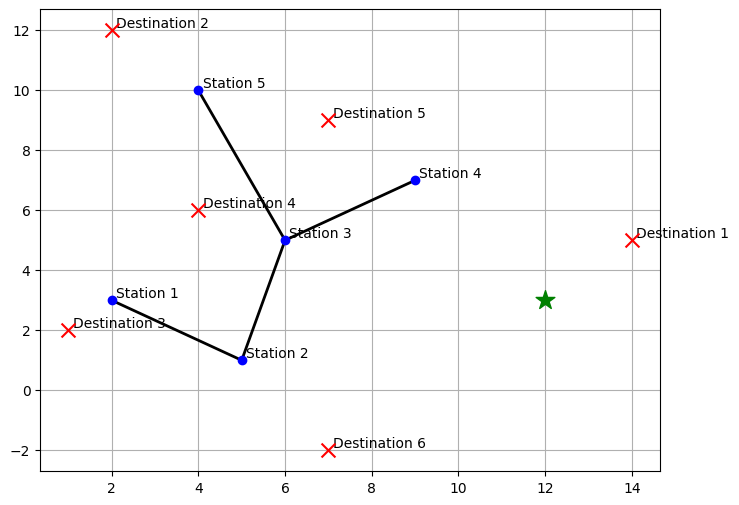

※주의※ PyPy3 정도의 속도인 언어로는 실행 제한 시간 안에 실행이 끝나지 않을 수 있습니다. C++ 등 빠른 언어를 권장합니다.

## 문제 설명

白君은 어떤 지역으로 여행을 떠나 $K$곳의 목적지를 둘러봅니다. 이 지역은 좌표평면 위에 있으며, $N$개의 역으로 이루어진 철도가 운행되고 목적지가 있습니다. 白君은 철도와 도보로 목적지와 호텔 사이를 이동합니다.

도보로 직접 이동해도 됩니다.

철도는 연결된 $M$개의 노선으로 이루어져 있으며, 노선 $i$는 역 $S_i$와 역 $T_i$를 양방향으로 곧은 선분으로 연결합니다.

호텔은 점 $(P,Q)$에 있고, 역 $j$는 점 $(X_j,Y_j)$에 있으며, 목적지 $k$는 점 $(A_k,B_k)$에 있습니다.

여행 중에는 호텔에서 출발하여 아직 선택하지 않은 목적지 $1$개를 골라 방문하고, 식사한 뒤 호텔로 돌아오는 일을 $K$번 반복합니다.

白君은 소식가이므로 이동 경로에 아직 방문하지 않은 다른 목적지가 있더라도 그곳에서는 식사할 수 없습니다. 따라서 반드시 호텔로 $1$번 돌아온 뒤에 그 목적지를 방문해야 합니다.

白君의 도보 속도는 $1$이고 철도 이동 속도는 $V=10^{18}$입니다. 거리는 유클리드 거리로 정의하며, 환승 시간은 고려하지 않습니다.

여행에서 이동하는 시간의 총합의 최솟값을 구하세요.

샘플을 제외한 입력에서는 좌표가 균일하게 무작위로 생성되고 노선도 무작위로 생성됩니다. 자세한 내용은 입력 설명을 확인하세요.

## 입력

```text
$N\ M\ K$
$P\ Q$
$X_1\ Y_1$
$\vdots$
$X_N\ Y_N$
$A_1\ B_1$
$\vdots$
$A_K\ B_K$
$V$
$S_1\ T_1$
$\vdots$
$S_M\ T_M$
```

입력은 모두 정수로 주어집니다.

샘플을 제외한 입력은 다음 조건을 만족하도록 아래 알고리즘으로 생성됩니다.

1. 일관되게 사용할 난수 생성기 $R$의 시드 값을, 적절한 시드로 초기화한 다른 난수 생성기 $R'$로 정합니다. $N,M,K$를 결정하는 경우를 제외한 모든 난수와 셔플에는 $R$을 사용합니다.
2. 조건을 만족하는 $N,M,K$를 직접 정하거나, 난수 생성기 $R'$로 정합니다.
3. 난수 생성기 $R$을 사용하여 호텔의 각 좌표 $P,Q$를 $-10^5$ 이상 $10^5$ 이하에서 균일하게 무작위로 정합니다.
4. $j=1,2,\ldots,N$ 순서로, 호텔이나 이전 역에서 사용하지 않은 좌표 후보 $(x,y)$가 나올 때까지 같은 방법으로 좌표를 생성합니다. 최종 좌표 $(x,y)$를 역 $j$의 좌표 $(X_j,Y_j)$로 정합니다.
5. $k=1,2,\ldots,K$ 순서로, 호텔·역·이전 목적지에서 사용하지 않은 좌표 후보 $(x,y)$가 나올 때까지 같은 방법으로 좌표를 생성합니다. 최종 좌표 $(x,y)$를 목적지 $k$의 좌표 $(A_k,B_k)$로 정합니다.
6. $V=10^{18}$로 정합니다.
7. 다음 절차로 $M$개의 노선을 생성합니다.
   - 빈 배열 $A$와 $1$ 이상 $N$ 이하의 값이 각각 $1$번씩 들어 있는 배열 $B$를 만듭니다.
   - $B$를 전체적으로 균일하게 무작위가 되도록 셔플합니다.
   - $B$의 마지막 원소를 삭제하여 $A$에 넣습니다.
   - $i=1,2,\ldots,N-1$에 대해 $A$의 원소 중 $1$개를 균일하게 무작위로 골라 $a$로 하고, $B$의 마지막 원소를 $b$로 하여 $(S_i,T_i)=(a,b)$로 정합니다. $B$에서 $b$를 삭제하고 $A$에 $b$를 추가합니다.
   - 나머지 $M-N+1$개 노선은 $1$ 이상 $N$ 이하에서 균일하게 무작위로 고른 서로 다른 $2$개의 정수 $u,v$에 대해, 역 $u$와 역 $v$를 잇는 노선이 아직 없을 때 새 노선으로 추가합니다. 이를 반복하여 $i$번째 노선이면 $(S_i,T_i)=(u,v)$로 정합니다.

입력 테스트 케이스에 사용하는 시드 값은 해설 페이지에서 공개됩니다. 실제로 입력 생성에 사용한 프로그램 코드의 기반은 다음과 같습니다. 실제로는 주석에 적힌 작업만 추가합니다.

```text class="tex2jax_ignore"

#[allow(unused_imports)]
use std::{collections::{HashSet, HashMap, BTreeSet, BTreeMap, BinaryHeap, VecDeque}, cmp::{Reverse, PartialOrd, Ordering, max, min}, mem::swap};

macro_rules! input {
    (source = $s:expr, $($r:tt)*) => {
        let mut iter = $s.split_whitespace();
        let mut next = || { iter.next().unwrap() };
        input_inner!{next, $($r)*}
    };
    ($($r:tt)*) => {
        let stdin = std::io::stdin();
        let mut bytes = std::io::Read::bytes(std::io::BufReader::new(stdin.lock()));
        let mut next = move || -> String{
            bytes
                .by_ref()
                .map(|r|r.unwrap() as char)
                .skip_while(|c|c.is_whitespace())
                .take_while(|c|!c.is_whitespace())
                .collect()
        };
        input_inner!{next, $($r)*}
    };
}

macro_rules! input_inner {
    ($next:expr) => {};
    ($next:expr, ) => {};

    ($next:expr, $var:ident : $t:tt $($r:tt)*) => {
        let $var = read_value!($next, $t);
        input_inner!{$next $($r)*}
    };
}

macro_rules! read_value {
    ($next:expr, ( $($t:tt),* )) => {
        ( $(read_value!($next, $t)),* )
    };

    ($next:expr, [ $t:tt ; $len:expr ]) => {
        (0..$len).map(|_| read_value!($next, $t)).collect::<\Vec<\_>>()
    };

    ($next:expr, chars) => {
        read_value!($next, String).chars().collect::<\Vec<\char>>()
    };

    ($next:expr, usize1) => {
        read_value!($next, usize) - 1
    };

    ($next:expr, $t:ty) => {
        $next().parse::<$t>().expect("Parse error")
    };
}

struct XorShiftStar{
    state: u64,
}

impl XorShiftStar{
    fn new(seed: u64)->Self{
        XorShiftStar{state: seed}
    }

    fn next(&mut self)->u64{
        let mut x = self.state;
        x ^= x << 13;
        x ^= x >> 7;
        x ^= x << 17;
        self.state = x;
        x.wrapping_mul(0x2545F4914F6CDD1D)
    }

    fn get(&mut self, l: usize, r: usize) -> usize {
        let range = r - l + 1;
        let num = (self.next() as usize) % (range) + l;
        num
    }

    fn shuffle<T>(&mut self, a: &mut Vec<T>){
        let n = a.len();
        for i in 0..n{
            let j = self.get(0, i);
            a.swap(i, j);
        }
    }

    fn choose<T>(&mut self, a: &Vec<T>)->T where T: Copy{
        let n = a.len();
        let p = self.get(0, n-1);
        a[p]
    }
}

fn main(){
    input!{
        c: u64,
    }
    //入力ごとに乱数シードを変更するため調整する
    let config1 = 0;
    let config2 = 0;
    //ここまで
    let mut pre_rng = XorShiftStar::new(config1*c+config2);
    for _ in 0..c{
        pre_rng.next();
    }
    let seed = (pre_rng.get(0, 199999) as u64+c*config2)%200000;
    let mut rng = XorShiftStar::new(seed);
    //ここは直接指定して操作するかpre_rngにより決定
    let n = pre_rng.get(2, 2);
    let m = pre_rng.get(n-1, 100000).min(n*(n-1)/2);
    let k = pre_rng.get(1, 100000);
    //ここまで。ここ以降は完全にrngのみで乱数を扱う。
    let mx = 200000i32;
    let h = 100000i32;
    let mut p = Vec::new();
    p.push(rng.get(0, mx as usize) as i32-h);
    p.push(rng.get(0, mx as usize) as i32-h);
    let mut used1 = HashSet::new();
    used1.insert((p[0], p[1]));
    let mut cnt = 0;
    let mut station = Vec::new();
    while cnt < n{
        let (u, v) = (rng.get(0, mx as usize) as i32-h, rng.get(0, mx as usize) as i32-h);
        if used1.contains(&(u, v)){continue}
        cnt += 1;
        used1.insert((u, v));
        station.push((u, v));
    }
    let mut t = Vec::new();
    cnt = 0;
    while cnt < k{
        let (u, v) = (rng.get(0, mx as usize) as i32-h, rng.get(0, mx as usize) as i32-h);
        if used1.contains(&(u, v)){continue}
        cnt += 1;
        used1.insert((u, v));
        t.push((u, v));
    }
    let z = 1_000_000_000_000_000_000i64;
    let mut leaf = Vec::new();
    for i in 0..n{
        leaf.push(i);
    }
    rng.shuffle(&mut leaf);
    let mut parent = Vec::new();
    let x = leaf.pop().unwrap();
    parent.push(x);
    let mut e = Vec::new();
    let mut used2 = HashSet::new();
    for _ in 1..n{
        let pre = rng.choose(&parent);
        let nex = leaf.pop().unwrap();
        e.push((pre, nex));
        parent.push(nex);
        used2.insert((pre, nex));
        used2.insert((nex, pre));
    }
    let mut cnt = n-1;
    while cnt < m{
        let (u, v) = (rng.get(0, n-1), rng.get(0, n-1));
        if u==v||used2.contains(&(u, v)){continue}
        used2.insert((u, v));
        used2.insert((v, u));
        e.push((u, v));
        cnt += 1;
    }
    assert!(n >= 2);
    assert!(n <= 100000);
    assert!(n-1 <= m);
    assert!(m <= n*(n-1)/2);
    assert!(m <= 100000);
    assert!(k >= 1);
    assert!(k <= 100000);
    assert!(p[0] <= h);
    assert!(p[0] >= -h);
    assert!(p[1] <= h);
    assert!(p[1] >= -h);
    assert_eq!(z, 1_000_000_000_000_000_000);
    println!("{} {} {}", n, m, k);
    println!("{} {}", p[0], p[1]);
    for &(u, v) in &station{
        assert!(u <= h);
        assert!(u >= -h);
        assert!(v <= h);
        assert!(v >= -h);
        println!("{} {}", u, v);
    }
    for &(u, v) in &t{
        assert!(u <= h);
        assert!(u >= -h);
        assert!(v <= h);
        assert!(v >= -h);
        println!("{} {}", u, v);
    }
    println!("{}", z);
    for &(u, v) in &e{
        assert!(u+1 >= 1);
        assert!(v+1 >= 1);
        assert!(u+1 <= n);
        assert!(v+1 <= n);
        println!("{} {}", u+1, v+1);
    }
    //ケース名はケースごとに直接指定するか渡された値を利用。シード値は出力から確認している。その後テストケース名から削除している。
    eprintln!("00_some_{}_seed_{}", c, seed);
}
    
```


## 제한

- $2 \leq N \leq 10^5$
- $N-1 \leq M \leq \min\left(\frac{N\times(N-1)}{2},10^5\right)$
- $1 \leq K \leq 10^5$
- $-10^5 \leq P,Q \leq 10^5$
- $-10^5 \leq X_i,Y_i \leq 10^5$
- $i\ne j$일 때 $(X_i,Y_i)\ne(X_j,Y_j)$
- $-10^5 \leq A_i,B_i \leq 10^5$
- $i\ne j$일 때 $(A_i,B_i)\ne(A_j,B_j)$
- $(P,Q)\ne(X_i,Y_i)$
- $(P,Q)\ne(A_i,B_i)$
- $(X_i,Y_i)\ne(A_j,B_j)$
- $V=10^{18}$
- $1 \leq S_i,T_i \leq N$
- $S_i\ne T_i$
- $i\ne j$일 때 $\{S_i, T_i\} ≠ \{S_j, T_j\}\ (i ≠ j)$
- 철도는 연결되어 있습니다.

## 출력

구한 값을 출력하세요. 출제자의 해답과의 절대 오차 또는 상대 오차가 $10^{-5}$ 이하이면 정답으로 인정됩니다.

마지막에 줄 바꿈을 출력하세요.

## 예제

### 예제 1 {file="01_sample_01.txt"}

#### 입력

```text
5 4 6
12 3
2 3
5 1
6 5
9 7
4 10
14 5
2 12
1 2
4 6
7 9
7 -2
1000000000000000000
1 2
3 2
5 3
3 4
```

#### 출력

```text
78.3769065542748
```



위 그림에서는 역과 노선이 그래프로, 호텔은 초록색 별로, 목적지는 ×로 표현됩니다.

예를 들어 목적지 $1$에 갈 때 철도를 이용하지 않고 직접 갔다가 돌아오면 $4\sqrt{2}$로 왕복할 수 있습니다. 이처럼 철도를 이용하지 않는 경우도 있습니다.

좌표가 음수일 수도 있다는 점에 주의하세요.


### 예제 2 {file="01_sample_02.txt"}

#### 입력

```text
2 1 1
-100000 -100000
-100000 -99999
-100000 -99998
100000 100000
1000000000000000000
1 2
```

#### 출력

```text
565684.5965291844
```

철도를 이용하여 아주 조금이라도 짧아진다면 철도를 이용하는 방법을 선택해야 합니다.

### 예제 3 {file="01_sample_03.txt"}

#### 입력

```text
12 24 17
49568 69196
-98957 -87293
96282 -5498
30527 -30128
21828 -29401
-37956 94439
-78187 -73404
-25005 -38011
86936 40205
-8187 -34299
48841 96226
-29661 53258
-10550 -2726
38374 20431
-72654 -13277
-88480 -1097
44653 55980
13844 -15041
-57186 -70519
47119 -20186
-65670 18338
26320 -53469
-51293 14935
22716 86271
73126 -69136
30758 96068
-91332 -31362
3606 35963
-29619 -25760
-28544 55494
1000000000000000000
3 9
9 7
9 2
2 8
3 1
1 11
3 6
6 12
8 4
11 10
4 5
2 4
8 11
9 12
2 7
11 7
12 8
1 6
10 4
8 9
2 6
5 2
10 5
1 9
```

#### 출력

```text
1857858.1089122023
```
