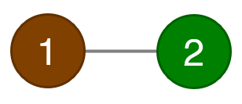
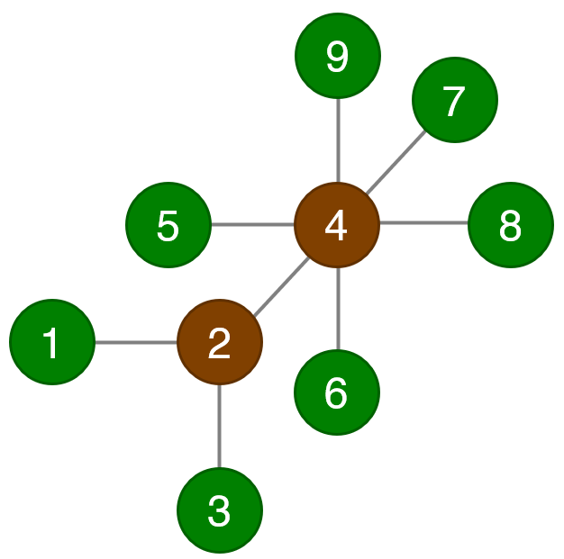

## 문제 설명

정점 수가 $2\times 10^5$ 이하인 트리이며, 각 정점이 **갈색** 또는 **녹색**이고 다음 조건을 모두 만족하는 것을 **좋은 가지**라고 합니다.

- 갈색 정점이 존재합니다.
- 녹색 정점이 존재합니다.
- 갈색 정점에 인접한 갈색 정점의 수는 최대 $2$개입니다.
- 갈색 정점끼리를 연결하는 경로에 녹색 정점이 존재하지 않습니다.

좋은 가지의 **아름다움**을 다음과 같이 구합니다.

- 모든 갈색 정점에 대해 인접한 녹색 정점의 수를 구합니다.
- 그 총곱을 아름다움으로 합니다.

아름다움이 정확히 $X$가 되는 좋은 가지 중 정점 수가 최소인 것을 출력하세요. 그러한 것이 여러 개라면 그중 아무 것이나 출력해도 됩니다.

단, 좋은 가지 중 조건을 만족하는 것이 존재하지 않는 경우에는 대신 그 사실을 보고하세요. 특히 정점 수가 $2\times 10^5$보다 큰 트리는 좋은 가지의 조건을 만족하지 않는다는 점에 주의하세요.

## 입력

```text
$X$
```

## 제한

- $1\leq X\leq 10^{18}$
- $X$는 정수입니다.

## 출력

좋은 가지이며 조건을 만족하는 것이 존재하지 않는 경우 $-1$만 출력하세요.

그렇지 않은 경우, 즉 답이 존재하는 경우에는 다음 형식으로 출력하세요.

```text
$n$
$u_1\ v_1$
$u_2\ v_2$
$\vdots$
$u_{n-1}\ v_{n-1}$
$c_1\ c_2\ \dots\ c_n$
```

$n$은 정점 수입니다. 정점에 $1,2,\dots,n$이라는 번호를 붙인 트리를 출력합니다.

$u_i\ v_i$는 정점 $u_i$와 정점 $v_i$를 잇는 간선이고, $c_i$는 정점 $i$의 색입니다. 여기서 $c_i$는 `b` 또는 `g`여야 하며, $c_i=\texttt{b}$이면 정점 $i$가 갈색임을, $c_i=\texttt{g}$이면 정점 $i$가 녹색임을 나타냅니다.

출력이 이 형식을 따르지 않으면 판정 결과는 정해지지 않습니다. 특히 불필요한 개행이나 공백이 있거나 필요한 개행이나 공백이 없으면 **WA**로 판정될 수 있습니다.

## 예제

### 예제 1 {file="01_sample_01.txt"}

#### 입력

```text
1
```

#### 출력

```text
2
1 2
b g
```

이 출력은 다음과 같은 트리입니다. 정점 $1$이 갈색으로, 정점 $2$가 녹색으로 칠해져 있습니다.



이 트리가 좋은 가지의 조건을 모두 만족한다는 것을 확인할 수 있습니다. 정점 $1$에 인접한 녹색 정점은 $1$개이므로 아름다움은 $1$입니다. 정점 수가 $1$ 이하인 트리 중 조건을 만족하는 것은 존재하지 않으므로 이는 올바른 답입니다.

예를 들어 다음과 같은 출력은 아름다움이 $1$이지만 정점 수가 최소가 아니므로 오답으로 판정됩니다.

```text
3
1 2
2 3
b g g
```


### 예제 2 {file="01_sample_02.txt"}

#### 입력

```text
10
```

#### 출력

```text
9
1 2
2 3
4 2
5 4
7 4
4 6
9 4
4 8
g b g b g g g g g
```

이 출력은 다음과 같은 트리입니다. 정점 $2,4$가 갈색으로, 나머지 정점이 녹색으로 칠해져 있습니다.



이 트리가 좋은 가지의 조건을 모두 만족한다는 것을 확인할 수 있습니다. 정점 $2$에 인접한 녹색 정점은 $2$개이고, 정점 $4$에 인접한 녹색 정점은 $5$개이므로 아름다움은 $10$입니다. 정점 수가 $8$ 이하인 트리 중 조건을 만족하는 것은 존재하지 않으므로 이는 올바른 답입니다.


### 예제 3 {file="01_sample_03.txt"}

#### 입력

```text
998244353
```

#### 출력

```text
-1
```

정점 수가 $2\times 10^5$ 이하인 트리 중 조건을 만족하는 것은 존재하지 않습니다.
