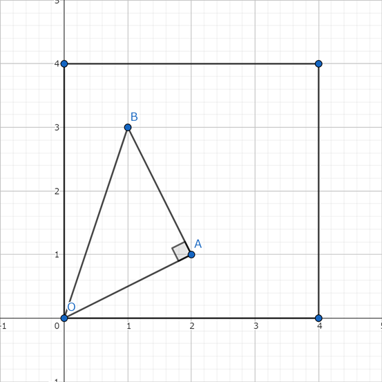

## 문제 설명

좌표평면 위의 $4$개 점 $O(0, 0)$, $(D, 0)$, $(D, D)$, $(0, D)$으로 이루어진 정사각형의 둘레와 내부를 합친 영역 $X$를 생각합니다.

영역 $X$ 위의 점 $A=(x,y)$가 주어집니다. 영역 $X$ 위의 **격자점** 중에서 $\angle OAB=90^\circ$가 되는 점 $B$를 고릅니다. 삼각형 $OAB$의 넓이의 최댓값을 구하세요.

삼각형 $OAB$의 넓이의 최댓값을 $2$배한 값 $S$는 항상 정수가 된다는 것을 보일 수 있습니다. $S$를 출력하세요.

조건을 만족하는 (퇴화하지 않은) 직각삼각형을 만들 수 없는 경우에는 $0$을 출력하세요.

이 문제는 여러 테스트 케이스로 이루어져 있습니다. $T$개의 테스트 케이스에 대한 답을 구하세요.

## 입력

입력은 다음 형식으로 표준 입력에서 주어집니다. $Case_i$는 $i$번째 테스트 케이스를 나타냅니다.

```text
$T$
$Case_1$
$Case_2$
$\vdots$
$Case_T$
```

각 테스트 케이스는 다음 형식으로 주어집니다.

```text
$D\ x\ y$
```

## 제한

- $1 \leq T \leq 100$
- $1 \leq D \leq 10^9$
- $0 \leq x,y \leq D$
- $(x,y) \neq (0,0)$
- 입력은 모두 정수입니다.

## 출력

각 테스트 케이스에 대한 답을 $1$줄에 출력하세요.

## 예제

### 예제 1 {file=""}

#### 입력

```text
3
4 2 1
3 3 3
6 1 1
```

#### 출력

```text
5
0
2
```

$1$번째 테스트 케이스를 그림으로 나타내면 다음과 같습니다. $B=(1,3)$으로 고릅니다. $\angle OAB=90^\circ$이고 $\triangle OAB$의 넓이는 $\frac{5}{2}$입니다. 이것이 넓이의 최댓값이므로 그 $2$배를 출력합니다.



$2$번째 테스트 케이스에서는 퇴화하지 않은 직각삼각형 $OAB$를 만들 수 없습니다.
