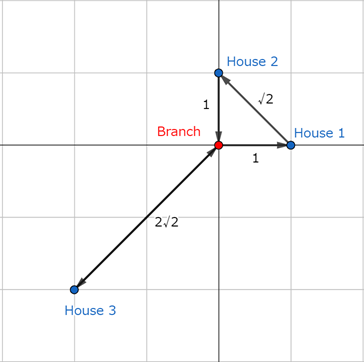

## 이야기

binapくん은 피자 가게에서 아르바이트를 하고 있습니다.

## 문제 설명

지금 $N$건의 주문이 동시에 들어왔습니다. $i$번째($1\leq i\leq N$) 주문은 좌표 $(x_i,y_i)$에 있는 집에 피자 $1$장을 배달해 달라는 내용입니다.

피자 가게는 원점 $O(0,0)$에 있으며, 항상 피자가 무한히 비축되어 있습니다.

binapくん은 피자 가게에서 피자를 받아 주문을 처리합니다. 하지만 피자는 동시에 최대 $K$장까지만 운반할 수 있으며, 피자 가게에 다시 들르면 가지고 있는 피자가 $K$장이 되도록 받을 수 있습니다.

binapくん이 피자 $K$장을 가진 상태로 피자 가게를 출발하여 모든 주문을 완료한 뒤 다시 피자 가게로 돌아올 때까지 걸리는 시간의 최솟값을 구하세요.

좌표 $(x_s,y_s)$에서 좌표 $(x_t,y_t)$까지 이동하는 데 걸리는 시간은 $\sqrt{(x_t-x_s)^2+(y_t-y_s)^2}$이며, 피자를 전달하는 데 걸리는 시간은 무시할 수 있습니다.

## 입력

입력은 다음 형식으로 주어집니다.

```text
$N\ K$
$x_1\ y_1$
$x_2\ y_2$
$\vdots$
$x_N\ y_N$
```

$N$과 $K$는 주문의 수와 동시에 운반할 수 있는 피자의 최대 개수입니다. $x_i$와 $y_i$는 $i$번째 주문의 배달지 좌표입니다.

## 제한

- $1\leq K\leq N\leq 14$
- $-10^9\leq x_i,y_i\leq 10^9$ ($1\leq i\leq N$)
- $i\neq j\iff (x_i,y_i)\neq(x_j,y_j)$
- $(x_i,y_i)\neq(0,0)$ ($1\leq i\leq N$)
- 입력은 모두 정수입니다.

## 출력

답을 출력하세요. 답이 의도한 정답과 절대 오차 또는 상대 오차 $10^{-6}$ 이하이면 정답으로 처리됩니다.

## 예제

### 예제 1 {file=""}

#### 입력

```text
3 2
1 0
0 1
-2 -2
```

#### 출력

```text
9.07106781187
```



최단 경로의 사례를 $1$가지 제시하겠습니다.

- 피자 가게에서 집 $1$로 이동합니다. 시간 $1$이 걸리며, 가지고 있는 피자가 $2$장에서 $1$장으로 줄어듭니다.
- 집 $1$에서 집 $2$로 이동합니다. 시간 $\sqrt{2}$가 걸리며, 가지고 있는 피자가 $1$장에서 $0$장으로 줄어듭니다.
- 집 $2$에서 피자 가게로 이동합니다. 시간 $1$이 걸리며, 가지고 있는 피자가 $0$장에서 $2$장으로 늘어납니다.
- 피자 가게에서 집 $3$으로 이동합니다. 시간 $2\sqrt{2}$가 걸리며, 가지고 있는 피자가 $2$장에서 $1$장으로 줄어듭니다.
- 집 $3$에서 피자 가게로 이동합니다. 시간 $2\sqrt{2}$가 걸립니다.

이러한 경로로 배달하면 모든 주문을 마치고 피자 가게로 돌아올 수 있습니다. 걸리는 시간의 합은 $2+5\sqrt{2}$이며, 이보다 짧은 시간에 배달하는 것은 불가능합니다.

### 예제 2 {file=""}

#### 입력

```text
3 3
1 0
0 1
-2 -2
```

#### 출력

```text
8.84819196258
```

### 예제 3 {file=""}

#### 입력

```text
5 3
-1 -2
1 1
5 2
-3 2
-3 1
```

#### 출력

```text
21.3696545235
```
