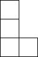
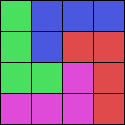

## 문제 설명

$1\times 1$인 정사각형을 칸이라고 합니다. L미노(L테트로미노)는 $4$개의 칸으로 이루어진 도형이며, 아래 그림과 같은 모양입니다.



binapくん은 L미노를 $10^{100}$개 가지고 있습니다. 이 중 몇 개를 선택하여, **회전이나 뒤집기를 허용하여** $N$행 $M$열의 칸으로 이루어진 직사각형 모양을 겹침이나 빈틈 없이 채울 수 있는지 판정하세요.

가능하다면 그중 $1$가지 방법을 제시하세요.

이 문제는 멀티 테스트 케이스입니다. $T$개의 테스트 케이스에 답하세요.

## 입력

입력은 다음 형식으로 표준 입력에서 주어집니다. $Case_i$는 $i$번째 테스트 케이스를 나타냅니다.

```text
$T$
$Case_1$
$Case_2$
$\vdots$
$Case_T$
```

각 테스트 케이스는 다음 형식으로 주어집니다.

```text
$N\ M$
```

## 제한

- $1\leq T\leq 500$
- $1\leq N\leq 500$
- $1\leq M\leq 500$
- 입력은 정수입니다.
- 모든 테스트 케이스에 대한 $NM$의 합은 $3\times 10^5$ 이하입니다.

## 출력

각 테스트 케이스에 대해 순서대로 다음을 출력하세요.

- 불가능한 경우 $-1$을 출력하고 개행하세요.
- 가능한 경우 먼저 채우기에 사용하는 L미노의 개수 $K$를 출력하고 개행하세요. 이어서 가능한 채우기 방법을 $N$행 $M$열로 나타내세요.

$i$행($1\leq i\leq N$) $j$열($1\leq j\leq M$)의 칸이 $k$번째 L미노($1\leq k\leq K$)에 의해 차지된다면 $A_{ij}=k$로 정의하여 다음을 출력하세요.

```text
$K$
$A_{11}\ A_{12}\ \cdots\ A_{1M}$
$A_{21}\ A_{22}\ \cdots\ A_{2M}$
$\vdots$
$A_{N1}\ A_{N2}\ \cdots\ A_{NM}$
```

유효한 채우기 방법이어야 합니다. 즉, 각 $k$($1\leq k\leq K$)에 대해 $A_{ij}=k$인 정수 쌍 $(i,j)$가 정확히 $4$개 존재하고, 그 칸들이 L자 모양(또는 역L자 모양)으로 배열되어 있어야 합니다.

채우는 방법이 여러 가지라면 그중 $1$가지 방법을 출력해도 됩니다.

## 예제

### 예제 1 {file=""}

#### 입력

```text
1
4 4
```

#### 출력

```text
4
3 2 2 2
3 2 4 4
3 3 1 4
1 1 1 4
```

$4$행 $4$열의 칸은 $4$개의 L미노를 사용하여 채울 수 있습니다.

출력 예시의 채우기 방법은 아래 그림과 같습니다.



L미노는 회전과 뒤집기가 허용됩니다. 다음과 같이 출력해도 정답으로 인정됩니다.

#### 출력

```text
4
1 1 1 2
3 3 1 2
3 4 2 2
3 4 4 4
```

### 예제 2 {file=""}

#### 입력

```text
2
1 1
3 5
```

#### 출력

```text
-1
-1
```

$1$행 $1$열의 칸을 L미노로 채우는 것은 불가능합니다.

$3$행 $5$열의 칸을 L미노로 채우는 것은 불가능합니다.
