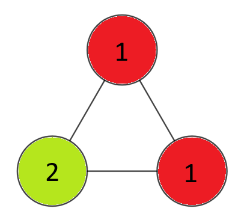
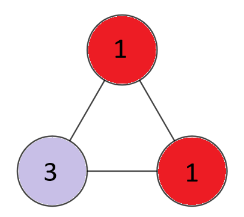
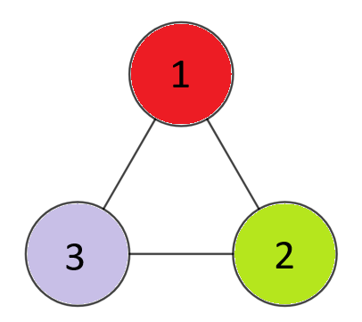
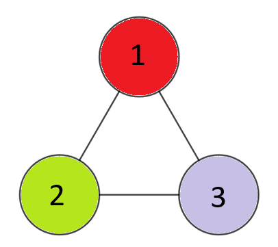

## 이야기

binapくん은 인형 놀이를 좋아합니다. 언제나 인형들을 원탁에 앉혀 다과회를 재현하고 있었는데, 문득 인형들을 앉히는 방법이 몇 가지나 있는지 궁금해졌습니다.

## 문제 설명

binapくん은 $N$종류의 인형을 가지고 있으며, $i$번째 종류의 인형은 $A_i$개 있습니다.

원탁에는 $K$개의 인형을 같은 간격으로 앉힐 수 있습니다. 빈자리가 있어서는 안 됩니다.

인형들을 앉히는 방법의 수를 구하세요. 답은 매우 큰 값이 될 수 있으므로, 소수 $998\,244\,353$으로 나눈 나머지를 출력하세요.

$2$가지 앉히는 방법은 원탁을 평면 안에서 어떻게 회전해도 앉아 있는 인형들의 종류를 모두 일치시킬 수 없을 때, 그리고 그때에만 서로 다르다고 합니다.

## 입력

입력은 다음 형식으로 표준 입력에서 주어집니다.

```text
$N\ K$
$A_1\ A_2\ \cdots\ A_N$
```

$1$번째 줄에 인형의 종류 수를 나타내는 정수 $N$과 원탁에 앉힐 인형의 수를 나타내는 정수 $K$가 주어집니다.

$2$번째 줄에 각 종류의 인형 수를 나타내는 $N$개의 정수 $A_1,\ldots,A_N$이 주어집니다.

## 제한

- $1\leq N\leq 3\times 10^5$
- $2\leq K\leq 1\,300$
- $1\leq A_i\leq 998\,244\,352$ $(1\leq i\leq N)$
- $K\leq\sum_{i=1}^N A_i$
- 입력은 모두 정수입니다.

## 출력

앉히는 방법의 총 개수를 $998\,244\,353$으로 나눈 나머지를 출력하세요.

## 예제

### 예제 1 {file=""}

#### 입력

```text
3 3
2 1 1
```

#### 출력

```text
4
```

아래 그림에 나타난 $4$가지 방법이 있습니다. 특히 $3$번째 방법과 $4$번째 방법이 구별된다는 점에 주의하세요.









### 예제 2 {file=""}

#### 입력

```text
3 6
3 4 1
```

#### 출력

```text
32
```

### 예제 3 {file=""}

#### 입력

```text
5 4
4 4 3 2 1
```

#### 출력

```text
128
```

### 예제 4 {file=""}

#### 입력

```text
14 14
1 1 1 1 1 1 1 1 1 1 1 1 1 1
```

#### 출력

```text
237554682
```

앉히는 방법의 총 개수를 $998\,244\,353$으로 나눈 나머지를 출력하세요.
