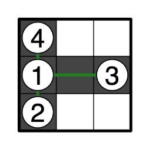
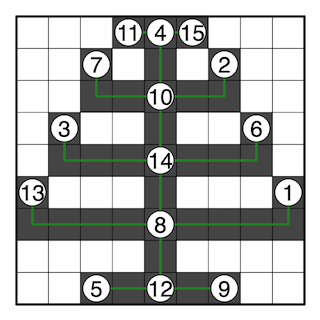
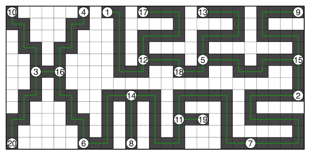

## 이야기

크리스마스가 끝나면 트리를 정리해야 합니다.

## 문제 설명

다음 문제를 $Q$개의 테스트 케이스에 대해 해결하세요.

$N$개의 정점을 가진 트리 $T$가 주어집니다. 정점에는 $1,\dots,N$의 번호가 붙어 있으며, $i$번째 간선은 정점 $u_i$와 정점 $v_i$를 잇고 가중치가 $w_i$입니다.

또한 $H$행 $W$열의 격자 $G$가 있으며, 각 칸은 흰색 또는 검은색으로 칠해져 있습니다. $i$행 $j$열의 칸 색은 문자 $S_{i,j}$로 주어지며, $S_{i,j}$가 `.`이면 흰색, `#`이면 검은색입니다. 다음 조건을 모두 만족하도록 칠해져 있음이 보장됩니다.

- 검은색 칸이 $1$개 이상 존재합니다.
- 검은색 칸들은 연결되어 있습니다. 즉, 임의의 검은색 칸에서 임의의 검은색 칸으로, 상하좌우로 인접한 검은색 칸으로 이동하는 것을 반복하여 도달할 수 있습니다.
- 임의의 검은색 칸 $X,Y$에 대해, $X$에서 $Y$까지 상하좌우로 인접한 검은색 칸으로 이동하는 경로 중 이동 횟수가 최소인 경로는 유일하게 존재합니다.
  - 그러한 이동 경로에 포함되는 모든 칸의 집합을 $P_{X,Y}$로 나타냅니다. 특히 $X,Y\in P_{X,Y}$입니다.

다음 조건을 모두 만족하도록 $G$의 검은색 칸 $C_1,\dots,C_N$을 선택할 수 있는지 판정하고, 가능하다면 선택 방법을 $1$개 구성하세요.

- 임의의 $i,j\in\{1,\dots,N\}$에 대해, $T$에서 정점 $i,j$ 사이의 거리와 $G$에서 검은색 칸 $C_i,C_j$ 사이의 거리가 같습니다.
  - $T$에서 정점 $i,j$ 사이의 거리는 $i,j$를 잇는 단순 경로(유일하게 존재)에 포함된 간선의 가중치 합입니다.
  - $G$에서 검은색 칸 $C_i,C_j$ 사이의 거리는 $C_i$에서 $C_j$까지 상하좌우로 인접한 검은색 칸으로 이동할 때의 이동 횟수 최솟값, 즉 $|P_{C_i,C_j}|-1$입니다.
- $G$의 임의의 검은색 칸 $C$에 대해, 어떤 $i,j\in\{1,\dots,N\}$이 존재하여 $C\in P_{C_i,C_j}$입니다.

## 입력

입력은 다음 형식으로 주어집니다.

```text
$Q$
$testcase_1$
$testcase_2$
$\vdots$
$testcase_Q$
```

각 테스트 케이스는 다음 형식으로 주어집니다.

$testcase_i$는 $i$번째 테스트 케이스를 의미합니다.

```text
$N$
$u_1\ v_1\ w_1$
$u_2\ v_2\ w_2$
$\vdots$
$u_{N-1}\ v_{N-1}\ w_{N-1}$
$H\ W$
$S_{1,1}S_{1,2}\cdots S_{1,W}$
$S_{2,1}S_{2,2}\cdots S_{2,W}$
$\vdots$
$S_{H,1}S_{H,2}\cdots S_{H,W}$
```

각 격자 행은 공백 없이 $W$개의 문자를 입력합니다. 각 문자는 해당 열의 칸 색을 나타냅니다.

## 제한

- $1\leq Q\leq 2\,024$
- $1\leq N\leq H\times W$
- $1\leq u_i<v_i\leq N$
- $1\leq w_i\leq H\times W$
- $1\leq H\leq 12$
- $1\leq W\leq 25$
- $S_{i,j}$는 `.` 또는 `#`입니다.
- $S_{i,j}=$ `#`인 $i,j$가 존재합니다.
- $S_{i,j}$ 이외의 입력은 모두 정수입니다.
- 각 입력 파일에 대해, 그 입력에 포함된 테스트 케이스의 $H\times W$의 합은 $12\,250$ 이하입니다.

## 출력

각 테스트 케이스에 대해 순서대로 다음과 같이 출력하세요.

문제의 조건을 만족하는 선택 방법이 존재하지 않으면 다음 $1$줄만 출력하세요.

```text
No
```

존재한다면, 칸 $C_1,\dots,C_N$을 선택했다고 할 때 $C_i$가 $x_i$행 $y_i$열의 칸인 경우 다음 형식으로 출력하세요.

```text
Yes
$x_1\ y_1$
$x_2\ y_2$
$\vdots$
$x_N\ y_N$
```

어느 경우든 마지막에 줄 바꿈을 출력하세요.

## 예제

### 예제 1 {file=""}

#### 입력

```text
5
4
1 2 1
1 4 1
1 3 2
3 3
#..
###
#..
4
1 2 1
1 4 2
1 3 2
3 3
#..
###
#..
3
1 2 1
1 3 2
3 3
#..
###
#..
15
4 15 1
8 13 5
5 12 2
8 14 2
3 14 4
4 10 2
7 10 3
1 8 5
9 12 2
6 14 4
10 14 2
4 11 1
8 12 2
2 10 3
9 9
...###...
..#.#.#..
..#####..
.#..#..#.
.#######.
#...#...#
#########
....#....
..#####..
20
5 15 10
11 14 10
6 16 8
3 10 7
12 17 10
11 19 2
7 11 12
3 16 2
1 12 9
5 13 10
2 7 16
9 15 10
5 18 3
4 16 7
2 15 3
12 18 4
6 14 8
3 20 8
8 14 4
12 25
#.....#.##.####.####.####
##...##..#....#....#.#...
.#...#...#.####.####.####
.##.##...#.#....#.......#
..#.#....#.####.####.####
..###....###..###..###..#
..#.#...................#
.##.##..#####.#####.#####
.#...#..#.#.#.#...#.#....
##...##.#.#.#.###.#.#####
#.....#.#.#.#.#...#.....#
#.....###.#.###...#######
```

#### 출력

```text
Yes
2 1
3 1
2 3
1 1
No
No
Yes
6 9
2 7
4 2
1 5
9 3
4 8
2 3
7 5
9 7
3 5
1 4
9 5
6 1
5 5
1 6
Yes
1 9
8 25
6 3
1 7
5 17
12 7
12 21
12 11
1 25
1 1
10 15
5 12
1 17
8 11
5 25
6 5
1 12
6 15
10 17
12 1
```

$1$번째 테스트 케이스의 출력은 다음 그림과 같습니다.



$2$번째 테스트 케이스에서는 문제의 $1$번째 조건을 만족하는 칸의 선택 방법이 존재하지 않습니다.

$3$번째 테스트 케이스에서는 문제의 $1$번째 조건을 만족하는 칸의 선택 방법은 존재하지만, $2$번째 조건까지 만족하는 칸의 선택 방법은 존재하지 않습니다.

$4$번째 테스트 케이스의 출력은 다음 그림과 같습니다.



$5$번째 테스트 케이스의 출력은 다음 그림과 같습니다.



