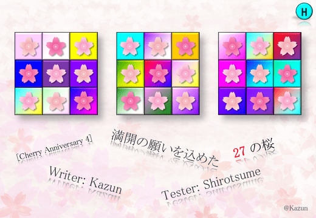

문제 비주얼입니다.



이미지에는 제목 [Cherry Anniversary 4] 만개를 바라는 마음을 담은 $27$개의 벚꽃, 출제자: Kazun, 테스터: Shirotsume가 표시됩니다.

## 문제 설명

$27$개의 원소를 가진 $3 \times 3 \times 3$ 삼중 첨자 수열 $A = \left(A_{i,j,k}\right)_{\substack{1 \leq i \leq 3 \\ 1 \leq j \leq 3 \\ 1 \leq k \leq 3}}$가 주어집니다.

$A$가 다음 조건을 모두 만족할 때, $A$를 "만개 수열"이라고 합니다.

- $1 \leq j \leq 3$, $1 \leq k \leq 3$을 만족하는 모든 정수 쌍 $(j,k)$에 대해 $A_{1,j,k} + A_{2,j,k} + A_{3,j,k} = X_{j,k}$입니다.
- $1 \leq i \leq 3$, $1 \leq k \leq 3$을 만족하는 모든 정수 쌍 $(i,k)$에 대해 $A_{i,1,k} + A_{i,2,k} + A_{i,3,k} = Y_{i,k}$입니다.
- $1 \leq i \leq 3$, $1 \leq j \leq 3$을 만족하는 모든 정수 쌍 $(i,j)$에 대해 $A_{i,j,1} + A_{i,j,2} + A_{i,j,3} = Z_{i,j}$입니다.

$A$에 대해 다음 연산 $(S)$를 $0$번 이상 수행하여 $A$를 만개 수열로 만들 수 있는지 판정하세요. 가능하다면 $A$를 만개 수열로 만들기 위해 필요한 연산 $(S)$의 최소 횟수를 구하세요.

- 연산 $(S)$: 다음 $3$가지 연산 중 $1$개를 골라 수행합니다.
  - $1 \leq p_1 < p_2 \leq 3$을 만족하는 정수 쌍 $(p_1,p_2)$를 $1$개 골라 다음을 수행합니다.
    - $1 \leq j \leq 3$, $1 \leq k \leq 3$을 만족하는 모든 정수 쌍 $(j,k)$에 대해 다음 연산을 각각 $1$번 수행합니다: $A_{p_1,j,k}$와 $A_{p_2,j,k}$를 맞바꿉니다.
  - $1 \leq q_1 < q_2 \leq 3$을 만족하는 정수 쌍 $(q_1,q_2)$를 $1$개 골라 다음을 수행합니다.
    - $1 \leq i \leq 3$, $1 \leq k \leq 3$을 만족하는 모든 정수 쌍 $(i,k)$에 대해 다음 연산을 각각 $1$번 수행합니다: $A_{i,q_1,k}$와 $A_{i,q_2,k}$를 맞바꿉니다.
  - $1 \leq r_1 < r_2 \leq 3$을 만족하는 정수 쌍 $(r_1,r_2)$를 $1$개 골라 다음을 수행합니다.
    - $1 \leq i \leq 3$, $1 \leq j \leq 3$을 만족하는 모든 정수 쌍 $(i,j)$에 대해 다음 연산을 각각 $1$번 수행합니다: $A_{i,j,r_1}$와 $A_{i,j,r_2}$를 맞바꿉니다.

여기서 $1$ 이상 $3$ 이하인 정수 $i_1,i_2,j_1,j_2,k_1,k_2$에 대해 "$A_{i_1,j_1,k_1}$과 $A_{i_2,j_2,k_2}$를 맞바꾼다"는 $A$에 다음 변경을 수행하는 것을 뜻합니다.

- 먼저 변수 $x_1$, $x_2$를 준비합니다. 다음으로 $x_1$에 $A_{i_1,j_1,k_1}$을, $x_2$에 $A_{i_2,j_2,k_2}$를 대입합니다. 그 후 $A_{i_1,j_1,k_1}$에 $x_2$를, $A_{i_2,j_2,k_2}$에 $x_1$을 대입합니다.

**$T$개의 테스트 케이스에 답하세요.**

## 입력

전체 입력은 다음 형식으로 주어집니다.

```text
$T$
$\textrm{Testcase}_1$
$\textrm{Testcase}_2$
$\vdots$
$\textrm{Testcase}_T$
```

$1$번째 줄에 테스트 케이스의 개수 $T$가 주어집니다. 이어서 $T$개의 테스트 케이스가 주어지며, $\textrm{Testcase}_i$는 $i$번째 테스트 케이스를 나타냅니다.

각 테스트 케이스는 다음 형식으로 주어집니다.

```text
$A_{1,1,1}\ A_{1,1,2}\ A_{1,1,3}$
$A_{1,2,1}\ A_{1,2,2}\ A_{1,2,3}$
$A_{1,3,1}\ A_{1,3,2}\ A_{1,3,3}$
$A_{2,1,1}\ A_{2,1,2}\ A_{2,1,3}$
$A_{2,2,1}\ A_{2,2,2}\ A_{2,2,3}$
$A_{2,3,1}\ A_{2,3,2}\ A_{2,3,3}$
$A_{3,1,1}\ A_{3,1,2}\ A_{3,1,3}$
$A_{3,2,1}\ A_{3,2,2}\ A_{3,2,3}$
$A_{3,3,1}\ A_{3,3,2}\ A_{3,3,3}$
$X_{1,1}\ X_{1,2}\ X_{1,3}$
$X_{2,1}\ X_{2,2}\ X_{2,3}$
$X_{3,1}\ X_{3,2}\ X_{3,3}$
$Y_{1,1}\ Y_{1,2}\ Y_{1,3}$
$Y_{2,1}\ Y_{2,2}\ Y_{2,3}$
$Y_{3,1}\ Y_{3,2}\ Y_{3,3}$
$Z_{1,1}\ Z_{1,2}\ Z_{1,3}$
$Z_{2,1}\ Z_{2,2}\ Z_{2,3}$
$Z_{3,1}\ Z_{3,2}\ Z_{3,3}$
```

$A$의 원소 $27$개, $X$의 원소 $9$개, $Y$의 원소 $9$개, $Z$의 원소 $9$개가 위 형식으로 주어집니다. 각 줄에는 공백으로 구분된 $3$개의 정수가 주어집니다.

## 제한

- $1 \leq T \leq 5\,000$입니다.
- 각 테스트 케이스에 대해 다음 제한을 만족합니다.
  - $-10^8 \leq A_{i,j,k} \leq 10^8$ ($1 \leq i,j,k \leq 3$)입니다.
  - $-3 \times 10^8 \leq X_{j,k} \leq 3 \times 10^8$ ($1 \leq j,k \leq 3$)입니다.
  - $-3 \times 10^8 \leq Y_{i,k} \leq 3 \times 10^8$ ($1 \leq i,k \leq 3$)입니다.
  - $-3 \times 10^8 \leq Z_{i,j} \leq 3 \times 10^8$ ($1 \leq i,j \leq 3$)입니다.
- 입력은 모두 정수입니다.

## 출력

$T$개의 줄을 출력합니다.

$t$ ($1 \leq t \leq T$)번째 줄에는 $t$번째 테스트 케이스에 대해 $A$를 만개 수열로 만들 수 있다면, 만개 수열로 만들기 위해 필요한 연산 $(S)$의 최소 횟수를 출력하고, 불가능하다면 $-1$을 출력하세요.

마지막에 줄바꿈을 출력하세요.

## 예제

### 예제 1 {file="0_Sample_1.txt"}

#### 입력

```text
3
1 0 1
0 0 0
0 0 0
0 0 0
0 0 0
0 0 0
0 0 0
0 0 0
0 0 0
0 0 0
0 0 0
1 0 1
0 0 0
0 0 0
1 0 1
0 0 0
0 0 0
0 0 2
1 2 3
4 5 6
7 8 9
-1 -2 -3
-4 -5 -6
-7 -8 -9
1 2 3
4 5 6
7 8 9
100 200 300
400 500 600
700 800 900
100 200 300
400 500 600
700 800 900
100 200 300
400 500 600
700 800 900
19970104 19981114 19980215
20010129 19990417 20000418
19991012 20021219 20020323
19981021 20010829 20020112
19991013 20010710 20000102
20050927 20020113 20060109
20040725 20050707 20050412
20030217 20061108 20060509
20040818 20050215 20050122
60062235 60031359 60061029
60091547 60082757 60130554
60042650 59991850 60050739
59992750 59971245 60000956
60162030 60111760 60161043
60041652 60022961 60080323
60000964 60032554 59931433
60151834 60141155 60141844
60001825 60131149 60011962
```

#### 출력

```text
2
-1
4
```

[$1$번째 테스트 케이스]

다음과 같이 연산 $(S)$를 $2$번 수행하면 $A$를 만개 수열로 만들 수 있습니다.

- $1 \leq q_1 < q_2 \leq 3$을 만족하는 정수 쌍 $(q_1,q_2)$로 $(1,3)$을 고르고, $1 \leq i \leq 3$, $1 \leq k \leq 3$을 만족하는 모든 정수 쌍 $(i,k)$에 대해 $A_{i,q_1,k}$와 $A_{i,q_2,k}$를 맞바꿉니다.
- $1 \leq p_1 < p_2 \leq 3$을 만족하는 정수 쌍 $(p_1,p_2)$로 $(1,3)$을 고르고, $1 \leq j \leq 3$, $1 \leq k \leq 3$을 만족하는 모든 정수 쌍 $(j,k)$에 대해 $A_{p_1,j,k}$와 $A_{p_2,j,k}$를 맞바꿉니다.

이 연산 후에는 $A_{3,3,1} = A_{3,3,3} = 1$이고, 나머지 $25$개 원소는 모두 $0$입니다.

그리고 만개 수열인지 확인하기 위해, 예를 들어 다음이 성립합니다.

- $(j,k)=(3,1)$로 두면 $A_{1,j,k} + A_{2,j,k} + A_{3,j,k} = 1 = X_{j,k}$입니다.
- $(i,j)=(3,3)$으로 두면 $A_{3,3,1} + A_{3,3,2} + A_{3,3,3} = 2 = Z_{3,3}$입니다.

또한 연산 $(S)$를 $2$번 미만 수행해서는 $A$를 만개 수열로 만들 수 없습니다. 따라서 정답은 $2$입니다.

[$2$번째 테스트 케이스]

연산 $(S)$를 $0$번 이상 수행해서는 $A$를 만개 수열로 만들 수 없습니다. 따라서 $-1$을 출력해야 합니다.
