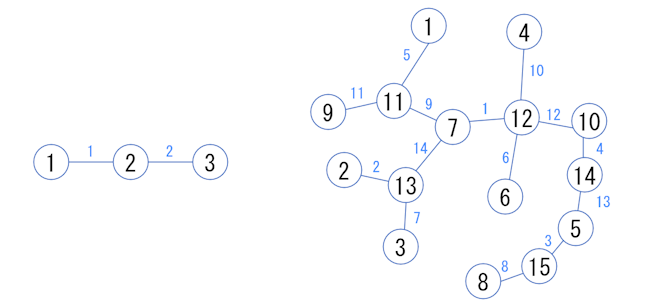
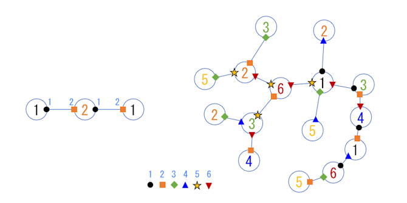

**22:05 추가:** 각 색은 $1$ 이상 $Q$ 이하의 정수로 나타내세요.

## 이야기

[国立こゃーそ大学](https://yukicoder.me/problems/no/2584)에서는 학교 축제를 준비하고 있습니다.

## 문제 설명

こゃーそ大学의 캠퍼스에는 $N$개의 **광장**과 $N-1$개의 **도로**가 있습니다. 각 도로는 정확히 $2$개의 광장을 연결합니다. $N-1$개의 도로를 통해 모든 광장 사이를 오갈 수 있습니다. 광장에는 $1$부터 $N$까지, 도로에는 $1$부터 $N-1$까지 번호가 붙어 있습니다.

광장 $k$에는 $C_k$개의 도로가 연결되어 있으며, 그 번호는 $E_{k,1},E_{k,2},\ldots,E_{k,C_k}$입니다. 또한 광장 $k$와 도로 $e$가 연결된 곳에는 **게이트** $(k,e)$가 설치되어 있습니다.

축제 장식으로 각 광장 $k$에 **광장 색** $F(k)$를 할당하고, 각 게이트 $(k,e)$에 **게이트 색** $F'(k,e)$를 할당합니다. 색 할당은 다음 조건을 만족해야 합니다.

- 각 도로 양 끝의 **게이트 색**은 서로 달라야 합니다. 즉, $a\neq b$이면 $F'(a,e)\neq F'(b,e)$여야 합니다.
- **광장 색**과 해당 광장에 설치된 게이트의 **게이트 색**을 쌍으로 만든 것은 캠퍼스 전체에서 중복되지 않아야 합니다. 즉, $(a,b)\neq(c,d)$이면 $(F(a),F'(a,b))\neq(F(c),F'(c,d))$여야 합니다.

먼저 색의 종류 수 $Q$를 정하고, **광장 색**과 **게이트 색**은 모두 그 $Q$가지 색 중에서 각각 선택합니다. 광장과 게이트에 같은 색을 사용해도 됩니다.

색의 종류 수 $Q$의 최솟값과, 이를 실현하는 색 할당 방법을 구하세요.

$1$번의 프로그램 실행에서 $T$개의 테스트 케이스를 처리하세요.

## 입력

먼저 정수 $T$가 주어집니다. 이어서 테스트 케이스가 $T$개 주어집니다. $1$개의 테스트 케이스 입력은 다음 형식입니다.

```text
$N$
$C_1\ E_{1,1}\ E_{1,2}\ \cdots\ E_{1,C_1}$
$C_2\ E_{2,1}\ E_{2,2}\ \cdots\ E_{2,C_2}$
$\vdots$
$C_N\ E_{N,1}\ E_{N,2}\ \cdots\ E_{N,C_N}$
```

## 제한

- $1\leq T\leq 10\,000$
- $2\leq N\leq 200\,000$
- $1\leq E_{i,j}\leq N-1$
- $E_{i,j}\neq E_{i,k}$ $(1\leq i\leq N,\ 1\leq j<k\leq C_i)$, 즉 $1$개의 광장에 같은 도로가 $2$번 이상 연결되어 있지 않습니다.
- $E_{i,j}$ $(1\leq i\leq N,\ 1\leq j\leq C_i)$의 값으로 $1,2,\ldots,N-1$가 정확히 $2$번씩 나타납니다.
- 모든 광장 사이를 오갈 수 있습니다.
- 입력되는 값은 모두 정수입니다.
- $2\leq T$일 때, $T$개 테스트 케이스에 걸친 $N$의 합은 $100\,000$을 넘지 않습니다.

## 출력

각 테스트 케이스에 대해 $N+1$줄을 출력하세요.

$1$번째 줄에는 색의 개수 $Q$를 출력하세요.

$k+1$번째 줄 $(1\leq k\leq N)$에는 광장 $k$의 색 $F(k)$와 광장 $k$에 인접한 게이트의 색 $F'(k,e)$를 도로 입력 순서대로 출력하세요. 즉, 다음 형식을 따릅니다.

```text
$Q$
$F(1)\ F'(1,E_{1,1})\ F'(1,E_{1,2})\ \cdots\ F'(1,E_{1,C_1})$
$F(2)\ F'(2,E_{2,1})\ F'(2,E_{2,2})\ \cdots\ F'(2,E_{2,C_2})$
$\vdots$
$F(N)\ F'(N,E_{N,1})\ F'(N,E_{N,2})\ \cdots\ F'(N,E_{N,C_N})$
```

마지막에 개행을 출력하세요.

## 예제

### 예제 1 {file=""}

#### 입력

```text
2
3
1 1
2 2 1
1 2
15
1 5
1 2
1 7
1 10
2 3 13
1 6
3 9 14 1
1 8
1 11
2 12 4
3 11 9 5
4 12 10 1 6
3 14 2 7
2 4 13
2 3 8
```

#### 출력

```text
2
2 1
1 1 2
2 2
6
3 3
2 3
4 2
2 4
1 4 2
5 4
6 5 2 6
5 2
5 3
3 1 2
2 5 6 2
1 6 1 5 3
3 5 4 6
4 6 1
6 1 3
```

입력 데이터가 나타내는 캠퍼스의 그림입니다.



이에 대응하여 출력 예제는 다음과 같은 색 할당을 나타냅니다.


