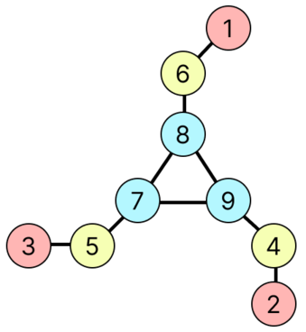
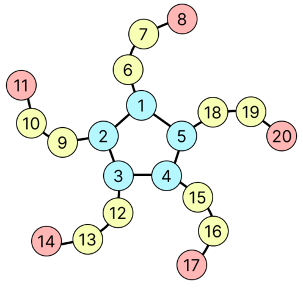

## 문제 설명

$3$ 이상인 정수 $X$, $Y$가 주어집니다. 다음과 같이 정의되는 팔의 개수가 $X$, 팔의 길이가 $Y$인 **岩井星人 그래프**를 $1$개 출력하세요.

- 정점 $XY$개와 간선 $XY$개로 이루어진 단순 무방향 그래프입니다.
- 차수가 $1$인 정점이 $X$개, 차수가 $2$인 정점이 $X(Y-2)$개, 차수가 $3$인 정점이 $X$개 있습니다.
- 임의의 차수 $1$인 정점 $v$에 대해, 정점 $v$에서 가장 가까운 차수 $3$인 정점까지의 거리가 $Y-1$입니다.

구체적인 예는 아래의 **예제**를 참고하세요.

단, 이 문제의 제한에서는 이러한 岩井星人 그래프가 여러 개 존재하지만, 그중 어느 것을 출력해도 정답으로 판정됩니다.

### 단순 무방향 그래프란

**단순 무방향 그래프**란 단순하고 간선에 방향이 없는 그래프를 말합니다.

그래프가 **단순**하다는 것은 그래프에 자기 루프나 다중 간선이 포함되지 않는다는 뜻입니다.

### 차수란

정점의 **차수**란 그 정점에서 뻗어 나가는 간선의 개수입니다.

## 입력

입력은 다음 형식으로 표준 입력에서 주어집니다.

```text
$X\ Y$
```

## 제한

- $3 \le X, Y \le 500$
- 입력은 모두 정수입니다.

## 출력

정답인 팔의 개수가 $X$, 팔의 길이가 $Y$인 岩井星人 그래프가 다음과 같이 설명된다고 합시다.

- 정점 $n$개로 이루어지며, 각 정점에는 $1$부터 $n$까지의 번호가 붙어 있습니다.
- 간선 $m$개로 이루어지며, 각 간선에는 $1$부터 $m$까지의 번호가 붙어 있습니다.
- 각 $i$ ($1 \le i \le m$)에 대해, 간선 $i$는 정점 $u_i$와 정점 $v_i$를 연결합니다.

이때 다음 형식으로 출력하세요. 단, 이 문제의 제한 아래에서는 답이 여러 개 존재하지만, 그중 어느 것을 출력해도 정답으로 판정됩니다.

```text
$n\ m$
$u_1\ v_1$
$u_2\ v_2$
$\vdots$
$u_m\ v_m$
```

## 예제

### 예제 1 {file=""}

#### 입력

```text
3 3
```

#### 출력

```text
9 9
1 6
2 4
3 5
4 9
5 7
6 8
7 8
8 9
9 7
```

다음은 팔의 개수가 $3$, 팔의 길이가 $3$인 岩井星人 그래프의 $1$개의 예입니다.



이 그래프에 대해 다음이 성립합니다. 여기서 $X=3$, $Y=3$입니다.

- 정점 $9$개와 간선 $9$개로 이루어진 단순 무방향 그래프입니다. ($XY=9$)
- 차수 $1$인 정점은 정점 $1$, $2$, $3$의 $3$개입니다. ($X=3$)
- 차수 $2$인 정점은 정점 $4$, $5$, $6$의 $3$개입니다. ($X(Y-2)=3$)
- 차수 $3$인 정점은 정점 $7$, $8$, $9$의 $3$개입니다. ($X=3$)
- 각 차수 $1$인 정점에 대해 다음이 성립합니다.
  - 정점 $1$에서 가장 가까운 차수 $3$인 정점은 정점 $8$이며, 그 거리는 $2$입니다. ($Y-1=2$)
  - 정점 $2$에서 가장 가까운 차수 $3$인 정점은 정점 $9$이며, 그 거리는 $2$입니다.
  - 정점 $3$에서 가장 가까운 차수 $3$인 정점은 정점 $7$이며, 그 거리는 $2$입니다.

### 예제 2 {file=""}

#### 입력

```text
5 4
```

#### 출력

```text
20 20
1 2
1 5
1 6
2 3
2 9
3 4
3 12
4 5
4 15
5 18
6 7
7 8
9 10
10 11
12 13
13 14
15 16
16 17
18 19
19 20
```

다음은 팔의 개수가 $5$, 팔의 길이가 $4$인 岩井星人 그래프의 $1$개의 예입니다.


