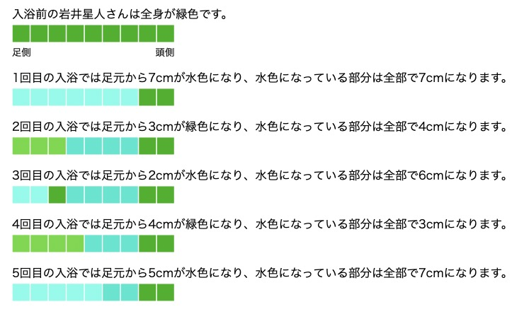

## 이야기

하늘색 코더가 되고 싶은 岩井星人さん은 대중목욕탕에 가서 하늘색 온천에 들어가기로 했습니다. 그런데 하늘색 온천은 너무 뜨거워서 계속 들어가 있을 수 없으므로, 미지근한 녹색 온천과 번갈아 들어갑니다.

## 문제 설명

岩井星人さん은 $N$번 목욕을 하며, 홀수 번째 목욕에서는 하늘색 온천에, 짝수 번째 목욕에서는 녹색 온천에 들어갑니다. 각 $i\ (1 \leq i \leq N)$에 대해, $i$번째 목욕을 마친 시점에 岩井星人さん의 발밑에서부터 $H_i$cm만큼 잠긴 부분이 들어갔던 온천과 같은 색이 됩니다.

岩井星人さん의 키는 $\max_{1 \leq i \leq N} {H_i}$cm보다 크며, 목욕하기 전에는 몸 전체가 녹색입니다. 각 $i\ (1 \leq i \leq N)$에 대해, $i$번째 목욕을 마친 시점에 岩井星人さん의 몸 중 하늘색인 부분은 모두 몇 cm인지 구하세요.

## 입력

입력은 다음 형식으로 표준 입력에서 주어집니다.

```text
$N$
$H_1\ H_2\ \dots\ H_N$
```

$1$번째 줄에 목욕 횟수를 나타내는 정수 $N$이 주어집니다. $2$번째 줄에 각 목욕에서 잠기는 높이를 나타내는 정수 $H_1,H_2,\dots,H_N$이 공백으로 구분되어 주어집니다.

## 제한

- $1 \leq N \leq 2 \times 10^5$
- $1 \leq H_i \leq 10^9$
- 입력되는 값은 모두 정수입니다.

## 출력

$N$줄에 걸쳐 출력하세요. $i$번째 줄에는 $i$번째 목욕을 마친 시점에 岩井星人さん의 몸 중 하늘색인 부분이 모두 몇 cm인지 출력하세요.

## 예제

### 예제 1 {file="01_sample_01.txt"}

#### 입력

```text
5
7 3 2 4 5
```

#### 출력

```text
7
4
6
3
7
```

목욕할 때마다 岩井星人さん의 몸 색은 다음과 같이 변합니다.



이미지 속 일본어 문구는 다음과 같습니다.

- 목욕 전 岩井星人さん의 몸 전체는 녹색입니다. 방향은 왼쪽이 발밑, 오른쪽이 머리 쪽입니다.
- $1$번째 목욕에서는 발밑부터 $7$cm가 하늘색이 되어, 하늘색인 부분은 모두 $7$cm가 됩니다.
- $2$번째 목욕에서는 발밑부터 $3$cm가 녹색이 되어, 하늘색인 부분은 모두 $4$cm가 됩니다.
- $3$번째 목욕에서는 발밑부터 $2$cm가 하늘색이 되어, 하늘색인 부분은 모두 $6$cm가 됩니다.
- $4$번째 목욕에서는 발밑부터 $4$cm가 녹색이 되어, 하늘색인 부분은 모두 $3$cm가 됩니다.
- $5$번째 목욕에서는 발밑부터 $5$cm가 하늘색이 되어, 하늘색인 부분은 모두 $7$cm가 됩니다.
