## 문제 설명

비교기라고 하는 간단한 장치가 있습니다. 비교기는 $2$개의 입력의 값을 비교하고, 큰 값을 뒤쪽에 배치하여 출력합니다. 이러한 비교기를 조합한 비교 네트워크를 적절히 구성하면 입력 열을 정렬하여 비감소 열을 출력하는 정렬 네트워크가 됩니다.

### 문제

$T$개의 비교 네트워크가 주어집니다. $i$번째 $(1\leq i\leq T)$ 비교 네트워크는 길이 $N_i$인 입출력 열을 다루며, $M_i$개의 비교기 $(A_{i,j},B_{i,j})$로 구성됩니다.

$i$번째 비교 네트워크에 대해서는 각각 $N_i,M_i,(A_{i,j},B_{i,j})$를 $N,M,(A_j,B_j)$로 줄여 쓰는 경우가 있습니다.

주어진 $T$개의 비교 네트워크가 각각 **정렬 네트워크인지 여부**를 판정하세요.

- 비교 네트워크가 정렬 네트워크인 경우: 길이 $N$인 임의의 입력 열에 대해 비교 네트워크의 동작 열 $W$에서 시각 $j$에 항상 $W[A_j]\leq W[B_j]$가 성립하여 **$1$번도 교환이 일어나지 않는 비교기 번호** $j\ (1\leq j\leq M)$를 오름차순으로 모두 출력하세요.
- 비교 네트워크가 정렬 네트워크가 아닌 경우: 길이 $N$인 입력 열 중 어떤 입력 열에서는 출력 열 $Y$에서 $Y[k]>Y[k+1]$이 될 수 있는 **인접 요소가 비감소 순서가 되지 않을 가능성이 있는 위치** $k\ (1\leq k\leq N-1)$를 오름차순으로 모두 출력하세요.

### 비교기

- $2$개의 입력과 $2$개의 출력을 가집니다.
- 입력 $(\alpha,\beta)$에 대해 $\alpha\leq\beta$이면 $(\alpha,\beta)$를 출력합니다.
- 입력 $(\alpha,\beta)$에 대해 $\alpha>\beta$이면 $(\beta,\alpha)$를 출력합니다.

### 비교 네트워크

- 비교기 $j\ (1\leq j\leq M)$에 대해 $1\leq A_j<B_j\leq N$입니다.
- 비교 네트워크에 대한 입력 열 $X$는 정수 $\{1,2,\dots,N\}$로 이루어진 수열입니다. (선형 순서(전순서) 집합의 원소로 이루어진 열로 일반화할 수 있습니다.)
- 입력 열 $X$는 길이 $N$인 열이며 $X=[X[1],X[2],\dots,X[N]]$로 나타냅니다.
- 동작 열 $W$는 길이 $N$인 열이며 $W=[W[1],W[2],\dots,W[N]]$로 나타냅니다.
- 출력 열 $Y$는 길이 $N$인 열이며 $Y=[Y[1],Y[2],\dots,Y[N]]$로 나타냅니다.

비교 네트워크는 처리를 시작하는 시각을 $0$으로 할 때 다음과 같이 동작합니다.

- 시각 $0$: 입력 열 $X$를 받아 동작 열 $W$에 복사합니다.
- 시각 $1$: $W[A_1]$과 $W[B_1]$을 비교하고, $W[A_1]>W[B_1]$이면 $W[A_1]$과 $W[B_1]$의 값을 교환합니다.
- 시각 $2$: $W[A_2]$와 $W[B_2]$를 비교하고, $W[A_2]>W[B_2]$이면 $W[A_2]$와 $W[B_2]$의 값을 교환합니다.
- $\vdots$
- 시각 $M$: $W[A_M]$과 $W[B_M]$을 비교하고, $W[A_M]>W[B_M]$이면 $W[A_M]$과 $W[B_M]$의 값을 교환합니다.
- 시각 $(M+1)$: 동작 열 $W$를 출력 열 $Y$에 복사하여 출력합니다.

### 정렬 네트워크

길이 $N$인 임의의 입력 열 $X$에 대해 항상 비감소 열 $Y[1]\leq Y[2]\leq\dots\leq Y[N]$을 출력하는 비교 네트워크를 정렬 네트워크라고 합니다.

반대로 비교 네트워크가 비감소 열을 출력하지 못하는 입력 열이 존재한다면 그 비교 네트워크는 정렬 네트워크가 아닙니다.

## 입력

입력은 표준 입력으로 주어집니다. 여기서 $\mathrm{case}_i$는 $i$번째 테스트 케이스를 뜻합니다.

```text
$T$
$\mathrm{case}_1$
$\mathrm{case}_2$
$\vdots$
$\mathrm{case}_T$
```

각 테스트 케이스는 다음 형식으로 주어집니다.

```text
$N\ M$
$A_1\ A_2\ A_3\ \dots\ A_M$
$B_1\ B_2\ B_3\ \dots\ B_M$
```

## 제한

- 입력은 모두 정수입니다.
- $1\leq T\leq 1\,000$
- $2\leq N_i\leq 27\ (1\leq i\leq T)$
- $1\leq M_i\leq\cfrac{N_i(N_i-1)}{2}\ (1\leq i\leq T)$
- $1\leq A_{i,j}<B_{i,j}\leq N_i\ (1\leq i\leq T,\ 1\leq j\leq M_i)$
- $\sum_{i=1}^{T}(M_i\times\varphi^{N_i})\leq 10^8$
- $\varphi=\dfrac{1+\sqrt{5}}{2}\simeq 1.6180339887$

## 출력

각 테스트 케이스마다 $3$줄, 전체 $3T$줄을 출력하세요.

비교 네트워크가 정렬 네트워크라고 판정한 경우 다음 $3$줄을 출력하세요.

1. $1$번째 줄에 `Yes`를 출력합니다.
2. $2$번째 줄에 조건에 맞는 비교기 번호 $j$의 개수를 출력합니다.
3. $3$번째 줄에 조건에 맞는 비교기 번호 $j$를 오름차순으로 공백으로 구분해 출력합니다. 개수가 $0$개이면 빈 줄을 출력합니다.

비교 네트워크가 정렬 네트워크가 아닌 것으로 판정한 경우 다음 $3$줄을 출력하세요.

1. $1$번째 줄에 `No`를 출력합니다.
2. $2$번째 줄에 조건에 맞는 위치 $k$의 개수를 출력합니다.
3. $3$번째 줄에 조건에 맞는 위치 $k$를 오름차순으로 공백으로 구분해 출력합니다.

## 예제

### 예제 1 {file=""}

#### 입력

```text
4
2 1
1
2
4 5
1 3 1 2 2
2 4 3 4 3
4 6
1 3 1 2 2 3
2 4 3 4 3 4
4 5
1 3 2 1 3
2 4 3 2 4
```

#### 출력

```text
Yes
0

Yes
0

Yes
1
6
No
1
2
```

아래 그림은 비교 네트워크의 모식도이며, 가로선의 왼쪽 끝은 입력, 오른쪽 끝은 출력을 나타냅니다. 세로선은 비교기를 나타냅니다.

비교 네트워크에서는 모든 비교기의 출력이 네트워크의 출력 또는 다른 비교기의 입력에 연결됩니다. 비교 네트워크는 유향 비순환 그래프 구조이므로 출력에서 입력으로 따라가 같은 비교기로 돌아오는 회로는 존재하지 않습니다. 따라서 그림과 같이 왼쪽에서 오른쪽으로 값이 흐르는 형태로 그릴 수 있습니다.

$1$번째 테스트 케이스는 입력 $2$개인 가장 간단한 **정렬 네트워크**입니다.

#### 입력

```text
2 1
1
2
```

$i=1$, $(N_1,M_1)=(2,1)$, $[(A_{1,j},B_{1,j})]=[(1,2)]$입니다.
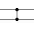

이 비교 네트워크에 예를 들어 $[1,1],\ [2,2],\ [1,2],\ [2,1]$인 정수 열을 각각 입력하면 다음과 같습니다.

- $X=[1,1]$을 입력하면 이 비교 네트워크는 비감소 열 $Y=[1,1]$을 출력합니다.
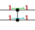
- $X=[2,2]$를 입력하면 이 비교 네트워크는 비감소 열 $Y=[2,2]$를 출력합니다.
- $X=[1,2]$를 입력하면 이 비교 네트워크는 비감소 열 $Y=[1,2]$를 출력합니다.
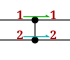
- $X=[2,1]$을 입력하면 이 비교 네트워크는 비감소 열 $Y=[1,2]$를 출력합니다.
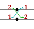

길이 $2$인 모든 입력 열에 대해 이 비교 네트워크는 비감소 열을 출력합니다. 따라서 이 비교 네트워크는 **정렬 네트워크**입니다.

$1$번째 출력:

#### 출력

```text
Yes
0

```


$2$번째 테스트 케이스는 입력 $4$개인 **정렬 네트워크**의 예입니다.

#### 입력

```text
4 5
1 3 1 2 2
2 4 3 4 3
```

$i=2$, $(N_2,M_2)=(4,5)$, $[(A_{2,j},B_{2,j})]=[(1,2),(3,4),(1,3),(2,4),(2,3)]$입니다.
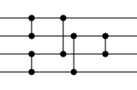

이 비교 네트워크에 예를 들어 $X=[4,3,2,1]$인 정수 열을 입력하면 다음과 같습니다.

- 시각 $0$: 초기 상태에서는 입력 열 $X$를 복사하여 $W=[4,3,2,1]$입니다.
- 시각 $1$: $1,2$번째 원소를 비교하여 $W=[3,4,2,1]$이 됩니다.
- 시각 $2$: $3,4$번째 원소를 비교하여 $W=[3,4,1,2]$가 됩니다.
- 시각 $3$: $1,3$번째 원소를 비교하여 $W=[1,4,3,2]$가 됩니다.
- 시각 $4$: $2,4$번째 원소를 비교하여 $W=[1,2,3,4]$가 됩니다.
- 시각 $5$: $2,3$번째 원소를 비교하여 $W=[1,2,3,4]$가 됩니다.
- 시각 $6$: $W=[1,2,3,4]$를 출력 열 $Y$로 출력합니다.

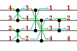

이 비교 네트워크에 예를 들어 $X=[4,2,3,1]$인 정수 열을 입력하면 다음과 같습니다.

- 시각 $0$: 초기 상태에서는 입력 열 $X$를 복사하여 $W=[4,2,3,1]$입니다.
- 시각 $1$: $1,2$번째 원소를 비교하여 $W=[2,4,3,1]$이 됩니다.
- 시각 $2$: $3,4$번째 원소를 비교하여 $W=[2,4,1,3]$이 됩니다.
- 시각 $3$: $1,3$번째 원소를 비교하여 $W=[1,4,2,3]$이 됩니다.
- 시각 $4$: $2,4$번째 원소를 비교하여 $W=[1,3,2,4]$가 됩니다.
- 시각 $5$: $2,3$번째 원소를 비교하여 $W=[1,2,3,4]$가 됩니다.
- 시각 $6$: $W=[1,2,3,4]$를 출력 열 $Y$로 출력합니다.

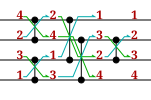

이 비교 네트워크는 다른 길이 $4$인 입력 열에 대해서도 항상 비감소 열을 출력하는 **정렬 네트워크**입니다.

$2$번째 출력:

#### 출력

```text
Yes
0

```

$3$번째 테스트 케이스도 **정렬 네트워크이지만, 빨간색 선으로 그린 $6$번째 비교기는 어떤 입력에 대해서도 교환 작업이 일어나지 않습니다.**

#### 입력

```text
4 6
1 3 1 2 2 3
2 4 3 4 3 4
```

$i=3$, $(N_3,M_3)=(4,6)$, $[(A_{3,j},B_{3,j})]=[(1,2),(3,4),(1,3),(2,4),(2,3),(3,4)]$입니다.
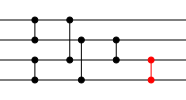

$3$번째 출력:

#### 출력

```text
Yes
1
6
```


$4$번째 테스트 케이스는 입력 $4$개의 비교 네트워크이지만 **정렬 네트워크가 아닙니다**.

#### 입력

```text
4 5
1 3 2 1 3
2 4 3 2 4
```

$i=4$, $(N_4,M_4)=(4,5)$, $[(A_{4,j},B_{4,j})]=[(1,2),(3,4),(2,3),(1,2),(3,4)]$입니다.
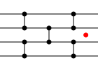

이 비교 네트워크에 예를 들어 $X=[4,3,2,1]$인 정수 열을 입력하면 다음과 같습니다.

- 시각 $0$: 초기 상태에서는 입력 열 $X$를 복사하여 $W=[4,3,2,1]$입니다.
- 시각 $1$: $1,2$번째 원소를 비교하여 $W=[3,4,2,1]$이 됩니다.
- 시각 $2$: $3,4$번째 원소를 비교하여 $W=[3,4,1,2]$가 됩니다.
- 시각 $3$: $2,3$번째 원소를 비교하여 $W=[3,1,4,2]$가 됩니다.
- 시각 $4$: $1,2$번째 원소를 비교하여 $W=[1,3,4,2]$가 됩니다.
- 시각 $5$: $3,4$번째 원소를 비교하여 $W=[1,3,2,4]$가 됩니다.
- 시각 $6$: $W=[1,3,2,4]$를 출력 열 $Y$로 출력합니다.

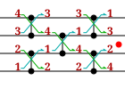

$[1,3,2,4]$는 비감소 순서로 정렬되지 않았으므로 $4$번째 테스트 케이스의 비교 네트워크는 **정렬 네트워크가 아닙니다**.

$Y[2]>Y[3]$이므로 이 입력 열에서는 $k=2$일 때 $Y[k]>Y[k+1]$입니다. 또한 길이 $N_i$인 어떤 입력 열에서도 $k\neq 2$일 때는 $Y[k]>Y[k+1]$이 되지 않으므로, **빨간 점을 표시한 위치인 $k=2$일 때만 $Y[k]>Y[k+1]$이 될 가능성이 있다고** 출력합니다.

$4$번째 출력:

#### 출력

```text
No
1
2
```

### 예제 2 {file=""}

#### 입력

```text
4
8 28
1 3 5 7 2 4 6 1 3 5 7 2 4 6 1 3 5 7 2 4 6 1 3 5 7 2 4 6
2 4 6 8 3 5 7 2 4 6 8 3 5 7 2 4 6 8 3 5 7 2 4 6 8 3 5 7
8 24
1 3 5 7 1 2 5 6 1 3 5 7 1 2 3 4 1 2 5 6 1 3 5 7
2 4 6 8 4 3 8 7 2 4 6 8 8 7 6 5 3 4 7 8 2 4 6 8
8 19
1 3 5 7 1 2 5 6 2 6 1 2 3 4 3 4 2 4 6
2 4 6 8 3 4 7 8 3 7 5 6 7 8 5 6 3 5 7
8 19
1 3 5 7 1 5 2 6 1 2 3 4 3 4 2 4 2 4 6
2 4 6 8 3 7 4 8 5 6 7 8 5 6 5 7 3 5 7
```

#### 출력

```text
Yes
0

Yes
0

Yes
0

Yes
0

```

이 비교 네트워크들은 모두 입력 열을 항상 비감소 순서로 정렬하여 출력하는 **정렬 네트워크**입니다.

홀짝 전치 정렬
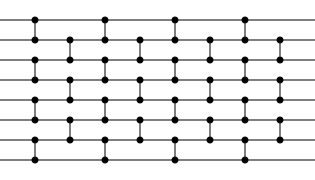

바이토닉 정렬
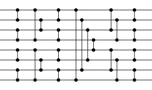

バッチャー 홀짝 병합 정렬
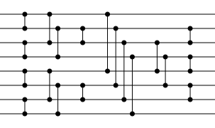

페어와이즈 정렬
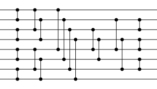


### 예제 3 {file=""}

#### 입력

```text
2
26 142
1 3 5 7 9 11 13 15 17 19 21 23 25 1 2 5 6 9 10 15 16 19 20 23 24 1 2 3 4 9 10 11 12 13 19 20 21 22 1 2 3 4 5 6 7 8 9 11 12 14 2 3 4 5 6 7 8 10 12 14 16 18 1 2 4 6 7 8 9 11 13 15 17 22 3 4 6 9 11 14 15 17 22 2 4 7 8 10 13 15 16 18 22 2 4 5 8 9 10 12 14 16 20 21 24 3 5 6 8 12 13 16 17 20 23 4 6 8 10 12 14 16 18 20 22 6 7 10 11 14 15 18 19 5 7 9 11 13 15 17 19 21
2 4 6 8 10 12 14 16 18 20 22 24 26 3 4 7 8 11 12 17 18 21 22 25 26 5 6 7 8 15 17 14 18 16 23 24 25 26 19 20 21 22 23 24 25 26 13 15 16 18 19 11 21 9 23 15 25 13 20 17 24 22 5 10 14 16 19 20 12 21 23 18 25 26 5 12 10 18 13 16 23 21 24 5 9 11 14 12 19 17 20 23 25 3 7 6 13 11 15 17 19 18 23 22 25 4 7 11 10 14 15 21 19 22 24 5 7 9 11 13 15 17 19 21 23 8 9 12 13 16 17 20 21 6 8 10 12 14 16 18 20 22
26 177
1 3 5 7 9 11 15 17 19 21 23 25 1 2 5 6 9 10 15 16 19 20 23 24 13 22 6 4 8 12 17 2 14 3 10 18 1 9 8 5 11 16 15 7 6 2 18 19 1 25 15 19 3 13 23 10 5 14 4 9 20 1 7 16 13 17 22 8 21 6 3 12 2 1 24 15 19 10 12 14 18 4 7 23 2 3 20 9 13 11 16 18 8 21 5 4 23 2 25 10 15 12 17 8 20 6 11 22 4 24 1 15 13 17 10 19 7 21 5 3 23 16 13 9 18 11 7 20 4 22 2 24 14 11 12 8 19 10 6 21 4 2 23 14 12 17 10 7 20 15 5 22 3 14 11 18 16 9 6 21 4 23 15 13 19 17 8 10 5 12 16 14 20 18 7 9 4
2 4 6 8 10 12 16 18 20 22 24 26 3 4 7 8 11 12 17 18 21 22 25 26 15 23 16 9 25 19 21 11 24 5 20 26 7 22 10 17 13 24 21 14 12 3 20 23 4 26 18 21 7 17 24 12 6 16 8 11 22 2 15 19 14 18 23 10 25 9 4 20 11 5 26 17 21 11 13 16 22 9 8 25 5 6 24 10 15 12 17 20 14 22 6 7 24 3 26 13 18 14 19 9 21 7 16 23 5 25 2 16 14 18 11 20 9 22 6 4 24 17 15 10 19 12 8 21 6 23 5 25 17 13 15 9 20 16 7 22 5 3 24 16 13 18 11 8 21 19 6 23 4 15 12 19 17 10 7 22 5 24 16 14 20 18 9 11 6 13 17 15 21 19 8 10 5
```

#### 출력

```text
Yes
1
78
No
7
3 6 11 13 15 19 21
```

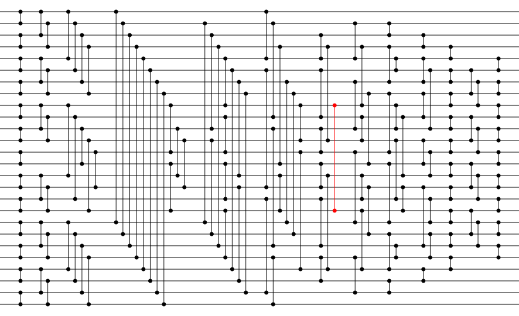
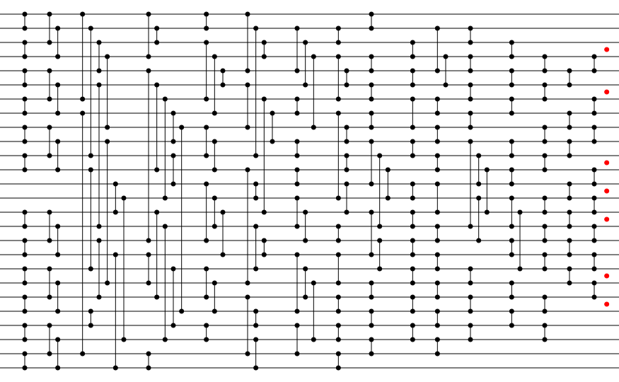
