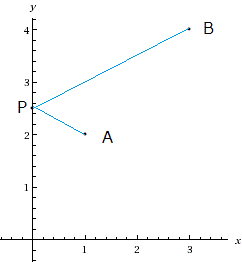

## 문제 설명

좌표평면의 제$1$사분면에 점 $A(x_a,y_a)$와 점 $B(x_b,y_b)$가 있습니다. 여기서 제$1$사분면은 $x>0$이고 $y>0$인 영역을 뜻합니다.

$|AP|+|PB|$가 최소가 되도록 $y$축 위에 점 $P(0,y_p)$를 놓으세요. $|AP|$와 $|PB|$는 각각 $2$개의 점 사이의 유클리드 거리를 뜻합니다.



## 입력

```text
$x_a\ y_a$
$x_b\ y_b$
```

$1$번째 줄에 점 $A$의 좌표, $2$번째 줄에 점 $B$의 좌표가 주어집니다.

입력은 정수로 주어집니다.

## 제한

- $0 < x_a,x_b,y_a,y_b < 1\,000$

## 출력

```text
$y_p$
```

점 $P$의 $y$좌표를 출력하세요.

판정 결과와의 절대 오차 또는 상대 오차가 $10^{-6}$ 이하이면 정답으로 인정됩니다.

## 예제

### 예제 1 {file=""}

#### 입력

```text
1 2
3 4
```

#### 출력

```text
2.5
```

문제 설명의 그림에 나온 예입니다.

### 예제 2 {file=""}

#### 입력

```text
100 100
100 200
```

#### 출력

```text
150
```

### 예제 3 {file=""}

#### 입력

```text
114 514
114 514
```

#### 출력

```text
514
```

$A\ne B$일 필요는 없습니다.

