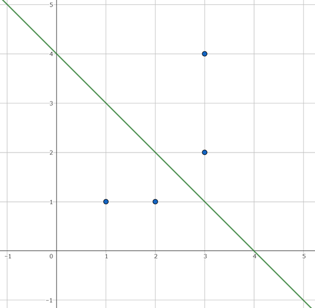

## 문제 설명

좌표평면 위에 있는 서로 다른 격자점 $2N$개 $(x_1, y_1), \cdots, (x_{2N}, y_{2N})$가 주어집니다. 다음 조건을 모두 만족하는 직선 $L$을 $1$개 구하세요.

- 직선 $L$ 위에는 주어진 격자점이 없습니다.
- 직선 $L$이 나누는 $2$개의 반평면은 각각 주어진 격자점을 $N$개씩 포함합니다.
- 직선 $L$의 방정식은 $|a| \leq 10^5$, $|b| \leq 10^5$, $|c| \leq 2\times 10^{10}$인 정수 $(a, b, c)$를 사용하여 $ax+by+c=0$으로 나타낼 수 있습니다.

이 문제의 제한에서 위 조건을 만족하는 $L$이 적어도 $1$개 존재한다는 것이 증명됩니다.

## 입력

```text
$N$
$x_1\ y_1$
$\vdots$
$x_{2N}\ y_{2N}$
```

## 제한

- $1 \leq N \leq 50\,000$
- $|x_i| \leq 100\,000$ ($1 \leq i \leq 2N$)
- $|y_i| \leq 100\,000$ ($1 \leq i \leq 2N$)
- $(x_i, y_i) \neq (x_j, y_j)$ ($i \neq j$)
- 입력은 모두 정수입니다.

## 출력

```text
$a\ b\ c$
```

직선 $L$의 방정식을 $ax+by+c=0$으로 했을 때의 정수 $a$, $b$, $c$를 출력하세요.

$|a| \leq 100\,000$, $|b| \leq 100\,000$, $|c| \leq 2\times 10^{10}$이어야 합니다.

단, $a=b=0$인 출력을 하면 `WA`가 됩니다.

## 주의

이 문제는 스페셜 저지입니다. 해가 여러 개 존재할 수 있습니다. 또한 출력 형식을 만족하지 않는 제출에 대한 저지의 동작은 보장되지 않습니다.

## 예제

### 예제 1 {file=""}

#### 입력

```text
2
1 1
2 1
3 2
3 4
```

#### 출력

```text
1 1 -4
```



입력된 $4$개의 점과 직선 $x+y-4=0$을 그림으로 나타내고 있습니다.

- 직선 $L$ 위에는 입력된 격자점이 없습니다.
- 직선 $L$은 입력된 격자점들을 각각 $2$개씩 나눕니다.
- $|1| \leq 10^5$, $|-4| \leq 2\times 10^{10}$입니다.

따라서 이 출력은 조건을 만족하는 $L$ 중 $1$개입니다.

그 밖에도 다음 출력들이 조건을 만족합니다.

#### 출력

```text
-3 -3 12
```

#### 출력

```text
2 0 -5
```

### 예제 2 {file=""}

#### 입력

```text
2
1 1
2 1
1 2
2 2
```

#### 출력

```text
2 0 -3
```

### 예제 3 {file=""}

#### 입력

```text
3
-2 -7
-6 2
5 -2
0 6
6 -9
-2 0
```

#### 출력

```text
2 1 3
```
