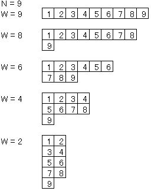

## 참고

이 문제는 [Advent Calendar Contest Advent Calendar 2015](http://www.adventar.org/calendars/912)의 $1$일차 문제로 만들어졌습니다.

## 문제 설명

이 게임은 플레이어 $1$명이 진행합니다. 게임의 목적은 게임판 왼쪽 위 모서리의 $1$번 칸에서 시작하여 다음 이동 규칙을 지키면서 $N$번 칸에 도착하는 것입니다.

이동 규칙은 다음과 같습니다.

- 십자 방향으로 인접한 칸으로만 이동할 수 있습니다.
- 소수가 적힌 칸을 지나가면 안 됩니다.

$2$가지 규칙을 지켜 $1$번 칸에서 $N$번 칸까지 도착할 수 있으면 플레이어의 승리입니다.

게임판은 $1$부터 $N$까지의 번호가 순서대로 적힌 $N$개의 칸으로 이루어집니다. 가로 $W$, 세로 $\lfloor N/W\rfloor$인 칸 덩어리의 왼쪽 아래에 가로 $N\bmod W$, 세로 $1$인 칸 덩어리가 붙은 모양입니다.

예를 들어 $N=9$일 때, $W$의 값에 따라 가능한 게임판의 일부를 아래에 나타냈습니다.



소수가 아닌 자연수 $N$이 주어질 때, 플레이어가 승리할 수 있는 가장 작은 자연수 $W$를 출력하세요.

## 입력

```text
$N$
```

## 제한

- $4 \le N \le 10^{24}$
- $N$은 소수가 아닙니다.

## 출력

```text
$W$
```

조건을 만족하는 가장 작은 $W$를 $1$줄에 출력하세요.

마지막에 개행을 출력하세요.

## 예제

### 예제 1 {file=""}

#### 입력

```text
9
```

#### 출력

```text
7
```

$N=9$일 때 $W=7$인 게임판이 플레이어가 승리할 수 있는 가장 작은 너비를 가집니다.

### 예제 2 {file=""}

#### 입력

```text
4
```

#### 출력

```text
3
```

$W=3$이 플레이어가 승리할 수 있는 유일한 게임판입니다. $N=4$의 다른 게임판에서는 소수 칸을 지나지 않고 $1$번 칸에서 $N$번 칸으로 가는 경로가 없습니다.

### 예제 3 {file=""}

#### 입력

```text
22
```

#### 출력

```text
7
```

