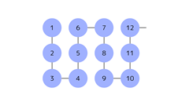
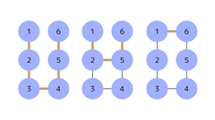

## 문제 설명

다음과 같이 정점 수가 $3N$인 무방향 그래프가 있습니다.



구체적으로, $1\leq i\leq 3N-1$을 만족하는 각 $i$에 대해 정점 $i$와 정점 $i+1$을 연결한 그래프입니다.

그림에서 서로 이웃한 정점을 추가로 최대 $K$번 연결할 수 있을 때, 정점 $1$에서 정점 $3N$으로 가는 가능한 단순 경로의 개수를 $998\,244\,353$으로 나눈 나머지를 구하세요.

보다 형식적으로 설명하겠습니다.

먼저 그래프에 서로 이웃한 정점을 추가로 최대 $K$번 연결합니다. 그러면 정점 $1$에서 정점 $3N$으로 가는 경로를, 그 경로에서 $i$번째로 지나는 정점을 $S_i$, 그 경로에서 지나는 정점 수를 $M$이라고 하여 수열 $S=(S_1,S_2,\dots,S_M)$으로 나타낼 수 있습니다.

이때 가능한 수열의 종류 수를 구하세요. 단, $2$개의 수열은 원소 수가 다르거나, 어떤 정수 $i$($1\leq i\leq M$)에 대해 왼쪽부터 $i$번째 원소 $S_i$가 다르면 서로 다른 수열로 셉니다.

다음과 같은 정점의 관계를 서로 이웃한다고 합니다.

정점 $i$에 대해 $(i+2)$를 $3$으로 나눈 몫을 그 정점이 속한 열이라고 정의합니다. $2$개의 정점이 각각 왼쪽에서 $A$번째, $B$번째 열에 쓰여 있고, 그곳에 쓰인 숫자가 각각 $C$, $D$일 때, 다음 조건을 모두 만족하면 $2$개의 정점은 서로 이웃합니다.

- $|A-B|=1$
- $C+D\equiv 1\pmod{6}$

## 입력

```text
$N\ K$
```

## 제한

- $1\leq N\leq 1\,000$
- $0\leq K\leq 2N-2$
- 입력은 모두 정수입니다.

## 출력

가능한 단순 경로의 개수를 $998\,244\,353$으로 나눈 나머지를 출력하세요.

마지막에 줄 바꿈을 출력하세요.

## 예제

### 예제 1 {file=""}

#### 입력

```text
2 1
```

#### 출력

```text
3
```

다음과 같이 단순 경로가 $3$개 존재합니다.



### 예제 2 {file=""}

#### 입력

```text
314 159
```

#### 출력

```text
545088277
```
